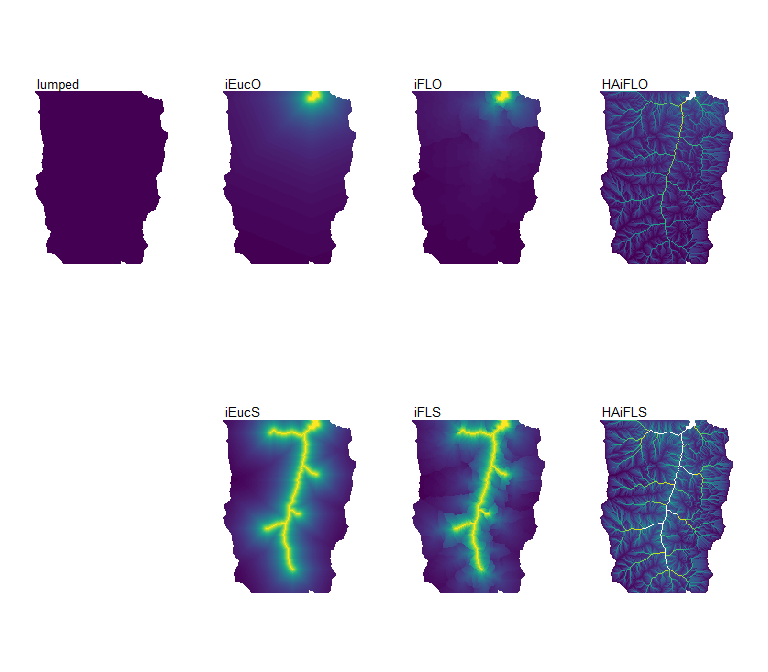
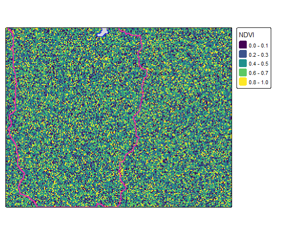
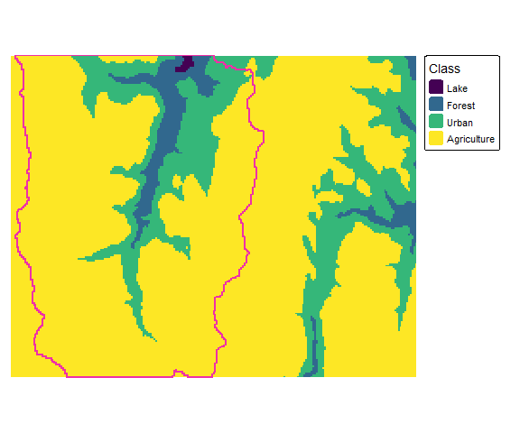
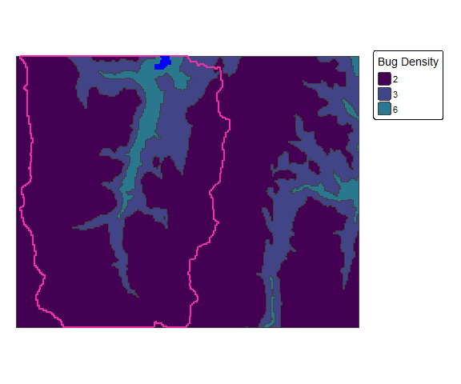
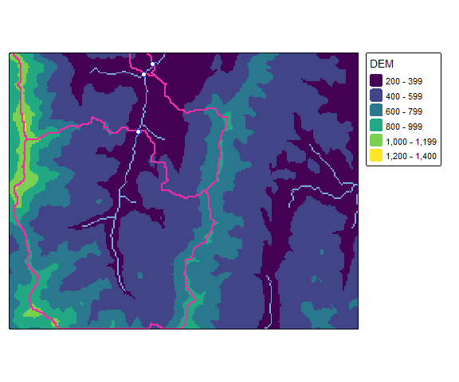
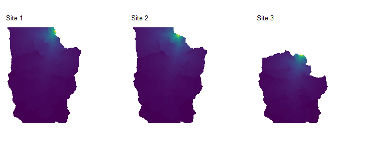
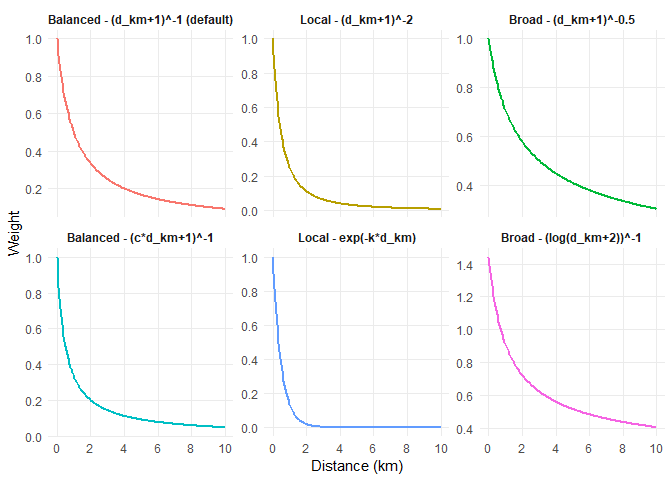
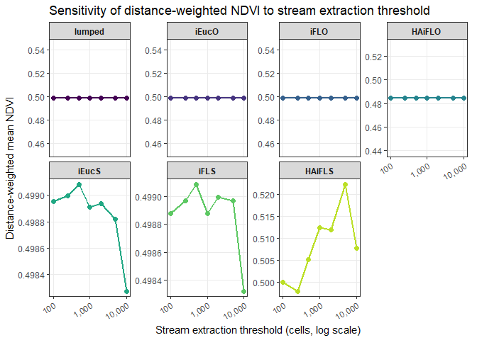
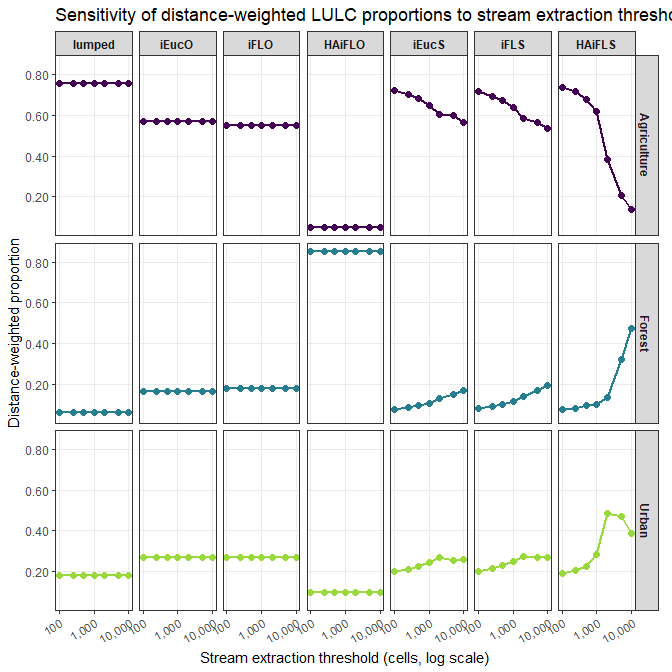
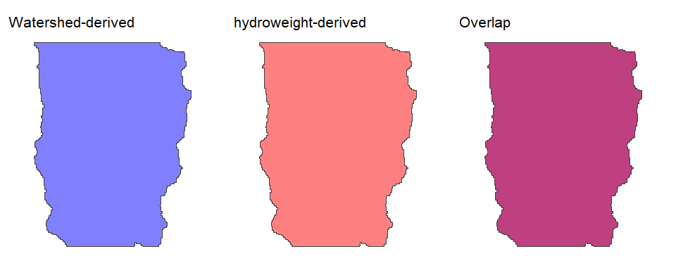

hydroweight: Distance-weighted rasters and landscape attributes
================

- [hydroweight](#hydroweight)
  - [Learning objectives](#learning-objectives)
  - [1. Why distance-weighted landscape
    metrics?](#1-why-distance-weighted-landscape-metrics)
  - [2. Installation & prerequisites](#2-installation--prerequisites)
  - [3. Tutorial](#3-tutorial)
    - [3.1 Prepare example terrain
      data](#31-prepare-example-terrain-data)
    - [3.2 Create example targets (`target_O`,
      `target_S`)](#32-create-example-targets-target_o-target_s)
    - [3.3 Generate distance‑weighted
      rasters](#33-generate-distanceweighted-rasters)
    - [3.4 Compute distance‑weighted
      attributes](#34-compute-distanceweighted-attributes)
  - [4. Scaling up: multiple sites & layers while looking more closely
    at data
    structures](#4-scaling-up-multiple-sites--layers-while-looking-more-closely-at-data-structures)
    - [4.1 Generate multiple sites and
      watersheds](#41-generate-multiple-sites-and-watersheds)
    - [4.2 Run `hydroweight()` across
      sites](#42-run-hydroweight-across-sites)
    - [4.3 Generate `loi` lists populated with layer-specific
      `hydroweight_attributes()`
      parameters](#43-generate-loi-lists-populated-with-layer-specific-hydroweight_attributes-parameters)
    - [4.4 Run `hydroweight_attributes()` across sites and
      layers](#44-run-hydroweight_attributes-across-sites-and-layers)
    - [4.5 Extract and adjust results data
      frames](#45-extract-and-adjust-results-data-frames)
  - [5. Quick guide to accessing intermediate files for
    troubleshooting](#5-quick-guide-to-accessing-intermediate-files-for-troubleshooting)
  - [6. Effect of different inverse weighting
    formulas](#6-effect-of-different-inverse-weighting-formulas)
  - [7. Effect of stream extraction threshold on distance-weighted
    attributes](#7-effect-of-stream-extraction-threshold-on-distance-weighted-attributes)
    - [7.1 Define the thresholds](#71-define-the-thresholds)
    - [7.2 Loop over thresholds](#72-loop-over-thresholds)
    - [7.3 Reshape results into tidy long-format data
      frames](#73-reshape-results-into-tidy-long-format-data-frames)
    - [7.4 Plot: NDVI sensitivity to stream
      threshold](#74-plot-ndvi-sensitivity-to-stream-threshold)
    - [7.5 Plot: LULC proportion sensitivity to stream
      threshold](#75-plot-lulc-proportion-sensitivity-to-stream-threshold)
  - [8. Using iFLO to derive catchments (alternative to watershed
    tool)](#8-using-iflo-to-derive-catchments-alternative-to-watershed-tool)
  - [9. Troubleshooting & performance](#9-troubleshooting--performance)
  - [10. References](#10-references)
  - [11. Acknowledgements](#11-acknowledgements)
  - [12. Development team](#12-development-team)
  - [12. License](#12-license)

<!-- README.md is generated from this file. Please edit README.Rmd. -->

\[

# hydroweight

`hydroweight` helps environmental scientists compute
***distance-weighted*** landscape metrics within hydrologically
meaningful areas. It implements workflows to compute spatially explicit
landscape metrics described in Peterson *et al*. (2011). Ultimately, the
landscape metrics can be used as predictor variables in other models
(e.g., contaminant modelling).

It provides:

- `hydroweight()` – used to generate distance-weighted rasters for
  ***targets*** (points/areas = `target_O`; streams = `target_S`) on a
  DEM.
- `hydroweight_attributes()` – used to summarize ***layers of
  interest*** (rasters or polygons; numeric or categorical) within a
  ***region of interest*** (e.g., watershed polygon), using the distance
  weights produced above.

The package is designed for transparent, flexible workflows across
weighting schemes, data types, and multiple sites.

------------------------------------------------------------------------

## Learning objectives

By the end of this tutorial, you will be able to:

- Explain why distance-weighted catchment metrics can outperform simple
  “lumped” metrics for many applications
- Prepare a DEM and hydrologic derivatives (flow directions,
  accumulation, streams) required by `hydroweight()`
- Generate distance-weighted rasters with different schemes (e.g.,
  iEucO, iFLO, HAiFLS) and interpret their meaning
- Compute distance-weighted numeric (i.e., mean) and categorical (i.e.,
  % cover) attributes with `hydroweight_attributes()`
- Scale the workflow to multiple sites and multiple layers
- Understand how to extract intermediate products
- Understand the effect of different inverse weighting formulas
- Understand the effect of different stream initiation thresholds
- Troubleshoot common issues and improve performance

------------------------------------------------------------------------

## 1. Why distance-weighted landscape metrics?

Traditional “lumped” metrics treat all upstream areas equally.
Distance-weighted metrics recognize that nearby areas can have more
influence on a target (e.g., stream site or lake) than distant areas.
Different weighting schemes represent different distance concepts:

- ***Euclidean*** (i.e., as the crow flies) distance to a target
  (`iEucO`, `iEucS`)
- ***Flow-path*** distance along the drainage network (`iFLO`, `iFLS`)
- ***Hydrologically active*** variants that incorporate flow
  accumulation (`HAiFLO`, `HAiFLS`)

This package reproduces the ideas introduced in IDW-PLUS (Peterson and
Pearse, 2017; Pearse *et al*., 2025) and related tools, while providing
a simple, flexible R workflow built on WhiteboxTools.

------------------------------------------------------------------------

## 2. Installation & prerequisites

You’ll need R packages for geospatial data and WhiteboxTools bindings
(and a few others used in demonstration here). Here `pacman::p_load()`
helps with install of key packages.

``` r
# Install hydroweight (replace with your install path/source as needed)
# install.packages("hydroweight")                         # if on CRAN
# remotes::install_github("GLFC-WET/hydroweight@dev")   # dev version
```

``` r
if (!require("pacman")) install.packages("pacman")

# Core
pacman::p_load(hydroweight)

# Spatial
pacman::p_load(terra, sf, whitebox)

# Tidy/data
pacman::p_load(dplyr, tidyr, purrr, tibble, stringr)

# Visualization
pacman::p_load(ggplot2, viridis, tmap, patchwork, scales)

# Parallel
pacman::p_load(foreach, doParallel, future.apply)

## Working directory for outputs (temp for the tutorial)
hydroweight_dir <- tempdir()
```

> **Additional WhiteboxTools details**
>
> - If `whitebox::install_whitebox()` is needed on your machine, run:
>   `whitebox::install_whitebox()` once.  
> - If you already have WhiteboxTools, set the path with:
>   `whitebox::wbt_init(exe_path = "/path/to/whitebox_tools")`.

------------------------------------------------------------------------

## 3. Tutorial

**Workflow at a glance**

    DEM → (Whitebox preprocessing) → hydroweight() → distance-weighted rasters
                                   → hydroweight_attributes() → summary tables

We’ll start with a toy DEM, create targets, compute distance weights,
and then summarize layers of interest (numeric and categorical).

Finally, we’ll scale to multiple sites, demonstrate the structure and
access of intermediate products, and look at effects of different
inverse weighting formulas and how to access intermediate products.

------------------------------------------------------------------------

### 3.1 Prepare example terrain data

We use the `whitebox` demo DEM to keep this tutorial reproducible.

**What we will create**

- A breached DEM (for continuous flow)
- D8 flow direction and flow accumulation rasters
- A stream network derived from accumulation

``` r
## Load the demo DEM shipped with {whitebox}
toy_dem <- rast(system.file("extdata", "DEM.tif", package = "whitebox"))

## Persist the DEM for WhiteboxTools
writeRaster(toy_dem, file.path(hydroweight_dir, "toy_dem.tif"), overwrite = TRUE)

## 1) Breach depressions to ensure continuous flow
wbt_breach_depressions(
  dem    = file.path(hydroweight_dir, "toy_dem.tif"),
  output = file.path(hydroweight_dir, "toy_dem_breached.tif")
)

## 2) Flow direction (D8)
wbt_d8_pointer(
  dem    = file.path(hydroweight_dir, "toy_dem_breached.tif"),
  output = file.path(hydroweight_dir, "toy_dem_breached_d8.tif")
)

## 3) Flow accumulation (cells)
wbt_d8_flow_accumulation(
  input    = file.path(hydroweight_dir, "toy_dem_breached.tif"),
  output   = file.path(hydroweight_dir, "toy_dem_breached_accum.tif"),
  out_type = "cells"
)

## 4) Stream network (threshold = 2000 cells)
wbt_extract_streams(
  flow_accum = file.path(hydroweight_dir, "toy_dem_breached_accum.tif"),
  output     = file.path(hydroweight_dir, "toy_dem_streams.tif"),
  threshold  = 2000
)

tg_S <- rast(file.path(hydroweight_dir, "toy_dem_streams.tif"))
```

------------------------------------------------------------------------

### 3.2 Create example targets (`target_O`, `target_S`)

`hydroweight()` supports two target types:

- **`target_O`**: points or areas (e.g., site locations, lakes)  
- **`target_S`**: streams/linear features (e.g., distance to streams)

We’ll create a small lake polygon (`target_O`) and derive its watershed.

``` r
## Lake polygon (target_O) below 220 m elevation
tg_O <- toy_dem < 220
tg_O <- ifel(tg_O, 1, 0) # to ensure only non-zero, non-NoData cells are used
writeRaster(tg_O, file.path(hydroweight_dir, "tg_O.tif"), overwrite = TRUE)
tg_O <- terra::as.polygons(tg_O, dissolve = TRUE) |> sf::st_as_sf() |> 
  dplyr::filter(DEM == 1)

## Watershed of the lake (`roi` candidate for later)
wbt_watershed(
  d8_pntr = file.path(hydroweight_dir, "toy_dem_breached_d8.tif"),
  pour_pts = file.path(hydroweight_dir, "tg_O.tif"),
  output   = file.path(hydroweight_dir, "tg_O_catchment.tif")
)

## Load and clean up
tg_O_catchment <- rast(file.path(hydroweight_dir, "tg_O_catchment.tif")) |>
  as.polygons(dissolve = TRUE) |>
  st_as_sf() |>
  rename(Lake = "tg_O_catchment")
```

**Quick look**

``` r
## Ensure static output in README
tmap::tmap_mode("plot")

## Streams palette: NA transparent, stream cells grey
stream_pal <- c(NA, "grey25")

m_quick <-
  tm_shape(toy_dem) +
  tm_raster(col.scale  = tm_scale(values = viridis::viridis(101))) +
  tm_shape(tg_S) + 
  tm_raster(                      
    col.scale  = tm_scale(values = stream_pal),
    col.legend = tm_legend(show = FALSE)
  ) +
  tm_shape(tg_O_catchment) + tm_borders(col = "maroon2", lwd = 2) +
  tm_shape(tg_O) + tm_fill(col = "blue") + tm_borders(col = "blue") 

m_quick
```


------------------------------------------------------------------------

### 3.3 Generate distance‑weighted rasters

We now compute distance weights with `hydroweight()` for several
schemes. See `?hydroweight` for specifics on parameter input.

``` r
## Inverse distance function; 0.001 converts m → km
myinv <- function(x) (x * 0.001 + 1)^-1

hw <- hydroweight(
  hydroweight_dir = hydroweight_dir,
  target_O        = tg_O,
  target_S        = tg_S,
  target_uid      = "Lake",
  # Optional clip region to limit processing area (can speed up large jobs)
  clip_region     = NULL,
  OS_combine      = TRUE,  # combine O/S distances for "nearest water" contexts
  dem             = file.path(hydroweight_dir, "toy_dem_breached.tif"),
  flow_accum      = file.path(hydroweight_dir, "toy_dem_breached_accum.tif"),
  weighting_scheme = c("lumped","iEucO","iFLO","HAiFLO","iEucS","iFLS","HAiFLS"),
  inv_function    = myinv,
)
#> Preparing hydroweight layers @ 2026-07-04 09:00:49.78959
#> Running distance-weighting @ 2026-07-04 09:00:50.14705

# hw comes in as a list of PackedSpatRaster, ensure elements are SpatRaster for plotting
hw <- lapply(hw, rast)
```

**What you get**

- A ***named list*** of rasters, one per weighting scheme.  
  e.g., `hw$lumped`, `hw$iEucO`, `hw$iFLO`, `hw$HAiFLS`, etc.

**Visualize** (log-transform HA\* variants for contrast)

``` r
## Crop/mask to the catchment for display & transform HA* for contrast
hw_vis <- lapply(hw, function(x) crop(x, tg_O_catchment, mask = TRUE))
hw_vis$HAiFLO <- log(hw_vis$HAiFLO)
hw_vis$HAiFLS <- log(hw_vis$HAiFLS)

## Map builder function with tight layout and small titles
weights_map <- function(r, ttl){
  tm_shape(r) +
    tm_raster(
      col.scale  = tm_scale_continuous(values = viridis::viridis(101)),
      col.legend = tm_legend(show = FALSE)
    ) +
    # Outside, centered title
    tm_title(ttl, size = 0.8, position = tm_pos_out("center", "top")) +
    tm_layout(
      frame = FALSE,
      inner.margins = c(0.01, 0.01, 0.02, 0.01),
      # Give the outside title space above the map:
      outer.margins = c(0.08, 0, 0, 0)
    )
}


## Construct maps
maps <- list(
  lumped  = weights_map(hw_vis$lumped,  "lumped"),
  iEucO   = weights_map(hw_vis$iEucO,   "iEucO"),
  iEucS   = weights_map(hw_vis$iEucS,   "iEucS"),
  iFLO    = weights_map(hw_vis$iFLO,    "iFLO"),
  iFLS    = weights_map(hw_vis$iFLS,    "iFLS"),
  HAiFLO  = weights_map(hw_vis$HAiFLO,  "HAiFLO"),
  HAiFLS  = weights_map(hw_vis$HAiFLS,  "HAiFLS")
)

## Extract tmap_grobs for use with patchwork
g <- lapply(maps, tmap_grob)

design <- "
ABDF
#CEG
"
wrap_plots(A = g[[1]], B = g[[2]], C = g[[3]],
           D = g[[4]], E = g[[5]], F = g[[6]], 
           G = g[[7]], design = design)
```



> **Interpretation tips**
>
> - *lumped*: equal weighting (all values = 1).  
> - *iEucO / iEucS*: weights extend to DEM bounds (straight-line
>   distance).  
> - *iFLO / iFLS / HAiFLO / HAiFLS*: weights follow contributing flow
>   paths; non-contributing cells are `NA`.  
> - In *HA* variants, targets (streams/lake cells) are set to `NA` to
>   avoid over-emphasizing concentrated flow corridors.

------------------------------------------------------------------------

### 3.4 Compute distance‑weighted attributes

`hydroweight_attributes()` combines:

- a ***distance-weighted raster*** (from `hydroweight()`),
- a ***layer of interest*** (`loi`; raster or polygon; numeric or
  categorical),
- and a ***region of interest*** (`roi`; e.g., a catchment polygon),

to produce ***attribute summaries*** (means, SDs, proportions, etc.).
Internally, inputs are projected/rasterized to the DEM grid. See
`?hydroweight_attributes` for specifics on parameter input.

#### Numeric raster example (NDVI)

We’ll create a toy NDVI raster and summarize distance-weighted mean/SD
within the lake catchment. Note that the lake itself is removed prior to
calculating statistics.

``` r
ndvi <- toy_dem
vals <- rnorm(n = ncell(ndvi), mean = 0.5, sd = 0.25)
values(ndvi) <- pmin(pmax(vals, 0), 1)

names(ndvi) <- "ndvi"

m_ndvi <- tm_shape(ndvi) +
  tm_raster(col.scale  = tm_scale_continuous(values = viridis::viridis(101)),
            col.legend = tm_legend(title = "NDVI")) +
  tm_shape(tg_O_catchment) + tm_borders(col = "maroon2", lwd = 2) +
  tm_shape(tg_O) + tm_polygons(fill = "blue", col = "blue")

m_ndvi
```



``` r
## See ?hydroweight_attributes for specifics

hwa_num <- hydroweight_attributes(
  loi                = ndvi,
  loi_columns        = NULL,
  loi_numeric        = TRUE,
  loi_numeric_stats  = c("distwtd_mean","distwtd_sd","mean","sd",
                         "median","min","max","cell_count","NA_cell_count"),
  roi                = tg_O_catchment,
  roi_uid            = "1",
  roi_uid_col        = "Lake",
  distance_weights   = hw,
  remove_region      = tg_O, # removes the lake itself prior to calculating statistics
  return_products    = TRUE
)
names(hwa_num$attribute_table)
#>  [1] "Lake"                     "ndvi_mean"               
#>  [3] "ndvi_sd"                  "ndvi_median"             
#>  [5] "ndvi_min"                 "ndvi_max"                
#>  [7] "ndvi_cell_count"          "ndvi_NA_cell_count"      
#>  [9] "ndvi_iEucO_distwtd_mean"  "ndvi_iEucO_distwtd_sd"   
#> [11] "ndvi_iFLO_distwtd_mean"   "ndvi_iFLO_distwtd_sd"    
#> [13] "ndvi_HAiFLO_distwtd_mean" "ndvi_HAiFLO_distwtd_sd"  
#> [15] "ndvi_iEucS_distwtd_mean"  "ndvi_iEucS_distwtd_sd"   
#> [17] "ndvi_iFLS_distwtd_mean"   "ndvi_iFLS_distwtd_sd"    
#> [19] "ndvi_HAiFLS_distwtd_mean" "ndvi_HAiFLS_distwtd_sd"
```

#### Categorical raster example (Land use/Land cover \[LULC\])

We’ll reclassify elevation into made up land use categories, then
compute distance-weighted ***proportions*** by class.

``` r
## Toy categorical LULC from elevation classes
lulc <- toy_dem
rcl  <- matrix(c(0,220,1,  220,300,2,  300,400,3,  400, Inf, 4), ncol=3, byrow=TRUE)
lulc <- classify(lulc, rcl); names(lulc) <- "lulc"
lulc <- terra::as.factor(lulc)

# Define human-readable labels for each class code
lulc_levels <- data.frame(
  ID    = 1:4,
  Class = c("Lake", "Forest", "Urban", "Agriculture")
)

levels(lulc) <- lulc_levels
str(levels(lulc))
#> List of 1
#>  $ :'data.frame':    4 obs. of  2 variables:
#>   ..$ ID   : int [1:4] 1 2 3 4
#>   ..$ Class: chr [1:4] "Lake" "Forest" "Urban" "Agriculture"

m_lulc <- tm_shape(lulc) +
  tm_raster(col.scale  = tm_scale_categorical(values = viridis(4),
                                              labels = levels(lulc)[[1]]$Class),
    col.legend = tm_legend(position = tm_pos_out("right"))) +
  tm_shape(tg_O_catchment) + tm_borders(col = "maroon2", lwd = 2) +
  tm_layout(frame = FALSE)

m_lulc
```



``` r
hwa_cat <- hydroweight_attributes(
  loi              = lulc,
  loi_numeric      = FALSE,
  roi              = tg_O_catchment,
  roi_uid          = "1",
  roi_uid_col      = "Lake",
  distance_weights = hw,
  remove_region    = tg_O,
  return_products  = TRUE
)

# Fix names so they aren't numeric classes according to lulc_levels
levels_map <- setNames(lulc_levels$Class, as.character(lulc_levels$ID))

hwa_cat$attribute_table <- hwa_cat$attribute_table %>%
  rename_with(~{
    id   <- str_match(.x, "^Class_(\\d+)_")[, 2]
    rest <- str_remove(.x, "^Class_\\d+_")
    cls  <- levels_map[id]
    ifelse(!is.na(cls), paste0(cls, "_", rest), .x)
  })
names(hwa_cat$attribute_table)
#>  [1] "Lake"                    "Forest_lumped_prop"     
#>  [3] "Urban_lumped_prop"       "Agriculture_lumped_prop"
#>  [5] "Forest_iEucO_prop"       "Urban_iEucO_prop"       
#>  [7] "Agriculture_iEucO_prop"  "Forest_iFLO_prop"       
#>  [9] "Urban_iFLO_prop"         "Agriculture_iFLO_prop"  
#> [11] "Forest_HAiFLO_prop"      "Urban_HAiFLO_prop"      
#> [13] "Agriculture_HAiFLO_prop" "Forest_iEucS_prop"      
#> [15] "Urban_iEucS_prop"        "Agriculture_iEucS_prop" 
#> [17] "Forest_iFLS_prop"        "Urban_iFLS_prop"        
#> [19] "Agriculture_iFLS_prop"   "Forest_HAiFLS_prop"     
#> [21] "Urban_HAiFLS_prop"       "Agriculture_HAiFLS_prop"
```

#### Polygon example (numeric columns)

Treat polygon attributes as numeric rasters under the hood and compute
distance-weighted statistics.

``` r
# Polygonize LULC and add numeric attributes
lulc_p <- as.polygons(lulc, dissolve = TRUE, na.rm = TRUE) |> st_as_sf()
set.seed(123); lulc_p$BugDensity <- sample(1:6, size = nrow(lulc_p), replace = TRUE)
set.seed(123); lulc_p$FishDensity <- sample(25:30, size = nrow(lulc_p), replace = TRUE)

m_lulc_p <- tm_shape(lulc_p) +
  tm_polygons(fill = "BugDensity",
              fill.scale  = tm_scale_categorical(values = viridisLite::viridis(6)),
              fill.legend = tm_legend(title = "Bug Density", 
                                      position = tm_pos_out("right"))) +
  tm_shape(tg_O_catchment) +
  tm_borders(col = "black") +
  tm_shape(tg_O_catchment) +
  tm_borders(col = "maroon2", lwd = 2) +
  tm_shape(tg_O) +
  tm_polygons(fill = "blue", col = "blue") +
  tm_layout(frame = FALSE)

m_lulc_p # plot var_1 only
```



``` r
hwa_poly_num <- hydroweight_attributes(
  loi               = lulc_p,
  loi_columns       = c("BugDensity","FishDensity"),
  loi_numeric       = TRUE,
  loi_numeric_stats = c("distwtd_mean","distwtd_sd","mean","sd",
                        "min","max","cell_count","NA_cell_count"),
  roi               = tg_O_catchment,
  roi_uid           = "1",
  roi_uid_col       = "Lake",
  distance_weights  = hw,
  remove_region     = tg_O,
  return_products   = TRUE
)
names(hwa_poly_num$attribute_table)
#>  [1] "Lake"                            "BugDensity_mean"                
#>  [3] "FishDensity_mean"                "BugDensity_sd"                  
#>  [5] "FishDensity_sd"                  "BugDensity_min"                 
#>  [7] "FishDensity_min"                 "BugDensity_max"                 
#>  [9] "FishDensity_max"                 "BugDensity_cell_count"          
#> [11] "FishDensity_cell_count"          "BugDensity_NA_cell_count"       
#> [13] "FishDensity_NA_cell_count"       "BugDensity_iEucO_distwtd_mean"  
#> [15] "FishDensity_iEucO_distwtd_mean"  "BugDensity_iEucO_distwtd_sd"    
#> [17] "FishDensity_iEucO_distwtd_sd"    "BugDensity_iFLO_distwtd_mean"   
#> [19] "FishDensity_iFLO_distwtd_mean"   "BugDensity_iFLO_distwtd_sd"     
#> [21] "FishDensity_iFLO_distwtd_sd"     "BugDensity_HAiFLO_distwtd_mean" 
#> [23] "FishDensity_HAiFLO_distwtd_mean" "BugDensity_HAiFLO_distwtd_sd"   
#> [25] "FishDensity_HAiFLO_distwtd_sd"   "BugDensity_iEucS_distwtd_mean"  
#> [27] "FishDensity_iEucS_distwtd_mean"  "BugDensity_iEucS_distwtd_sd"    
#> [29] "FishDensity_iEucS_distwtd_sd"    "BugDensity_iFLS_distwtd_mean"   
#> [31] "FishDensity_iFLS_distwtd_mean"   "BugDensity_iFLS_distwtd_sd"     
#> [33] "FishDensity_iFLS_distwtd_sd"     "BugDensity_HAiFLS_distwtd_mean" 
#> [35] "FishDensity_HAiFLS_distwtd_mean" "BugDensity_HAiFLS_distwtd_sd"   
#> [37] "FishDensity_HAiFLS_distwtd_sd"
```

#### Polygon example (categorical columns)

Compute distance-weighted **proportions** for polygon categorical
fields.

``` r
# Reuse lulc_p; treat attributes as categorical
hwa_poly_cat <- hydroweight_attributes(
  loi              = lulc_p,
  loi_columns      = c("BugDensity","FishDensity"),
  loi_numeric      = FALSE,
  roi              = tg_O_catchment,
  roi_uid          = "1",
  roi_uid_col      = "Lake",
  distance_weights = hw,
  remove_region    = tg_O,
  return_products  = TRUE
)
names(hwa_poly_cat$attribute_table) # reads as "BugDensity.cat#_lumped_prop
#>  [1] "Lake"                       "BugDensity.2_lumped_prop"  
#>  [3] "BugDensity.3_lumped_prop"   "BugDensity.6_lumped_prop"  
#>  [5] "FishDensity.26_lumped_prop" "FishDensity.27_lumped_prop"
#>  [7] "FishDensity.30_lumped_prop" "BugDensity.2_iEucO_prop"   
#>  [9] "BugDensity.3_iEucO_prop"    "BugDensity.6_iEucO_prop"   
#> [11] "FishDensity.26_iEucO_prop"  "FishDensity.27_iEucO_prop" 
#> [13] "FishDensity.30_iEucO_prop"  "BugDensity.2_iFLO_prop"    
#> [15] "BugDensity.3_iFLO_prop"     "BugDensity.6_iFLO_prop"    
#> [17] "FishDensity.26_iFLO_prop"   "FishDensity.27_iFLO_prop"  
#> [19] "FishDensity.30_iFLO_prop"   "BugDensity.2_HAiFLO_prop"  
#> [21] "BugDensity.3_HAiFLO_prop"   "BugDensity.6_HAiFLO_prop"  
#> [23] "FishDensity.26_HAiFLO_prop" "FishDensity.27_HAiFLO_prop"
#> [25] "FishDensity.30_HAiFLO_prop" "BugDensity.2_iEucS_prop"   
#> [27] "BugDensity.3_iEucS_prop"    "BugDensity.6_iEucS_prop"   
#> [29] "FishDensity.26_iEucS_prop"  "FishDensity.27_iEucS_prop" 
#> [31] "FishDensity.30_iEucS_prop"  "BugDensity.2_iFLS_prop"    
#> [33] "BugDensity.3_iFLS_prop"     "BugDensity.6_iFLS_prop"    
#> [35] "FishDensity.26_iFLS_prop"   "FishDensity.27_iFLS_prop"  
#> [37] "FishDensity.30_iFLS_prop"   "BugDensity.2_HAiFLS_prop"  
#> [39] "BugDensity.3_HAiFLS_prop"   "BugDensity.6_HAiFLS_prop"  
#> [41] "FishDensity.26_HAiFLS_prop" "FishDensity.27_HAiFLS_prop"
#> [43] "FishDensity.30_HAiFLS_prop"
```

------------------------------------------------------------------------

## 4. Scaling up: multiple sites & layers while looking more closely at data structures

The package returns explicit intermediate objects to support batch
processing and troubleshooting. Here, we will take a little bit of extra
space to become familiar with the results structure of `hydroweight()`
and `hydroweight_attributes()` while demonstrating how to chain an
analysis together across sites, distances weights, and layers of
interest.

The basic chain looks like this this:

- For each site: Run `hydroweight()`
- For each layer of interest: Run `hydroweight_attributes()`

Here, we try to make the code easier to troubleshoot rather than make it
look pretty - recognizing lots of opportunity to clean up

------------------------------------------------------------------------

### 4.1 Generate multiple sites and watersheds

``` r
## Example: take 3 points along the stream network as sites (targets_O)
tg_O_multi <- as.points(rast(file.path(hydroweight_dir, "toy_dem_streams.tif"))) |> st_as_sf()
tg_O_multi <- tg_O_multi[st_coordinates(tg_O_multi)[,1] < 675000, ]  # choose one network
tg_O_multi <- tg_O_multi[c(10, 50, 100), ]
tg_O_multi$Site <- c(1,2,3)
tg_O_multi <- tg_O_multi[, -1] # drop default column

# Watersheds for each site, demonstration of foreach approach
tg_O_multi_catchment <- foreach(xx = 1:nrow(tg_O_multi), .errorhandling = "pass") %do% {
  sel <- tg_O_multi[xx, ]
  st_write(sel, file.path(hydroweight_dir, "tg_O_multi_single.shp"),
           delete_layer = TRUE, quiet = TRUE)
  wbt_watershed(
    d8_pntr = file.path(hydroweight_dir, "toy_dem_breached_d8.tif"),
    pour_pts = file.path(hydroweight_dir, "tg_O_multi_single.shp"),
    output   = file.path(hydroweight_dir, "tg_O_multi_single_catchment.tif")
  )
  sel_cth <- rast(file.path(hydroweight_dir, "tg_O_multi_single_catchment.tif")) |>
    as.polygons(dissolve = TRUE) 
  sel_cth$Site <- sel$Site
  st_as_sf(sel_cth)
} |> dplyr::bind_rows()
```

**Quick look**

``` r
## Ensure static output in README
tmap::tmap_mode("plot")

## Streams palette: NA transparent, stream cells grey
stream_pal <- c(NA, "grey25")

multi_quick <-
  tm_shape(toy_dem) +
  tm_raster(col.scale  = tm_scale(values = viridis::viridis(101))) +
  tm_shape(tg_S) + 
  tm_raster(                      
    col.scale  = tm_scale(values = stream_pal),
    col.legend = tm_legend(show = FALSE)
  ) +
  tm_shape(tg_O_multi_catchment) + tm_borders(col = "maroon2", lwd = 2) +
  tm_shape(tg_O_multi) + tm_symbols(
  fill = "white",
  col  = "blue",   # border color in v4
  shape = 21,
  size  = 0.5
)

multi_quick
```



------------------------------------------------------------------------

### 4.2 Run `hydroweight()` across sites

``` r
## Sites and catchments
# tg_O_multi              # sites (sf)
# tg_O_multi_catchment    # catchments (sf or SpatVector)
# tg_S                    # optional S-targets (sf/SpatVector)

# Example inverse function (adjust as needed)
myinv <- function(x) { (x * 0.001 + 1)^-1 }

sites_weights <- foreach(xx = 1:nrow(tg_O_multi), .errorhandling = "pass") %do% {

  ## Distance-weighted raster component
  message("\n******Running hydroweight() on Site ", xx, " of ", nrow(tg_O_multi), " ", Sys.time(), "******")

  ## Select individual site and its catchment
  sel     <- tg_O_multi[xx, ]
  sel_roi <- subset(tg_O_multi_catchment, Site == sel$Site)

  ## Run hydroweight (returns a named list of distance-weighted rasters)
  site_weights <- hydroweight::hydroweight(
    hydroweight_dir = hydroweight_dir,
    target_O        = sel,                 # O-target for this site
    target_S        = tg_S,                # optional S-targets (can be NULL)
    target_uid      = as.character(sel$Site[1]),
    clip_region     = NULL,
    OS_combine      = TRUE,
    dem             = file.path(hydroweight_dir, "toy_dem_breached.tif"),
    flow_accum      = file.path(hydroweight_dir, "toy_dem_breached_accum.tif"),
    weighting_scheme = c("lumped","iEucO","iFLO","HAiFLO","iEucS","iFLS","HAiFLS"),
    inv_function     = myinv,
    return_products  = TRUE,   # keep rasters in the returned list
    wrap_return_products = FALSE, # note not wrapping, better access for display
    save_output      = FALSE,   # also write individual .tif and a *_inv_distances.zip
    clean_tempfiles  = TRUE
  )
}
names(sites_weights) <- tg_O_multi$Site

## Resultant structure:
## length(sites_weights)            # 3 sites
## length(sites_weights[[1]])       # 7 distance-weighted rasters for each site
## sites_weights[[1]][[1]]          # site 1, lumped
## sites_weights[[1]][[2]]          # site 1, iEucO
## sites_weights[[1]][[3]]          # site 1, iFLO
## sites_weights[[2]][[4]]          # site 2, HAiFLO
## sites_weights[[2]][[5]]          # site 2, iEucS
## sites_weights[[2]][[6]]          # site 2, iFLS
## sites_weights[[2]][[7]]          # site 2, HAiFLS
```

**Quick look**

``` r
## Visualize iFLO products, using earlier weights_map function

## Construct maps
maps <- list(
  s1_iFLO <- weights_map(sites_weights[[1]]$iFLO,  "Site 1"), 
  s2_iFLO <- weights_map(sites_weights[[2]]$iFLO,  "Site 2"), 
  s3_iFLO <- weights_map(sites_weights[[3]]$iFLO,  "Site 3")
)

## Extract tmap_grobs for use with patchwork
g <- lapply(maps, tmap_grob)

wrap_plots(A = g[[1]], B = g[[2]], C = g[[3]])
```



------------------------------------------------------------------------

### 4.3 Generate `loi` lists populated with layer-specific `hydroweight_attributes()` parameters

``` r
## Layers of interest
# ndvi ## numeric raster
# lulc ## categorical raster
# lulc_p_n ## polygon with variables var_1 and var_2 as numeric
# lulc_p_c ## polygon with variables var_1 and var_2 as categorical

## ndvi: numeric raster (single layer)
loi_ndvi <- list(
  loi = ndvi,
  loi_numeric = TRUE,
  loi_numeric_stats = c("distwtd_mean", "distwtd_sd", "mean", "sd", "min", "max", "cell_count")
)

## lulc: categorical raster
loi_lulc <- list(
  loi = lulc,
  loi_numeric = FALSE
)

## lulc_p used twice:
##   a) numeric attributes var_1, var_2
loi_lulc_p_n <- list(
  loi = lulc_p,                        # same object
  loi_columns = c("BugDensity", "FishDensity"),
  loi_numeric = TRUE,
  loi_numeric_stats = c("distwtd_mean", "distwtd_sd", "mean", "sd", "min", "max", "cell_count")
)

##   b) categorical attributes var_1, var_2
loi_lulc_p_c <- list(
  loi = lulc_p,                        # same object
  loi_columns = c("BugDensity", "FishDensity"),
  loi_numeric = FALSE
)

## Bundle
loi_variable <- list(loi_ndvi, loi_lulc, loi_lulc_p_n, loi_lulc_p_c)
```

------------------------------------------------------------------------

### 4.4 Run `hydroweight_attributes()` across sites and layers

``` r
sites_attributes_products <- foreach(xx = 1:nrow(tg_O_multi), .errorhandling = "pass") %do% {

  message("\n******Running hydroweight() on Site ", xx, " of ", nrow(tg_O_multi), " ", Sys.time(), "******")

  ## Select individual site, ROI, and weights
  sel         <- tg_O_multi[xx, ]
  sel_roi     <- subset(tg_O_multi_catchment, Site == sel$Site)
  sel_weights <- sites_weights[[sel$Site]]  # list of SpatRasters, e.g., "lumped","iEucO","iFLO",...

  ## Arguments shared by all LOIs for this site
  loi_consist <- list(
    roi = sel_roi,
    distance_weights = sel_weights,
    remove_region = NULL,
    return_products = TRUE,
    roi_uid = sel$Site,
    roi_uid_col = "Site"
    # attributes_dir = "/path/if/you/want/tmp/here"  # optional
  )

  ## Run hydroweight_attributes() for each LOI
  sel_layers_hwa <- foreach(yy = 1:length(loi_variable), .errorhandling = "pass") %do% {
    args <- c(loi_variable[[yy]], loi_consist)
    do.call(hydroweight::hydroweight_attributes, args)
  }

  sel_layers_hwa
}
#> 
#> ******Running hydroweight() on Site 1 of 3 2026-07-04 09:01:15.282509******
#> 
#> ******Running hydroweight() on Site 2 of 3 2026-07-04 09:01:18.238591******
#> 
#> ******Running hydroweight() on Site 3 of 3 2026-07-04 09:01:21.702965******

## Sanity checks
length(sites_attributes_products)                             # one list per site (3)
#> [1] 3
length(sites_attributes_products[[1]])                        # one list per LOI (4)
#> [1] 4
length(sites_attributes_products[[1]][[1]])                   # components for site 1, LOI 1
#> [1] 2
names(sites_attributes_products[[1]][[1]]$attribute_table)    # columns in attribute table
#>  [1] "Site"                     "ndvi_mean"               
#>  [3] "ndvi_sd"                  "ndvi_min"                
#>  [5] "ndvi_max"                 "ndvi_cell_count"         
#>  [7] "ndvi_iEucO_distwtd_mean"  "ndvi_iEucO_distwtd_sd"   
#>  [9] "ndvi_iFLO_distwtd_mean"   "ndvi_iFLO_distwtd_sd"    
#> [11] "ndvi_HAiFLO_distwtd_mean" "ndvi_HAiFLO_distwtd_sd"  
#> [13] "ndvi_iEucS_distwtd_mean"  "ndvi_iEucS_distwtd_sd"   
#> [15] "ndvi_iFLS_distwtd_mean"   "ndvi_iFLS_distwtd_sd"    
#> [17] "ndvi_HAiFLS_distwtd_mean" "ndvi_HAiFLS_distwtd_sd"
names(sites_attributes_products[[1]][[1]]$return_products)    # products by distance-weight scheme
#> [1] "iEucO"  "iFLO"   "HAiFLO" "iEucS"  "iFLS"   "HAiFLS" "lumped"
```

------------------------------------------------------------------------

### 4.5 Extract and adjust results data frames

Now - like any good environmental scientist - you will have more
variables and/or metrics than sites.

``` r
sites_attributes_list <- foreach(xx = 1:length(sites_attributes_products), .errorhandling = "pass") %do% {

  ## Selects an individual site
  sel_site <- sites_attributes_products[[xx]]

  ## Selects distance-weighted raster results set
  site_stats <- foreach(yy = 1:length(sel_site), .errorhandling = "pass") %do% {
    sel_site[[yy]]$attribute_table
  }

  ## Merges the distance-weighted raster-specific datasets
  site_stats <- Reduce(merge, site_stats)

  return(site_stats)
}

## Bind rows
sites_attributes_df <- bind_rows(sites_attributes_list)

## If a raster category was missing in a site's catchment but was present in another site's,
## that record would be filled with NA according to bind_rows. Need to fix this.
## This is only true for columns containing "prop".
sites_attributes_df[, grep("prop", colnames(sites_attributes_df))][is.na(sites_attributes_df[, grep("prop", colnames(sites_attributes_df))])] <- 0

## Change "Class_" attributes to their factor values
sites_attributes_df <- sites_attributes_df %>%
  rename_with(~{
    id   <- str_match(.x, "^Class_(\\d+)_")[, 2]
    rest <- str_remove(.x, "^Class_\\d+_")
    cls  <- levels_map[id]
    ifelse(!is.na(cls), paste0(cls, "_", rest), .x)
  })

## Final data frame
names(sites_attributes_df)
#>   [1] "Site"                            "ndvi_mean"                      
#>   [3] "ndvi_sd"                         "ndvi_min"                       
#>   [5] "ndvi_max"                        "ndvi_cell_count"                
#>   [7] "ndvi_iEucO_distwtd_mean"         "ndvi_iEucO_distwtd_sd"          
#>   [9] "ndvi_iFLO_distwtd_mean"          "ndvi_iFLO_distwtd_sd"           
#>  [11] "ndvi_HAiFLO_distwtd_mean"        "ndvi_HAiFLO_distwtd_sd"         
#>  [13] "ndvi_iEucS_distwtd_mean"         "ndvi_iEucS_distwtd_sd"          
#>  [15] "ndvi_iFLS_distwtd_mean"          "ndvi_iFLS_distwtd_sd"           
#>  [17] "ndvi_HAiFLS_distwtd_mean"        "ndvi_HAiFLS_distwtd_sd"         
#>  [19] "Lake_lumped_prop"                "Forest_lumped_prop"             
#>  [21] "Urban_lumped_prop"               "Agriculture_lumped_prop"        
#>  [23] "Lake_iEucO_prop"                 "Forest_iEucO_prop"              
#>  [25] "Urban_iEucO_prop"                "Agriculture_iEucO_prop"         
#>  [27] "Lake_iFLO_prop"                  "Forest_iFLO_prop"               
#>  [29] "Urban_iFLO_prop"                 "Agriculture_iFLO_prop"          
#>  [31] "Lake_HAiFLO_prop"                "Forest_HAiFLO_prop"             
#>  [33] "Urban_HAiFLO_prop"               "Agriculture_HAiFLO_prop"        
#>  [35] "Lake_iEucS_prop"                 "Forest_iEucS_prop"              
#>  [37] "Urban_iEucS_prop"                "Agriculture_iEucS_prop"         
#>  [39] "Lake_iFLS_prop"                  "Forest_iFLS_prop"               
#>  [41] "Urban_iFLS_prop"                 "Agriculture_iFLS_prop"          
#>  [43] "Lake_HAiFLS_prop"                "Forest_HAiFLS_prop"             
#>  [45] "Urban_HAiFLS_prop"               "Agriculture_HAiFLS_prop"        
#>  [47] "BugDensity_mean"                 "FishDensity_mean"               
#>  [49] "BugDensity_sd"                   "FishDensity_sd"                 
#>  [51] "BugDensity_min"                  "FishDensity_min"                
#>  [53] "BugDensity_max"                  "FishDensity_max"                
#>  [55] "BugDensity_cell_count"           "FishDensity_cell_count"         
#>  [57] "BugDensity_iEucO_distwtd_mean"   "FishDensity_iEucO_distwtd_mean" 
#>  [59] "BugDensity_iEucO_distwtd_sd"     "FishDensity_iEucO_distwtd_sd"   
#>  [61] "BugDensity_iFLO_distwtd_mean"    "FishDensity_iFLO_distwtd_mean"  
#>  [63] "BugDensity_iFLO_distwtd_sd"      "FishDensity_iFLO_distwtd_sd"    
#>  [65] "BugDensity_HAiFLO_distwtd_mean"  "FishDensity_HAiFLO_distwtd_mean"
#>  [67] "BugDensity_HAiFLO_distwtd_sd"    "FishDensity_HAiFLO_distwtd_sd"  
#>  [69] "BugDensity_iEucS_distwtd_mean"   "FishDensity_iEucS_distwtd_mean" 
#>  [71] "BugDensity_iEucS_distwtd_sd"     "FishDensity_iEucS_distwtd_sd"   
#>  [73] "BugDensity_iFLS_distwtd_mean"    "FishDensity_iFLS_distwtd_mean"  
#>  [75] "BugDensity_iFLS_distwtd_sd"      "FishDensity_iFLS_distwtd_sd"    
#>  [77] "BugDensity_HAiFLS_distwtd_mean"  "FishDensity_HAiFLS_distwtd_mean"
#>  [79] "BugDensity_HAiFLS_distwtd_sd"    "FishDensity_HAiFLS_distwtd_sd"  
#>  [81] "BugDensity.2_lumped_prop"        "BugDensity.3_lumped_prop"       
#>  [83] "BugDensity.6_lumped_prop"        "FishDensity.26_lumped_prop"     
#>  [85] "FishDensity.27_lumped_prop"      "FishDensity.30_lumped_prop"     
#>  [87] "BugDensity.2_iEucO_prop"         "BugDensity.3_iEucO_prop"        
#>  [89] "BugDensity.6_iEucO_prop"         "FishDensity.26_iEucO_prop"      
#>  [91] "FishDensity.27_iEucO_prop"       "FishDensity.30_iEucO_prop"      
#>  [93] "BugDensity.2_iFLO_prop"          "BugDensity.3_iFLO_prop"         
#>  [95] "BugDensity.6_iFLO_prop"          "FishDensity.26_iFLO_prop"       
#>  [97] "FishDensity.27_iFLO_prop"        "FishDensity.30_iFLO_prop"       
#>  [99] "BugDensity.2_HAiFLO_prop"        "BugDensity.3_HAiFLO_prop"       
#> [101] "BugDensity.6_HAiFLO_prop"        "FishDensity.26_HAiFLO_prop"     
#> [103] "FishDensity.27_HAiFLO_prop"      "FishDensity.30_HAiFLO_prop"     
#> [105] "BugDensity.2_iEucS_prop"         "BugDensity.3_iEucS_prop"        
#> [107] "BugDensity.6_iEucS_prop"         "FishDensity.26_iEucS_prop"      
#> [109] "FishDensity.27_iEucS_prop"       "FishDensity.30_iEucS_prop"      
#> [111] "BugDensity.2_iFLS_prop"          "BugDensity.3_iFLS_prop"         
#> [113] "BugDensity.6_iFLS_prop"          "FishDensity.26_iFLS_prop"       
#> [115] "FishDensity.27_iFLS_prop"        "FishDensity.30_iFLS_prop"       
#> [117] "BugDensity.2_HAiFLS_prop"        "BugDensity.3_HAiFLS_prop"       
#> [119] "BugDensity.6_HAiFLS_prop"        "FishDensity.26_HAiFLS_prop"     
#> [121] "FishDensity.27_HAiFLS_prop"      "FishDensity.30_HAiFLS_prop"
```

------------------------------------------------------------------------

## 5. Quick guide to accessing intermediate files for troubleshooting

``` r
## Quick access to a hydroweight output   
## hw[[1]] or hw[["lumped"]] # index depends on weights input order 
## hw[[2]] or hw[["iEucO"]]   

## Quick access to a hydroweight attribute table  
## hwa_cat$attribute_table  

## Quick access to hydroweight attribute intermediate products (if return_products = TRUE)  
## This is the loi * weight product 
## rast(hwa_cat$return_products$iEucO$loi_dist_rast)  

## Access to a chained-together process can vary depending on analysis needs. But here:  

## sites_weights 
## length(sites_weights)            # 3 sites 
## length(sites_weights[[1]])       # 7 distance-weighted rasters for each site 
## sites_weights[[1]][[1]]          # site 1, lumped 
## sites_weights[[1]][[2]]          # site 1, iEucO 
## sites_weights[[1]][[3]]          # site 1, iFLO 
## sites_weights[[2]][[4]]          # site 2, HAiFLO 
## sites_weights[[2]][[5]]          # site 2, iEucS 
## sites_weights[[2]][[6]]          # site 2, iFLS 
## sites_weights[[2]][[7]]          # site 2, HAiFLS  

## sites_attributes_products 
## length(sites_attributes_products)        # 3 sites  
## length(sites_attributes_products[[1]])   # site 1, 4 loi  
## length(sites_attributes_products[[1]][[1]]) # site 1, ndvi loi, 2 items (attribute tables, distance products) 
## sites_attributes_products[[1]][[1]]$attribute_table # site 1, ndvi loi, attribute table  
## sites_attributes_products[[1]][[1]]$return_products # site 1, ndvi loi, distance products 
## sites_attributes_products[[1]][[1]]$return_products[["lumped"]] # site 1, ndvi loi, lumped distance products}`
```

------------------------------------------------------------------------

## 6. Effect of different inverse weighting formulas

The `inv_function` in `hydroweight()` controls *how rapidly weights
decay with distance*, which in turn governs how strongly distant parts
of the watershed influence your summaries. Below, we visualize common
choices, ordered from *balanced* to *local emphasis* to *broad
influence*.

`hydroweight_attributes()` uses `hydroweight()` output and layers of
interest (`loi`) to calculate distance-weighted attributes within a
region of interest (`roi`). Inputs can be numeric rasters, categorical
rasters, and polygon data with either numeric or categorical data in the
columns. Internally, all layers are projected to or rasterized to the
spatial resolution of the `hydroweight()` output (i.e., the original
DEM).

For numeric inputs, the distance-weighted mean and standard deviation
for each `roi`:`loi` combination are calculated using:


where  is the number of
cells,  are the
cell weights, and 
are `loi` cell values, 
is the number or non-zero weights, and

is the weighted mean. For categorical inputs, the proportion for each
`roi`:`loi` combination is calculated using


where
=1")
when category  is
present in a cell or
=0")
when not.

Finally, `loi` `NA` values are handled differently depending on `loi`
type. For numeric, `NA` cells are excluded from all calculations. If
`cell_count` is specified in `loi_statistics` (see below), count of
non-`NA` cells and `NA` cells are returned in the attribute table. For
categorical, `NA` cells are considered a category and are included in
the calculated proportions. A `prop_NA` column is included in the
attribute table. The `lumped_"loi"_prop_NA` would be the true proportion
of `NA` cells whereas other columns would be their respective
distance-weighted `NA` proportions. This could allow the user to
re-calculate proportions using non-`NA` values only.

Here we show three potential options, recognizing that this is highly
generalized:

- *Balanced* (default): keeps distant influence but emphasizes nearby
  cells  
  ^{-1}");
  scaled variant
  ^{-1}")

- *Local influence* (steeper decay): strongly down‑weights distant
  areas  
  ^{-2}");
  

- *Broad influence* (flatter decay): slowly changing weights with
  distance  
  ^{-0.5}");
  ^{-1}")

``` r
## Distances: 0–10 km in 0.05 km steps
d_km <- seq(0, 10, by = 0.05)

## Parameters
c_scale <- 2.0   # scaling for balanced variant
k_exp   <- 2.0   # per km for exponential

## Weight functions (all km-based)
w_balanced        <- (d_km + 1)^(-1)
w_balanced_scaled <- (c_scale * d_km + 1)^(-1)
w_local_pow2      <- (d_km + 1)^(-2)
w_local_exp       <- exp(-k_exp * d_km)
w_broad_pow05     <- (d_km + 1)^(-0.5)
w_broad_log       <- (log(d_km + 2))^(-1)

## Assemble tidy data for plotting (with clear km-based labels)
df <- tibble(
  distance_km = d_km,
  `Balanced - (d_km+1)^-1 (default)`       = w_balanced,
  `Balanced - (c*d_km+1)^-1`     = w_balanced_scaled,
  `Local - (d_km+1)^-2`          = w_local_pow2,
  `Local - exp(-k*d_km)`         = w_local_exp,
  `Broad - (d_km+1)^-0.5`        = w_broad_pow05,
  `Broad - (log(d_km+2))^-1`     = w_broad_log
) |>
  pivot_longer(-distance_km, names_to = "formula", values_to = "weight")

## Facet order: Balanced → Local → Broad
df$formula <- factor(
  df$formula,
  levels = c(
    "Balanced - (d_km+1)^-1 (default)",
    "Local - (d_km+1)^-2",
    "Broad - (d_km+1)^-0.5",
    "Balanced - (c*d_km+1)^-1",
    "Local - exp(-k*d_km)",
    "Broad - (log(d_km+2))^-1"
  )
)

## Plot
ggplot(df, aes(x = distance_km, y = weight, color = formula)) +
  geom_line(linewidth = 0.9, show.legend = FALSE) +
  facet_wrap(~ formula, ncol = 3, scales = "free_y") +
  scale_x_continuous("Distance (km)", breaks = pretty_breaks()) +
  scale_y_continuous("Weight", breaks = pretty_breaks()) +
  theme_minimal(base_size = 11) +
  theme(
    strip.text = element_text(face = "bold"),
    panel.grid.minor = element_blank(),
    plot.margin = margin(5, 5, 5, 5)
  )
```



> **Tip:** In `hydroweight()`, set your function via
> `inv_function = myinv`. You can parameterize it, e.g.:
>
> ``` r
> inv_pow <- function(p = 1, c_scale = 0.001) {
>   function(d_m) (c_scale * d_m + 1)^(-p)
> }
> # Examples:
> # hydroweight(..., inv_function = inv_pow(p = 1, c_scale = 0.001))  # balanced
> # hydroweight(..., inv_function = inv_pow(p = 2, c_scale = 0.001))  # local
> # hydroweight(..., inv_function = inv_pow(p = 0.5, c_scale = 0.0005))  # broad
> ```

------------------------------------------------------------------------

## 7. Effect of stream extraction threshold on distance-weighted attributes

The choice of `threshold` in `wbt_extract_streams()` controls how dense
the derived stream network is: a **lower** threshold initiates channels
in more cells, producing a finer network; a **higher** threshold limits
channels to larger accumulation areas, leaving fewer, broader channels.

Because stream-referenced weighting schemes (`iEucS`, `iFLS`, `HAiFLS`)
compute distances to the nearest stream cell, the threshold directly
controls *where* streams are, and therefore how distance weights are
assigned across the catchment. This section examines a range of
thresholds and tracks how the choice propagates through `hydroweight()`
and into the attribute values returned by `hydroweight_attributes()` —
for both a **numeric** layer (NDVI) and a **categorical** layer (LULC).

**Workflow:**

1.  Define a range of thresholds to examine
2.  For each threshold:
    1.  Re-extract the stream raster with `wbt_extract_streams()`
    2.  Run `hydroweight()` using that stream raster as `target_S`
    3.  Run `hydroweight_attributes()` for the numeric `loi` (NDVI)
    4.  Run `hydroweight_attributes()` for the categorical `loi` (LULC)
3.  Bind results into tidy long-format data frames (one per `loi` type)
4.  Plot: x = threshold, y = `distwtd_mean`, faceted by weighting scheme
    (NDVI)
5.  Plot: x = threshold, y = `distwtd_prop`, faceted by scheme × LULC
    class

> **Prerequisites:** This section assumes all objects from Sections 3–4
> of the tutorial are already in your environment: `hydroweight_dir`,
> `tg_O`, `tg_O_catchment`, `ndvi`, `lulc`, `levels_map`, and `myinv`.

------------------------------------------------------------------------

### 7.1 Define the thresholds

``` r
# Threshold values (cells) to test — cover two orders of magnitude to
# see meaningful changes in network density; adjust to your DEM's drainage
# area range if needed
thresholds <- c(100, 250, 500, 1000, 2000, 5000, 10000)

# Weighting schemes to run at every threshold
weighting_schemes <- c("lumped", "iEucO", "iFLO", "HAiFLO",
                        "iEucS",  "iFLS",  "HAiFLS")
```

------------------------------------------------------------------------

### 7.2 Loop over thresholds

Each iteration of the loop below:

- writes a threshold-specific stream raster to `hydroweight_dir`,
- runs `hydroweight()` once (reused for both `loi` types),
- runs `hydroweight_attributes()` twice — once for NDVI (numeric), once
  for LULC (categorical), and
- returns both attribute tables in a named list.

`.errorhandling = "pass"` means a failing threshold inserts the error
object into the results list rather than aborting the whole sweep —
useful when testing a wide range where very high thresholds may produce
degenerate networks.

``` r
threshold_results <- foreach(thr = thresholds, .errorhandling = "pass") %do% {

  message("\n*** Stream threshold = ", thr, " cells  (", Sys.time(), ") ***")

  # -- 7.2a  Extract streams at this threshold ---------------------------------
  stream_path <- file.path(hydroweight_dir,
                            paste0("streams_thr", thr, ".tif"))

  wbt_extract_streams(
    flow_accum = file.path(hydroweight_dir, "toy_dem_breached_accum.tif"),
    output     = stream_path,
    threshold  = thr
  )

  tg_S_thr <- rast(stream_path)   # stream raster for this threshold

  # -- 7.2b  Run hydroweight() with the new stream raster ----------------------
  # target_S is now threshold-specific; everything else is unchanged
  hw_thr <- hydroweight(
    hydroweight_dir  = hydroweight_dir,
    target_O         = tg_O,
    target_S         = tg_S_thr,
    target_uid       = paste0("Lake_thr", thr),
    clip_region      = NULL,
    OS_combine       = TRUE,
    dem              = file.path(hydroweight_dir, "toy_dem_breached.tif"),
    flow_accum       = file.path(hydroweight_dir, "toy_dem_breached_accum.tif"),
    weighting_scheme = weighting_schemes,
    inv_function     = myinv
  )

  # hydroweight() can return PackedSpatRasters; unpack for hydroweight_attributes()
  hw_thr <- lapply(hw_thr, rast)

  # -- 7.2c  Compute distance-weighted NDVI attributes (numeric) ---------------
  hwa_ndvi_thr <- hydroweight_attributes(
    loi               = ndvi,
    loi_numeric       = TRUE,
    loi_numeric_stats = c("distwtd_mean", "distwtd_sd",
                          "mean", "sd", "cell_count"),
    roi               = tg_O_catchment,
    roi_uid           = "1",
    roi_uid_col       = "Lake",
    distance_weights  = hw_thr,
    remove_region     = tg_O,    # exclude the lake itself, as in Section 3.4
    return_products   = FALSE    # keep memory footprint small across iterations
  )

  hwa_ndvi_thr$attribute_table$threshold <- thr

  # -- 7.2d  Compute distance-weighted LULC attributes (categorical) -----------
  # lulc is a factor raster; hydroweight_attributes() returns one _prop column
  # per class × scheme combination (see Section 3.4 for full explanation)
  hwa_lulc_thr <- hydroweight_attributes(
    loi              = lulc,
    loi_numeric      = FALSE,     # categorical: returns proportions, not means
    roi              = tg_O_catchment,
    roi_uid          = "1",
    roi_uid_col      = "Lake",
    distance_weights = hw_thr,
    remove_region    = tg_O,
    return_products  = FALSE
  )

  # Rename Class_<id>_* columns to <ClassName>_* using levels_map from Section 3.4
  hwa_lulc_thr$attribute_table <- hwa_lulc_thr$attribute_table |>
    rename_with(~ {
      id   <- str_match(.x, "^Class_(\\d+)_")[, 2]
      rest <- str_remove(.x, "^Class_\\d+_")
      cls  <- levels_map[id]
      ifelse(!is.na(cls), paste0(cls, "_", rest), .x)
    })

  hwa_lulc_thr$attribute_table$threshold <- thr

  # Return both tables in a named list so the loop result is self-documenting
  list(
    ndvi = hwa_ndvi_thr$attribute_table,
    lulc = hwa_lulc_thr$attribute_table
  )
}
```

------------------------------------------------------------------------

### 7.3 Reshape results into tidy long-format data frames

The loop returns a list of `list(ndvi = ..., lulc = ...)` - one per
threshold. `map()` extracts each sub-table by name before binding rows.

``` r
# Split the per-threshold lists into two flat wide data frames
threshold_df_wide_ndvi <- bind_rows(map(threshold_results, "ndvi"))
threshold_df_wide_lulc <- bind_rows(map(threshold_results, "lulc"))
```

#### NDVI: one row per threshold × scheme

``` r
# Target the distwtd_mean columns plus the plain "mean" (= lumped equivalent)
threshold_df_long_ndvi <- threshold_df_wide_ndvi |>
  select(threshold,
         ndvi_mean,                  # unweighted (equivalent to lumped)
         ends_with("_distwtd_mean")  # distance-weighted means per scheme
         ) |>
  pivot_longer(
    cols      = -threshold,
    names_to  = "column",
    values_to = "distwtd_mean"
  ) |>
  # Parse a clean scheme label from the column name:
  #   "ndvi_mean"               → "lumped"
  #   "ndvi_iEucO_distwtd_mean" → "iEucO"
  mutate(
    scheme = case_when(
      column == "ndvi_mean" ~ "lumped",
      TRUE ~ str_extract(column, "(?<=ndvi_).*(?=_distwtd_mean)")
    ),
    scheme = factor(scheme, levels = weighting_schemes)
  ) |>
  select(threshold, scheme, distwtd_mean)

# Quick check: should have length(thresholds) × length(weighting_schemes) rows
stopifnot(nrow(threshold_df_long_ndvi) == length(thresholds) * length(weighting_schemes))

glimpse(threshold_df_long_ndvi)
#> Rows: 49
#> Columns: 3
#> $ threshold    <dbl> 100, 100, 100, 100, 100, 100, 100, 250, 250, 250, 250, 25…
#> $ scheme       <fct> lumped, iEucO, iFLO, HAiFLO, iEucS, iFLS, HAiFLS, lumped,…
#> $ distwtd_mean <dbl> 0.5010977, 0.4983292, 0.4976765, 0.4553006, 0.5009715, 0.…
```

#### LULC: one row per threshold × class × scheme

``` r
# Column names follow the pattern <ClassName>_<scheme>_prop.
# We exclude:
#   - _prop_NA columns: these track missing-data coverage, not land-cover area
#   - Lake_ columns: the target itself, removed via remove_region = tg_O
threshold_df_long_lulc <- threshold_df_wide_lulc |>
  select(threshold, ends_with("_prop")) |>
  select(-ends_with("_prop_NA")) |>
  select(-starts_with("Lake_")) |>
  pivot_longer(
    cols      = -threshold,
    names_to  = "column",
    values_to = "prop"
  ) |>
  # Parse lulc_class and scheme from the column name:
  #   "Forest_iEucO_prop"  → class = "Forest", scheme = "iEucO"
  #   "Forest_lumped_prop" → class = "Forest", scheme = "lumped"
  mutate(
    lulc_class = str_extract(column, "^[^_]+"),
    scheme     = str_remove(column, "^[^_]+_") |> str_remove("_prop$"),
    scheme     = factor(scheme, levels = weighting_schemes)
  ) |>
  select(threshold, lulc_class, scheme, prop)

# Quick check: rows = thresholds × classes × schemes
# (classes = Forest, Urban, Agriculture = 3; Lake excluded above)
n_classes <- length(unique(threshold_df_long_lulc$lulc_class))
stopifnot(nrow(threshold_df_long_lulc) ==
            length(thresholds) * n_classes * length(weighting_schemes))

glimpse(threshold_df_long_lulc)
#> Rows: 147
#> Columns: 4
#> $ threshold  <dbl> 100, 100, 100, 100, 100, 100, 100, 100, 100, 100, 100, 100,…
#> $ lulc_class <chr> "Forest", "Urban", "Agriculture", "Forest", "Urban", "Agric…
#> $ scheme     <fct> lumped, lumped, lumped, iEucO, iEucO, iEucO, iFLO, iFLO, iF…
#> $ prop       <dbl> 0.06272549, 0.17926538, 0.75800913, 0.16238075, 0.26822626,…
```

------------------------------------------------------------------------

### 7.4 Plot: NDVI sensitivity to stream threshold

**Interpretation guide:**

- `lumped` and `iEucO` use no stream information – flat lines are
  expected.
- `iFLO` / `HAiFLO` are flow-path schemes referenced to `target_O` (the
  lake), not `target_S`, so they also change very little with threshold.
- `iEucS`, `iFLS`, and `HAiFLS` are stream-referenced: as threshold
  rises and the network thins, distances from catchment cells to the
  nearest stream increase, shifting weights toward more distant areas.
- Because NDVI was randomly generated (Section 3.4), absolute values
  will differ each session, but the *shape* of the response is
  meaningful.

``` r
p_threshold_ndvi <- ggplot(threshold_df_long_ndvi, aes(x = threshold, y = distwtd_mean, colour = scheme)) +
  geom_line(linewidth = 0.8) +
  geom_point(size = 2) +
  # Free y-scales: each panel uses its full range, making within-scheme
  # variation visible even when absolute values differ across schemes
  facet_wrap(~ scheme, ncol = 4, scales = "free_y") +
  # Log10 x-axis: thresholds span orders of magnitude; a linear axis would
  # compress the low end where stream density changes most rapidly
  scale_x_log10(
    "Stream extraction threshold (cells, log scale)",
    labels = label_comma()
  ) +
  scale_y_continuous("Distance-weighted mean NDVI", breaks = pretty_breaks()) +
  scale_colour_viridis_d(option = "D", end = 0.9, guide = "none") +
  theme_bw(base_size = 11) +
  theme(
    strip.text       = element_text(face = "bold"),
    panel.grid.minor = element_blank(),
    plot.margin      = margin(5, 10, 5, 5),
    axis.text.x      = element_text(angle = 30, hjust = 1)
  ) +
  labs(
    title    = "Sensitivity of distance-weighted NDVI to stream extraction threshold"
  )

p_threshold_ndvi
```



------------------------------------------------------------------------

### 7.5 Plot: LULC proportion sensitivity to stream threshold

**Interpretation guide:**

- Each facet column is a weighting scheme; each facet row is a LULC
  class.
- Proportions across all classes sum to ~1 within each scheme ×
  threshold combination (the Lake class is excluded via
  `remove_region`).
- Stream-referenced schemes (`iEucS`, `iFLS`, `HAiFLS`) are expected to
  show the most variation: as threshold rises and the network thins,
  weights shift spatially, which can tip the proportion balance between
  classes that are near vs. far from stream channels.
- If a LULC class clusters near typical stream locations (e.g., Forest
  in lowland riparian zones), its distance-weighted proportion should
  decline as the stream network retracts to larger channels at high
  thresholds.

``` r
# One colour per LULC class, viridis palette
lulc_colours <- setNames(
  viridis::viridis(n_classes, end = 0.85),
  sort(unique(threshold_df_long_lulc$lulc_class))
)

p_threshold_lulc <- ggplot(
  threshold_df_long_lulc,
  aes(x = threshold, y = prop, colour = lulc_class)
) +
  geom_line(linewidth = 0.8) +
  geom_point(size = 2) +
  # Grid facet: columns = scheme, rows = LULC class
  # Fixed y-scale so proportions are directly comparable across classes
  facet_grid(lulc_class ~ scheme, scales = "fixed") +
  scale_x_log10(
    "Stream extraction threshold (cells, log scale)",
    labels = label_comma()
  ) +
  scale_y_continuous(
    "Distance-weighted proportion",
    labels = label_number(accuracy = 0.01),
    breaks = pretty_breaks()
  ) +
  scale_colour_manual(values = lulc_colours, guide = "none") +
  theme_bw(base_size = 11) +
  theme(
    strip.text       = element_text(face = "bold"),
    panel.grid.minor = element_blank(),
    plot.margin      = margin(5, 10, 5, 5),
    axis.text.x      = element_text(angle = 30, hjust = 1)
  ) +
  labs(
    title    = "Sensitivity of distance-weighted LULC proportions to stream extraction threshold"
  )

p_threshold_lulc
```



------------------------------------------------------------------------

## 8. Using iFLO to derive catchments (alternative to watershed tool)

A practical trick: the **non-NA** domain of an iFLO raster approximates
the contributing area to the target site. You can convert iFLO to
polygons and use it as a catchment boundary, noting that minor
differences can occur near DEM edges.

``` r
# Example using current hw$iFLO
site3_catchment <- hw$iFLO
site3_catchment[!is.na(site3_catchment)] <- 1
site3_catchment <- as.polygons(site3_catchment, dissolve = TRUE) |> st_as_sf()

m_ws <- tm_shape(tg_O_catchment) + tm_polygons(fill = "blue", fill_alpha = 0.5) +
  tm_title("Watershed-derived") + tm_layout(frame = FALSE)

m_hw <- tm_shape(site3_catchment) + tm_polygons(fill = "red", fill_alpha = 0.5) +
  tm_title("hydroweight-derived") + tm_layout(frame = FALSE)

m_overlap <- tm_shape(site3_catchment) + tm_polygons(fill = "blue", fill_alpha = 0.5) +
  tm_shape(tg_O_catchment) + tm_polygons(fill = "red", fill_alpha = 0.5) +
  tm_title("Overlap") + tm_layout(frame = FALSE)

tmap_arrange(m_ws, m_hw, m_overlap, ncol = 3)
```



------------------------------------------------------------------------

## 9. Troubleshooting & performance

**Potential issues**

- **WhiteboxTools not found**  
  Run `whitebox::install_whitebox()` once, or point to your binary with
  `whitebox::wbt_init(exe_path=...)`.

- **CRS / resolution mismatches**  
  `hydroweight_attributes()` will internally align inputs to the DEM
  grid, but large on-the-fly resampling can be resource expensive.
  Pre-process LOIs to the DEM grid when possible.

- **Memory pressure on large rasters**  
  Prefer file-backed rasters (write intermediates to disk); set
  `return_products = FALSE` when you only need summary tables.

- **Parallelization choices**  
  A future consideration that hasn’t been fully resolved yet.

**Performance tips**

- Limit by `clip_region` in `hydroweight()` to reduce processing.
- Batch **numeric** and **categorical** rasters separately.
- Cache reprojected/rasterized LOIs so they can be reused across sites.

------------------------------------------------------------------------

## 10. References

- Lindsay, J.B. (2016). Whitebox GAT: A case study in geomorphometric
  analysis. *Computers & Geosciences*, 95: 75–84.
  <https://doi.org/10.1016/j.cageo.2016.07.003>

- Peterson, E. E., Sheldon, F., Darnell, R., Bunn, S. E., & Harch, B. D.
  (2011). A comparison of spatially explicit landscape representation
  methods and their relationship to stream condition. *Freshwater
  Biology*, 56(3), 590–610.
  <https://doi.org/10.1111/j.1365-2427.2010.02507.x>

- Peterson, E. E., & Pearse, A. R. (2017). IDW-Plus: An ArcGIS Toolset
  for calculating spatially explicit watershed attributes for survey
  sites. *JAWRA*, 53(5): 1241–1249.
  <https://doi.org/10.1111/1752-1688.12558>

- Pearse, A., Heron, G., & Peterson, E. (2025). *rdwplus*: An
  Implementation of IDW-PLUS. R package v1.0.1.
  <a href="10.32614/CRAN.package.rdwplus"
  class="uri">10.32614/CRAN.package.rdwplus</a>

- R Core Team (2021). R: A language and environment for statistical
  computing. R Foundation for Statistical Computing, Vienna, Austria.
  <https://www.R-project.org/>

- Wickham, H., & Bryan, J. (2021). *R Packages* (2nd ed.).
  <https://r-pkgs.org/>

- Wu, Q. (2020). *whitebox*: ‘WhiteboxTools’ R Frontend. R package
  v1.4.0. <https://github.com/giswqs/whiteboxR>

------------------------------------------------------------------------

## 11. Acknowledgements

Early review/testing (alphabetical): Darren McCormick, Courtney Mondoux,
and Emily Smenderovac

Funding: Natural Resources Canada, Ontario Ministry of Natural
Resources, and NSERC Strategic Partnership Grant (STPGP 521405-2018).

------------------------------------------------------------------------

## 12. Development team

The development of this package is a collaborative project led and
developed by Dr. Erik Emilson with planning and conceptual contributions
from Dr. Brian Kielstra, Dr. Robert Mackereth and, Dr Stephanie Melles.

To date, the coding and development of this package has been completed
by Dr. Brian Kielstra and Dr. Erik Emilson, with minor maintenance and
updates being incorporated by Emily Smenderovac and other WETlab
members. Version \>2.0 was greatly enhanced by major contributions from
Patrick Schaeffer who is now an author. Tutorial enhancement with
respect to th effect of stream thresholds on distance-weighted
attributes was contributed by Sam Woodman.

------------------------------------------------------------------------

## 12. License

Copyright (C) 2026  
His Majesty the King in Right of Canada, as represented by the Minister
of Natural Resources
