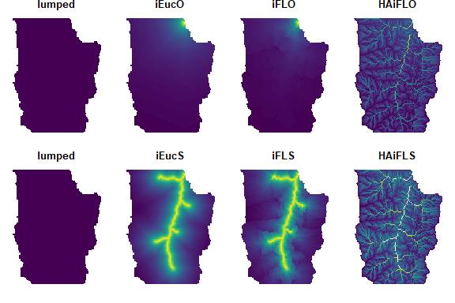
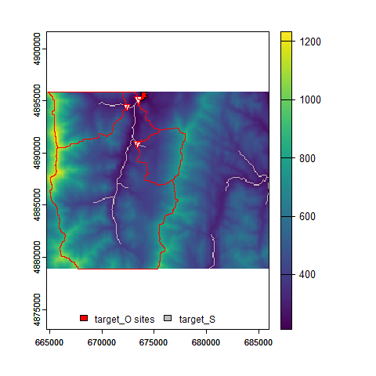
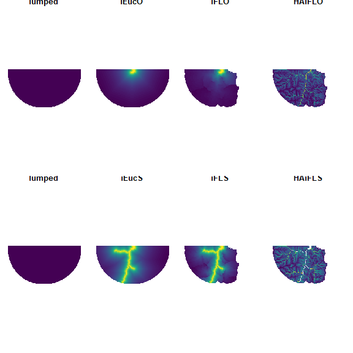
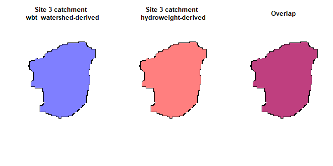
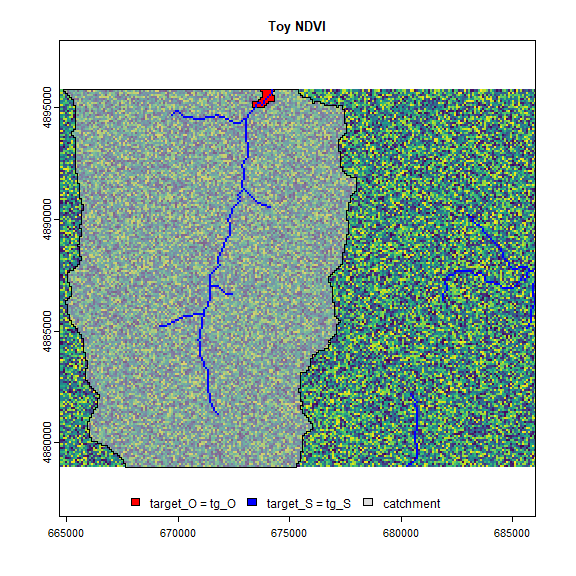
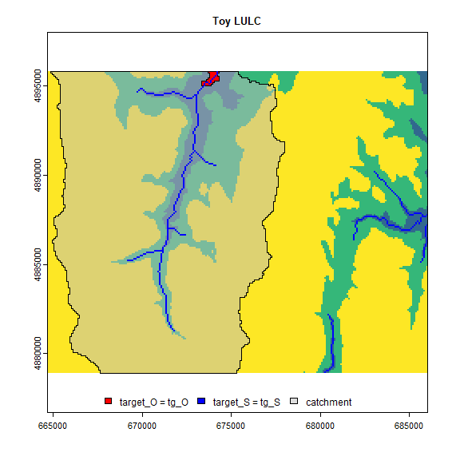
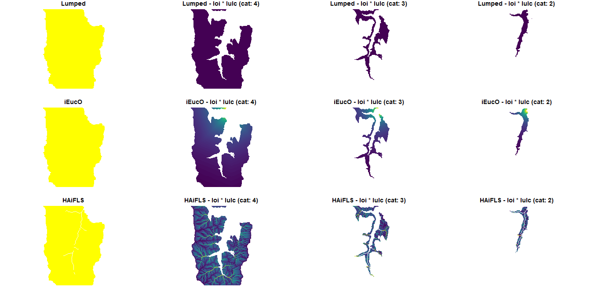

hydroweight: Inverse distance-weighted rasters and landscape attributes
================

<!-- README.md is generated from README.Rmd. Please edit that file -->

[](https://zenodo.org/badge/latestdoi/330996075)

## Contents

-   [1.0 Introduction](#10-introduction)
-   [2.0 System setup and
    installation](#20-system-setup-and-installation)
-   [3.0 Inverse distance-weighted rasters using
    `hydroweight()`](#30-inverse-distance-weighted-rasters-using-hydroweight)
-   [3.1 Generate toy terrain dataset](#31-generate-toy-terrain-dataset)
-   [3.2 Generate targets](#32-generate-targets)
-   [3.3 Run `hydroweight()`](#33-run-hydroweight)
-   [3.4 Run `hydroweight()` across a set of
    sites](#34-run-hydroweight-across-a-set-of-sites)
-   [3.5 Using `iFLO` output as catchment boundaries for
    `hydroweight_attributes()`](#35-using-iFLO-output-as-catchment-boundaries-for-hydroweight_attributes)
-   [4.0 Inverse distance-weighted rasters using
    `hydroweight_attributes()`](#40-inverse-distance-weighted-attributes-using-hydroweight_attributes)
-   [4.1 Using a numeric raster layer of
    interest](#41-using-a-numeric-raster-layer-of-interest)
-   [4.2 Using a categorical raster layer of
    interest](#42-using-a-categorical-raster-layer-of-interest)
-   [4.3 Using a polygon layer of interest with numeric data in the
    column](#43-using-a-polygon-layer-of-interest-with-numeric-data-in-the-column)
-   [4.4 Using a polygon layer of interest with categorical data in the
    column](#44-using-a-polygon-layer-of-interest-with-categorical-data-in-the-column)
-   [5.0 Inverse distance-weighted rasters and attributes across
    multiple layers and
    sites](#50-inverse-distance-weighted-rasters-and-attributes-across-multiple-sites-and-layers)
-   [5.1 Run hydroweight across sites](#51-Run-hydroweight-across-sites)
-   [5.2 Generate `loi` lists populated with `hydroweight_attributes()`
    parameters](#52-generate-loi-lists-populated-with-hydroweight_attributes-parameters)
-   [5.3 Run `hydroweight_attributes()` across sites and
    layers](#53-run-hydroweight_attributes-across-sites-and-layers)
-   [5.4 Extract and adjust results data
    frames](#54-extract-and-adjust-results-data-frames)
-   [6.0 Processing large amounts of
    data](#60-Processing-large-amounts-of-data)
-   [7.0 Future plans](#70-future-plans)
-   [8.0 Acknowledgements](#80-acknowledgements)
-   [9.0 References](#90-references)
-   [10.0 Copyright](#100-copyright)

## 1.0 Introduction



Environmental scientists often want to calculate landscape statistics
within upstream topographic contributing areas (i.e., catchments) to
examine their potential effects on a target (e.g., stream network point
or waterbody). When calculating landscape statistics like the proportion
of upstream urban cover, practitioners typically use a “lumped”
approach; this approach gives equal weighting to areas nearby and far
away from the target (Peterson et al. 2011).

A more spatially explicit approach could be to generate buffers of
successive distances away from the target and calculate the lumped
statistics. For example, one could calculate the proportion of urban
cover in a 250 m buffer and a 1000 m buffer from the target (Kielstra et
al. 2019).

Another approach is to calculate landscape statistics based on distances
to the target where areas nearby have more weight than those farther
away (i.e., inverse distance-weighting). A set of inverse distance
weighting scenarios for stream survey sites was described in Peterson
*et al.* (2011) that included various types of Euclidean and flow-path
distances to targets. Tools are implemented as *IDW-Plus* in *ArcGIS*
(Peterson et al. 2017) as well as in *rdwplus* in *R* through *GRASS
GIS* (Pearse et al. 2019).

***hydroweight*** replicates the above approaches but also provides a
set of simple and flexible functions to accommodate a wider set of
scenarios and statistics (e.g., numerical and categorical rasters and
polygons). It also uses the speedy WhiteboxTools (Lindsay 2016, Wu
2020).

There are two functions:

-   `hydroweight()` generates distance-weighted rasters for targets on a
    digital elevation model raster. Examples of targets include single
    points, areas such as lakes, or linear features such as streams. The
    function outputs a list of `length(weighting_scheme)` and an
    accompanying `*.rds` file of distance-weighted rasters for targets
    (`target_O` is a point/area target as in iFLO and `target_S` is a
    linear feature target as in iFLS in Peterson *et al.* 2011).
    IMPORTANTLY, this function acts on a single set of targets but can
    produce multiple weights. The distance-weighted rasters can be used
    for generating distance-weighted attributes with
    `hydroweight_attributes()` (e.g., % urban cover weighted by flow
    distance to a point). See `?hydroweight`.

-   `hydroweight_attributes()` calculates distance-weighted attributes
    using distance-weighted rasters generated in `hydroweight()`, an
    attribute layer (`loi`, e.g., land use raster/polygon), and a region
    of interest (`roi`, e.g., a catchment polygon). The function outputs
    an attribute summary table or a list that includes the summary table
    and layers used for calculation. Summary statistics are calculated
    as in Peterson *et al.* (2011). IMPORTANTLY, this function only
    produces one instance of the `loi` x `distance_weights` summary
    statistics (i.e., one `loi`, one `roi`, and one set of
    `distance_weights`). See `?hydroweight_attributes`.

Workflows are provided below to run these functions across multiple
sites and layers.

Distance weights defined by Peterson *et al.* (2011) are:

| Distance weight | Definition                                                                                                                          | Input layers required        |
|-----------------|-------------------------------------------------------------------------------------------------------------------------------------|------------------------------|
| lumped          | all weights = 1                                                                                                                     | `dem`, `target_O`/`target_S` |
| iEucO           | weighted inverse Euclidean distance to `target_O` (i.e., stream outlet)                                                             | `dem`, `target_O`            |
| iEucS           | weighted inverse Euclidean distance to `target_S` (i.e., streams)                                                                   | `dem`, `target_S`            |
| iFLO            | weighted inverse flow-path distance to `target_O` using d8 flow direction                                                           | `dem`, `target_O`            |
| HAiFLS          | hydrologically-active (proportional to flow accumulation) weighted inverse flow-path distance to `target_S` using d8 flow direction | `dem`, `target_S`, `accum`   |

[Back to top](#contents)

## 2.0 System setup and installation

*WhiteboxTools* and *whitebox* are required for ***hydroweight***. See
[whiteboxR](https://github.com/giswqs/whiteboxR) or below for
installation.

``` r
## Follow instructions for whitebox installation accordingly
## devtools::install_github("giswqs/whiteboxR") # For development version
## whitebox is now available on CRAN
#install.packages("whitebox")

library(whitebox)

if (F){
  install_whitebox()
  # Possible warning message:
  # ------------------------------------------------------------------------
  # Could not find WhiteboxTools!
  # ------------------------------------------------------------------------
  #
  # Your next step is to download and install the WhiteboxTools binary:
  #     > whitebox::install_whitebox()
  #
  # If you have WhiteboxTools installed already run `wbt_init(exe_path=...)`':
  #    > wbt_init(exe_path='/home/user/path/to/whitebox_tools')
  #
  # For whitebox package documentation, ask for help:
  #    > ??whitebox
  #
  # For more information visit https://giswqs.github.io/whiteboxR/
  #
  # ------------------------------------------------------------------------
}

## Install current version of hydroweight
#devtools::install_github("bkielstr/hydroweight@main")
```

[Back to top](#contents)

## 3.0 Inverse distance-weighted rasters using `hydroweight()`

### 3.1 Generate toy terrain dataset

We begin by bringing in our toy digital elevation model and using it to
generate terrain products.

``` r
## Load libraries
library(dplyr)
library(foreach)
library(future.apply)
library(hydroweight)
library(terra)
library(sf)
library(viridis)
library(whitebox)
library(mapview)

## Import toy_dem from whitebox package
toy_file<-sample_dem_data()
toy_file <- system.file("extdata", "DEM.tif", package = "whitebox")
toy_dem <- rast(x = toy_file) # reading the file from terra directly sometimes crashes R for some reason
crs(toy_dem) <- "epsg:3161"

## Generate hydroweight_dir as a temporary directory
hydroweight_dir <- tempdir()

## Write toy_dem to hydroweight_dir
writeRaster(
  x = toy_dem, filename = file.path(hydroweight_dir, "toy_dem.tif"),
  overwrite = TRUE
)

## Breach depressions to ensure continuous flow
wbt_breach_depressions(
  dem = file.path(hydroweight_dir, "toy_dem.tif"),
  output = file.path(hydroweight_dir, "toy_dem_breached.tif")
)

## Generate d8 flow pointer (note: other flow directions are available)
wbt_d8_pointer(
  dem = file.path(hydroweight_dir, "toy_dem_breached.tif"),
  output = file.path(hydroweight_dir, "toy_dem_breached_d8.tif")
)

## Generate d8 flow accumulation in units of cells (note: other flow directions are available)
wbt_d8_flow_accumulation(
  input = file.path(hydroweight_dir, "toy_dem_breached.tif"),
  output = file.path(hydroweight_dir, "toy_dem_breached_accum.tif"),
  out_type = "cells"
)

## Generate streams with a stream initiation threshold of 2000 cells
wbt_extract_streams(
  flow_accum = file.path(hydroweight_dir, "toy_dem_breached_accum.tif"),
  output = file.path(hydroweight_dir, "toy_dem_streams.tif"),
  threshold = 2000
)
```

[Back to top](#contents)

### 3.2 Generate toy targets

Next we generate a few targets below. Users can provide their own vector
or raster type targets (see `?hydroweight`). Targets are often called
*pour points* in the literature; here, targets can be a group of raster
cells, polygons, polylines, or points.

Our first target is a low lying area we will call a lake (`tg_O`). All
cells \<220 m elevation are assigned `TRUE` or `1` and those \>220 m are
assigned `NA`. We also generate its catchment (`tg_O_catchment`) using
`whitebox::wbt_watershed()`. Our target streams (`tg_S`) are loaded from
the `whitebox::wbt_extract_streams()` output. Finally, we do some
manipulation to the stream network raster to generate three points along
the stream network (`tg_O_multi`) and their catchments
(`tg_O_multi_catchment`).

``` r
## For hydroweight, there are target_O and target_S
## target_O is a target point/area for calculating distances
## target_S is a stream/linear feature target for calculating distances

## Generate target_O, tg_O, representing a lake.
tg_O <- toy_dem < 220
tg_O[tg_O != 1] <- NA
writeRaster(tg_O, file.path(hydroweight_dir, "tg_O.tif"), overwrite = TRUE)
tg_O <- terra::as.polygons(tg_O, dissolve = TRUE)
tg_O <- sf::st_as_sf(tg_O)

## Generate catchment for tg_O
wbt_watershed(
  d8_pntr = file.path(hydroweight_dir, "toy_dem_breached_d8.tif"),
  pour_pts = file.path(hydroweight_dir, "tg_O.tif"),
  output = file.path(hydroweight_dir, "tg_O_catchment.tif")
)

tg_O_catchment <- rast(file.path(hydroweight_dir, "tg_O_catchment.tif"))
tg_O_catchment <- as.polygons(tg_O_catchment, dissolve = TRUE)
tg_O_catchment <- st_as_sf(tg_O_catchment)
names(tg_O_catchment)[1]<-"Lake"

## Generate target_S, tg_S, representing the stream network
tg_S <- rast(file.path(hydroweight_dir, "toy_dem_streams.tif"))

## Generate target_O, tg_O, representing several points along stream network, and their catchments
tg_O_multi <- rast(file.path(hydroweight_dir, "toy_dem_streams.tif"))
tg_O_multi <- as.points(tg_O_multi)
tg_O_multi <- st_as_sf(tg_O_multi)
tg_O_multi <- tg_O_multi[st_coordinates(tg_O_multi)[, 1] < 675000, ] # selects single network
tg_O_multi <- tg_O_multi[c(10, 50, 100), ]
tg_O_multi$Site <- c(1, 2, 3)
tg_O_multi<-tg_O_multi[,-c(1)]

tg_O_multi_catchment <- foreach(xx = 1:nrow(tg_O_multi), .errorhandling = "pass") %do% {
  
  ## Take individual stream point and write to file
  sel <- tg_O_multi[xx, ]
  st_write(sel, file.path(hydroweight_dir, "tg_O_multi_single.shp"),
           delete_layer = TRUE, quiet = TRUE
  )
  
  ## Run watershed operation on stream point
  wbt_watershed(
    d8_pntr = file.path(hydroweight_dir, "toy_dem_breached_d8.tif"),
    pour_pts = file.path(hydroweight_dir, "tg_O_multi_single.shp"),
    output = file.path(hydroweight_dir, "tg_O_multi_single_catchment.tif")
  )
  
  ## Load catchment and convert to polygon with Site code.
  sel_catchment_r <- rast(file.path(hydroweight_dir, "tg_O_multi_single_catchment.tif"))
  sel_catchment_r <- as.polygons(sel_catchment_r, dissolve = TRUE)
  sel_catchment_r$Site <- sel$Site
  sel_catchment_r <- st_as_sf(sel_catchment_r)
  
  return(sel_catchment_r)
}
tg_O_multi_catchment <- bind_rows(tg_O_multi_catchment)

## Plot locations
par(mfrow = c(1, 1))
plot(toy_dem, legend = TRUE, col = viridis(101), cex.axis = 0.75, axis.args = list(cex.axis = 0.75))
plot(tg_S, col = "grey", add = TRUE, legend = FALSE)
plot(st_geometry(tg_O), col = "red", add = TRUE)
plot(st_geometry(tg_O_multi), col = "red", pch = 25, add = TRUE)
plot(st_geometry(tg_O_multi_catchment), col = NA, border = "red", add = TRUE)
legend("bottom", legend = c("target_O sites", "target_S"), fill = c("red", "grey"), horiz = TRUE, bty = "n", cex = 0.75)
```



[Back to top](#contents)

### 3.3 Run `hydroweight()`

Below, `hydroweight()` is run using our lake as `target_O` for iEucO,
iFLO, and HAiFLO, and using our streams as `target_S` for iEucS, iFLS,
and HAiFLS. For export of the distance-weighted rasters, we use “Lake”;
the .rds exported from `hydroweight()` to `hydroweight_dir` will now be
called “Lake_inv_distances.rds”. Since our DEM is small, we decide to
not clip our region (i.e., `clip_region = NULL`). Using
`OS_combine = TRUE`, we indicate that distances to the nearest water
feature will be either the lake or stream. Furthermore, for HAiFLO or
HAiFLS, both the lake and streams will be set to NoData for their
calculation as these represent areas of concentrated flow rather than
areas of direct terrestrial-aquatic interaction (see Peterson *et al.*
2011). Our `dem` and `flow_accum` are assigned using character strings
with the `.tif` files located in `hydroweight_dir`. Weighting schemes
and the inverse function are indicated.

Note that these distance-weighted rasters will eventually be clipped to
an `roi` - a region of interest like a site’s catchment - in
`hydroweight_attributes()`. The value for `clipped_region` is really
meant to decrease processing time of large rasters.

See `?hydroweight` for more details.

``` r
## Generate inverse distance-weighting function
myinv <- function(x) {
  (x * 0.001 + 1)^-1
} ## 0.001 multiplier turns m to km

## Plot inverse distance-weighting function
par(mfrow = c(1, 1))
x <- seq(from = 0, to = 10000, by = 100)
y <- myinv(x)
plot((x / 1000), y, type = "l", xlab = "Distance (km)", ylab = "Weight", bty = "L", cex.axis = 0.75, cex.lab = 0.75)
text(6, 0.8, expression("(Distance + 1)"^-1), cex = 0.75)
```


``` r
## Run hydroweight::hydroweight()
hw_test_1 <- hydroweight(
  hydroweight_dir = hydroweight_dir,
  target_O = tg_O,
  target_S = tg_S,
  target_uid = "Lake",
  clip_region = tg_O_multi_catchment[1,1],
  OS_combine = TRUE,
  dem = file.path(hydroweight_dir,"toy_dem_breached.tif"),
  flow_accum = file.path(hydroweight_dir,"toy_dem_breached_accum.tif"),
  weighting_scheme = c(
    "lumped", "iEucO", "iFLO", "HAiFLO",
    "iEucS", "iFLS", "HAiFLS"
  ),
  inv_function = myinv,
  clean_tempfiles=F
)

hw_test_1<-lapply(hw_test_1,rast)

## Resultant structure:
# length(hw_test_1) ## 1 set of targets and 7 distance-weighted rasters
# hw_test_1[[1]] ## lumped
# hw_test_1[[2]] ## iEucO
# hw_test_1[[3]] ## iFLO
# hw_test_1[[4]] ## HAiFLO
# hw_test_1[[5]] ## iEucS
# hw_test_1[[6]] ## iFLS
# hw_test_1[[7]] ## HAiFLS
# or
# hw_test_1[["lumped"]]
# hw_test_1[["iEucO"]] etc.

## Plot different weighting schemes; where purple --> yellow == low --> high weight
hw_test_1$HAiFLO<-log(hw_test_1$HAiFLO) # These two weighting schemes can get vary high weights due to flow accumulation,
hw_test_1$HAiFLS<-log(hw_test_1$HAiFLS) #  log transformation improves visualization

plot(rast(c(hw_test_1[1:4],hw_test_1$lumped,hw_test_1[5:7])),
     legend=F,axes=F,col=viridis(101),nc=4,mar=c(1.25,1.25,1.25,1.25),reset=T,cex.main = 1.25)
```


Important things to note from this plot:

-   Lumped is equal weighting where all values = 1.
-   iEucO and iEucS distances extend outward to the extent of the DEM.
-   For iFLO/HAiFLO/iFLS/HAiFLS, only distances in cells contributing to
    the areas of interest are included.
-   As in Peterson *et al.* (2011), for HAiFLS, the targets are set to
    NoData (i.e., NA) since they likely represent concentrated flow
    areas.

A few options to consider:

``` r
## Ignoring target_O
hw_test_2 <- hydroweight(
  hydroweight_dir = hydroweight_dir,
  target_S = tg_S,
  target_uid = "Lake",
  clip_region = NULL,
  dem = file.path(hydroweight_dir,"toy_dem_breached.tif"),
  flow_accum = file.path(hydroweight_dir,"toy_dem_breached_accum.tif"),
  weighting_scheme = c("lumped", "iEucS", "iFLS", "HAiFLS"),
  inv_function = myinv
)

hw_test_2<-lapply(hw_test_2,rast)
## Resultant structure:
# length(hw_test_3) ## 1 set of targets and 4 distance-weighted rasters
# hw_test_2[[1]] ## lumped
# hw_test_2[[2]] ## iEucS
# hw_test_2[[3]] ## iFLS
# hw_test_2[[4]] ## HAiFLS

## Ignoring target_S
hw_test_3 <- hydroweight(
  hydroweight_dir = hydroweight_dir,
  target_O = tg_O,
  target_uid = "Lake",
  dem = file.path(hydroweight_dir,"toy_dem_breached.tif"),
  flow_accum = file.path(hydroweight_dir,"toy_dem_breached_accum.tif"),
  weighting_scheme = c("lumped", "iEucO", "iFLO", "HAiFLO"),
  inv_function = myinv
)

hw_test_3<-lapply(hw_test_3,rast)

# length(hw_test_3) ## 1 set of targets and 4 distance-weighted rasters
# hw_test_3[[1]] ## lumped
# hw_test_3[[2]] ## iEucO
# hw_test_3[[3]] ## iFLO
# hw_test_3[[4]] ## HAiFLO

## Setting a clip region
hw_test_4 <- hydroweight(
  hydroweight_dir = hydroweight_dir,
  target_O = tg_O,
  target_S = tg_S,
  target_uid = "Lake",
  clip_region = sf::st_buffer(tg_O,8000),
  OS_combine = TRUE,
  dem = file.path(hydroweight_dir,"toy_dem_breached.tif"),
  flow_accum = file.path(hydroweight_dir,"toy_dem_breached_accum.tif"),
  weighting_scheme = c(
    "lumped", "iEucO", "iFLO", "HAiFLO",
    "iEucS", "iFLS", "HAiFLS"
  ),
  inv_function = myinv
)

hw_test_4<-lapply(hw_test_4,rast)

## Plot
hw_test_4$HAiFLO<-log(hw_test_4$HAiFLO) # These two weighting schemes can get vary high weights due to flow accumulation,
hw_test_4$HAiFLS<-log(hw_test_4$HAiFLS) #  log transformation improves visualization

plot(rast(c(hw_test_4[1:4],hw_test_4$lumped,hw_test_4[5:7])),
     legend=F,axes=F,col=viridis(101),nc=4,mar=c(1,1,1,1),reset=T,cex.main = 1.25)
```



[Back to top](#contents)

### 3.4 Run `hydroweight()` across a set of sites

We wanted users to access intermediate products and also anticipated
that layers and/or errors may be very case-specific. For these reasons,
we don’t *yet* provide an all-in-one solution for multiple sites and/or
layers of interest but provide workflows instead.

We advocate using `foreach` since it is `lapply`-like but passes along
errors to allow for later fixing. Linking `foreach` with `doParallel`
allows for parallel processing. (e.g., `foreach(...) %dopar%`). We have
not tested `whitebox` using parallel processing. However
`hydroweight_attributes()` can be run in parallel.

Since `hydroweight()` exports an `.rds` of its result to
`hydroweight_dir`, it allows users to assign the results of
`hydroweight()` to an object in the current environment or to run
`hydroweight()` alone and upload the `.rds` afterwards.

``` r
## Run hydroweight across sites found in stream points tg_O_multi/tg_O_multi_catchment
hw_test_5 <- foreach(xx = 1:nrow(tg_O_multi), .errorhandling = "pass") %do% {
  message("Running hydroweight for site ", xx, " at ", Sys.time())
  
  hw_test_xx <- hydroweight(
    hydroweight_dir = hydroweight_dir,
    target_O = tg_O_multi[xx, ], ## Important to change
    target_S = tg_S,
    target_uid = tg_O_multi$Site[xx], ## Important to change
    clip_region = NULL,
    OS_combine = TRUE,
    dem =  file.path(hydroweight_dir,"toy_dem_breached.tif"),
    flow_accum =  file.path(hydroweight_dir,"toy_dem_breached_accum.tif"),
    weighting_scheme = c(
      "lumped", "iEucO", "iFLO", "HAiFLO",
      "iEucS", "iFLS", "HAiFLS"
    ),
    inv_function = myinv
  )
  
  return(hw_test_xx)
}
#> Running hydroweight for site 1 at 2022-09-23 12:19:43
#> Running hydroweight for site 2 at 2022-09-23 12:20:31
#> Running hydroweight for site 3 at 2022-09-23 12:21:33

hw_test_5<-lapply(hw_test_5,function(x) lapply(x,rast))
## Resultant structure:
## length(hw_test_5) # 3 sites
## length(hw_test_5[[1]]) # 7 distance-weighted rasters for each site
## hw_test_5[[1]][[1]] # site 1, lumped
## hw_test_5[[1]][[2]] # site 1, iEucO
## hw_test_5[[1]][[3]] # site 1, iFLO
## hw_test_5[[1]][[4]] # site 1, HAiFLO
## hw_test_5[[1]][[5]] # site 1, iEucS
## hw_test_5[[1]][[6]] # site 1, iFLS
## hw_test_5[[1]][[7]] # site 1, HAiFLS
## ...
## ...
## ...
## hw_test_5[[3]][[7]] # site 3, HAiFLS

## Loading up data from .zip file
inv_distance_collect <- file.path(hydroweight_dir, paste0(tg_O_multi$Site, "_inv_distances.zip"))
inv_distance_collect <- lapply(inv_distance_collect, function(x) {
  fls<-unzip(x,list=T)
  fls<-file.path("/vsizip",x,fls$Name)
  x<-lapply(fls,terra::rast)
  names(x)<-sapply(x,names)
  return(x)
})

## Resultant structure:
## length(hw_test_5) # 3 sites
## length(hw_test_5[[1]]) # 7 distance-weighted rasters for each site
## hw_test_5[[1]][[1]] # site 1, lumped
## hw_test_5[[1]][[2]] # site 1, iEucO
## hw_test_5[[1]][[3]] # site 1, iFLO
## hw_test_5[[1]][[4]] # site 1, HAiFLO
## hw_test_5[[1]][[5]] # site 1, iEucS
## hw_test_5[[1]][[6]] # site 1, iFLS
## hw_test_5[[1]][[7]] # site 1, HAiFLS
## ...
## ...
## ...
## hw_test_5[[3]][[7]] # site 3, HAiFLS

## Plot sites, their catchments, and their respective distance-weighted iFLO rasters

par(mfrow = c(1, 3), mar = c(1, 1, 1, 1), oma = c(0, 0, 0, 0))
plot(st_geometry(tg_O_multi_catchment), col = "grey", border = "white", main = "Site 1 - iFLO")
plot(hw_test_5[[1]][[3]], axes = F, legend = F, col = viridis(101), add = T)
plot(st_geometry(tg_O_multi_catchment), col = "grey", border = "white", main = "Site 2 - iFLO")
plot(hw_test_5[[2]][[3]], axes = F, legend = F, col = viridis(101), add = T)
plot(st_geometry(tg_O_multi_catchment), col = "grey", border = "white", main = "Site 3 - iFLO")
plot(hw_test_5[[3]][[3]], axes = F, legend = F, col = viridis(101), add = T)
```


[Back to top](#contents)

### 3.5 Using `iFLO` output as catchment boundaries for `hydroweight_attributes()`

An advantage of using `hydroweight()` is that an iFLO-derived product
can be used as a catchment boundary in subsequent operations. iFLO uses
`whitebox::wbt_downslope_distance_to_stream` that uses a D8 flow-routing
algorithm to trace the flow path. Converting all non-`NA` iFLO distances
will yield a catchment boundary analogous to
`whitebox::wbt_watershed()`. However, we have noticed minor
inconsistencies when comparing catchments derived from the two
procedures when catchment boundaries fall along DEM edges. The procedure
for deriving the catchment boundary for Site 3 is below.

``` r
## Pull out iFLO from Site 3, convert non-NA values to 1, then to polygons, then to sf
site3_catchment <- hw_test_5[[3]][["iFLO"]]
site3_catchment[!is.na(site3_catchment)] <- 1
site3_catchment <- as.polygons(site3_catchment, dissolve = T)
site3_catchment <- st_as_sf(site3_catchment)

## Compare
par(mfrow = c(1, 3))
plot(st_geometry(tg_O_multi_catchment[3, ]),
     col = adjustcolor("blue", alpha.f = 0.5),
     main = "Site 3 catchment \n wbt_watershed-derived"
)
plot(st_geometry(site3_catchment),
     col = adjustcolor("red", alpha.f = 0.5),
     main = "Site 3 catchment \n hydroweight-derived"
)
plot(st_geometry(site3_catchment), col = adjustcolor("blue", alpha.f = 0.5), main = "Overlap")
plot(st_geometry(tg_O_multi_catchment[3, ]), col = adjustcolor("red", alpha.f = 0.5), main = "Overlap", add = T)
```



[Back to top](#contents)

## 4.0 Inverse distance-weighted attributes using `hydroweight_attributes()`

`hydroweight_attributes()` uses `hydroweight()` output and layers of
interest (`loi`) to calculate distance-weighted attributes within a
region of interest (`roi`). Inputs can be numeric rasters, categorical
rasters, and polygon data with either numeric or categorical data in the
columns. Internally, all layers are projected to or rasterized to the
spatial resolution of the `hydroweight()` output (i.e., the original
DEM).

For numeric inputs, the distance-weighted mean and standard deviation
for each `roi`:`loi` combination are calculated using

<p align="center">

</p>
<p align="center">

</p>

where  is the number of
cells,  are the
cell weights, and 
are `loi` cell values, 
is the number or non-zero weights, and

is the weighted mean. For categorical inputs, the proportion for each
`roi`:`loi` combination is calculated using

<p align="center">

</p>

where
=1")
when category  is
present in a cell or
=0")
when not.

Finally, `loi` `NA` values are handled differently depending on `loi`
type. For numeric, `NA` cells are excluded from all calculations. If
`cell_count` is specified in `loi_statistics` (see below), count of
non-`NA` cells and `NA` cells are returned in the attribute table. For
categorical, `NA` cells are considered a category and are included in
the calculated proportions. A `prop_NA` column is included in the
attribute table. The `lumped_"loi"_prop_NA` would be the true proportion
of `NA` cells whereas other columns would be their respective
distance-weighted `NA` proportions. This could allow the user to
re-calculate proportions using non-`NA` values only.

### 4.1 Using a numeric raster layer of interest

Using the results of `hydroweight()` (i.e., a list of distance-weighted
rasters), we generate distance-weighted attributes for a single site
across the weighting schemes.

First, we generate a numeric raster layer of interest `loi = ndvi` and
then summarize those cells falling within the region of interest,
`roi = tg_O_catchment`, for each distance-weighted raster in `tw_test_1`
(all weighting schemes, see above). See `?hydroweight_attributes` for
`loi_`- and `roi_`-specific information indicating type of data and how
results are returned.

``` r
## Construct continuous dataset
ndvi <- toy_dem
values(ndvi) <- runif(n = (dim(ndvi)[1] * dim(ndvi)[2]), min = 0, max = 1)
names(ndvi) <- "ndvi"

hwa_test_numeric <- hydroweight_attributes(
  #loi = ndvi,
  loi = rast(list(setNames(ndvi,"ndvi1"),setNames(ndvi,"ndvi2"))),
  loi_columns=c("ndvi1","ndvi2"),
  loi_numeric = TRUE,
  loi_numeric_stats = c("distwtd_mean", "distwtd_sd", "mean", "sd", "median", "min", "max", "cell_count"),
  roi = tg_O_catchment,
  roi_uid = "1",
  roi_uid_col = "Lake",
  distance_weights = hw_test_1,#file.path(hydroweight_dir,"Lake_inv_distances.zip"),
  remove_region = tg_O,
  return_products = TRUE
)
names(hwa_test_numeric$attribute_table)
#>  [1] "Lake"                      "ndvi1_lumped_mean"        
#>  [3] "ndvi2_lumped_mean"         "ndvi1_lumped_sd"          
#>  [5] "ndvi2_lumped_sd"           "ndvi1_lumped_median"      
#>  [7] "ndvi2_lumped_median"       "ndvi1_lumped_min"         
#>  [9] "ndvi2_lumped_min"          "ndvi1_lumped_max"         
#> [11] "ndvi2_lumped_max"          "ndvi1_lumped_cell_count"  
#> [13] "ndvi2_lumped_cell_count"   "ndvi1_iEucO_distwtd_mean" 
#> [15] "ndvi2_iEucO_distwtd_mean"  "ndvi1_iEucO_distwtd_sd"   
#> [17] "ndvi2_iEucO_distwtd_sd"    "ndvi1_iFLO_distwtd_mean"  
#> [19] "ndvi2_iFLO_distwtd_mean"   "ndvi1_iFLO_distwtd_sd"    
#> [21] "ndvi2_iFLO_distwtd_sd"     "ndvi1_HAiFLO_distwtd_mean"
#> [23] "ndvi2_HAiFLO_distwtd_mean" "ndvi1_HAiFLO_distwtd_sd"  
#> [25] "ndvi2_HAiFLO_distwtd_sd"   "ndvi1_iEucS_distwtd_mean" 
#> [27] "ndvi2_iEucS_distwtd_mean"  "ndvi1_iEucS_distwtd_sd"   
#> [29] "ndvi2_iEucS_distwtd_sd"    "ndvi1_iFLS_distwtd_mean"  
#> [31] "ndvi2_iFLS_distwtd_mean"   "ndvi1_iFLS_distwtd_sd"    
#> [33] "ndvi2_iFLS_distwtd_sd"     "ndvi1_HAiFLS_distwtd_mean"
#> [35] "ndvi2_HAiFLS_distwtd_mean" "ndvi1_HAiFLS_distwtd_sd"  
#> [37] "ndvi2_HAiFLS_distwtd_sd"

hwa_test_numeric$return_products<-lapply(hwa_test_numeric$return_products,function(x) lapply(x,rast))

## Resultant structure
## length(hw_test_numeric) # Length 2; 1) attribute table, 2) processing components for 7 inputted distance-weighted rasters
## hw_test_numeric[[1]] == hw_test_numeric$attribute_table # Attribute table
## hw_test_numeric[[2]] == hw_test_numeric$return_products # Processing components for 7 inputted distance-weighted rasters
## hw_test_numeric$return_products$lumped # Processing components used in calculating lumped statistics
## hwa_test_numeric$return_products$lumped$`loi_Raster*_bounded` # Processed loi used in calculating lumped attribute statistics
## hwa_test_numeric$return_products$lumped$distance_weights_bounded # Processed distance-weighted raster used in calculating lumped attribute statistics
## ...
## ...
## ...
## hwa_test_numeric$return_products$HAiFLS$distance_weights_bounded # Processed distance-weighted raster used in calculating HAiFLS attribute statistics

## Plot
par(mfrow = c(1, 1))
plot(ndvi, axes = F, legend = F, col = viridis(101), main = "Toy NDVI")
plot(st_geometry(tg_O_catchment), col = adjustcolor("grey", alpha.f = 0.5), add = T)
plot(st_geometry(tg_O), col = "red", add = T)
plot(tg_S, col = "blue", add = T, legend = FALSE)
legend("bottom",
       legend = c("target_O = tg_O", "target_S = tg_S", "catchment"),
       fill = c("red", "blue", adjustcolor("grey", alpha.f = 0.5)), horiz = TRUE, bty = "n", cex = 0.75
)
```



``` r
## Plot results

plot(
  rast(
    list(
      hw_test_1$lumped,hwa_test_numeric$return_products$lumped$loi_dist_rast[[1]],
      hw_test_1$iFLO,hwa_test_numeric$return_products$iFLO$loi_dist_rast[[1]],
      hw_test_1$HAiFLS,hwa_test_numeric$return_products$HAiFLS$loi_dist_rast[[1]]
    )),
  col=viridis(50),
  main=c("Lumped - distance_weights","Lumped - distance_weights * ndvi",
         "iFLO - distance_weights","iFLO - distance_weights * ndvi",
         "HAiFLS - distance_weights","HAiFLS - distance_weights * ndvi"),
  axes = F, legend = F,cex.main = 1.25,
  nc=2,mar=c(1.5,1.5,1.5,1.5),reset=T)
```


[Back to top](#contents)

### 4.2 Using a categorical raster layer of interest

Here, we generate a categorical raster layer of interest `loi = lulc`
and then summarize those cells falling within the region of interest,
`roi = tg_O_catchment`, for each distance-weighted raster in `tw_test_1`
(all weighting schemes, see above). See `?hydroweight_attributes` for
`loi_`- and `roi_`-specific information indicating type of data and how
results are returned.

``` r
## Construct categorical dataset by reclassify elevation values into categories
## All values > 0 and <= 220 become 1, etc. 
lulc <- toy_dem
m <- c(0, 220, 1, 220, 300, 2, 300, 400, 3, 400, Inf, 4) 
rclmat <- matrix(m, ncol = 3, byrow = TRUE)
lulc <- classify(lulc, rclmat)
names(lulc)<-"lulc"

## For each distance weight from hydroweight_test above, calculate the landscape statistics for lulc
hwa_test_categorical <- hydroweight_attributes(
  loi = rast(list(setNames(lulc,"lulc1"),setNames(lulc,"lulc2"))),
  loi_numeric = FALSE,
  roi = tg_O_catchment,
  roi_uid = "1",
  roi_uid_col = "Lake",
  distance_weights = hw_test_1,
  remove_region = tg_O,
  return_products = TRUE
)
names(hwa_test_categorical$attribute_table)
#>  [1] "Lake"                "lulc1_1_iEucO_prop"  "lulc1_2_iEucO_prop" 
#>  [4] "lulc1_3_iEucO_prop"  "lulc1_4_iEucO_prop"  "lulc2_1_iEucO_prop" 
#>  [7] "lulc2_2_iEucO_prop"  "lulc2_3_iEucO_prop"  "lulc2_4_iEucO_prop" 
#> [10] "lulc1_1_iFLO_prop"   "lulc1_2_iFLO_prop"   "lulc1_3_iFLO_prop"  
#> [13] "lulc1_4_iFLO_prop"   "lulc2_1_iFLO_prop"   "lulc2_2_iFLO_prop"  
#> [16] "lulc2_3_iFLO_prop"   "lulc2_4_iFLO_prop"   "lulc1_1_HAiFLO_prop"
#> [19] "lulc1_2_HAiFLO_prop" "lulc1_3_HAiFLO_prop" "lulc1_4_HAiFLO_prop"
#> [22] "lulc2_1_HAiFLO_prop" "lulc2_2_HAiFLO_prop" "lulc2_3_HAiFLO_prop"
#> [25] "lulc2_4_HAiFLO_prop" "lulc1_1_iEucS_prop"  "lulc1_2_iEucS_prop" 
#> [28] "lulc1_3_iEucS_prop"  "lulc1_4_iEucS_prop"  "lulc2_1_iEucS_prop" 
#> [31] "lulc2_2_iEucS_prop"  "lulc2_3_iEucS_prop"  "lulc2_4_iEucS_prop" 
#> [34] "lulc1_1_iFLS_prop"   "lulc1_2_iFLS_prop"   "lulc1_3_iFLS_prop"  
#> [37] "lulc1_4_iFLS_prop"   "lulc2_1_iFLS_prop"   "lulc2_2_iFLS_prop"  
#> [40] "lulc2_3_iFLS_prop"   "lulc2_4_iFLS_prop"   "lulc1_1_HAiFLS_prop"
#> [43] "lulc1_2_HAiFLS_prop" "lulc1_3_HAiFLS_prop" "lulc1_4_HAiFLS_prop"
#> [46] "lulc2_1_HAiFLS_prop" "lulc2_2_HAiFLS_prop" "lulc2_3_HAiFLS_prop"
#> [49] "lulc2_4_HAiFLS_prop"

hwa_test_categorical$return_products<-lapply(hwa_test_categorical$return_products,function(x) lapply(x,rast))

## Resultant structure
## length(hw_test_categorical) # Length 2; 1) attribute table, 2) processing components for 7 inputted distance-weighted rasters
## hw_test_categorical[[1]] == hw_test_categorical$attribute_table # Attribute table
## hw_test_categorical[[2]] == hw_test_categorical$return_products # Processing components for 7 inputted distance-weighted rasters
## hw_test_categorical$return_products$lumped # Processing components used in calculating lumped statistics
## hwa_test_categorical$return_products$lumped$`loi_Raster*_bounded` # Processed loi used in calculating lumped attribute statistics
## hwa_test_categorical$return_products$lumped$distance_weights_bounded # Processed distance-weighted raster used in calculating lumped attribute statistics
## ...
## ...
## ...
## hwa_test_categorical$return_products$HAiFLS$distance_weights_bounded # Processed distance-weighted raster used in calculating HAiFLS attribute statistics

## Plot
par(mfrow = c(1, 1))
plot(lulc, axes = F, legend = F, col = viridis(4), main = "Toy LULC")
plot(st_geometry(tg_O_catchment), col = adjustcolor("grey", alpha.f = 0.5), add = T)
plot(tg_O, col = "red", add = T, legend = FALSE)
plot(tg_S, col = "blue", add = T, legend = FALSE)
legend("bottom",
       legend = c("target_O = tg_O", "target_S = tg_S", "catchment"),
       fill = c("red", "blue", adjustcolor("grey", alpha.f = 0.5)), horiz = TRUE, bty = "n", cex = 0.75
)
```



``` r
## Plot results
par(mfrow = c(3, 4), mar = c(1, 1, 1, 1), oma = c(0, 0, 0, 0), cex = 0.75)

## Lumped
plot(st_as_sfc(st_bbox(tg_O_catchment)), border = "white", main = "Lumped")
plot(hw_test_1$lumped,
     axes = F, legend = F, col = "yellow", add = TRUE
)
plot(st_as_sfc(st_bbox(tg_O_catchment)), border = "white", main = "Lumped - loi * lulc (cat: 4)")
plot(hwa_test_categorical$return_products$lumped$loi_dist_rast$lulc1_4,
     axes = F, legend = F, col = viridis(101), add = TRUE
)
plot(st_as_sfc(st_bbox(tg_O_catchment)), border = "white", main = "Lumped - loi * lulc (cat: 3)")
plot(hwa_test_categorical$return_products$lumped$loi_dist_rast$lulc1_3,
     axes = F, legend = F, col = viridis(101), add = TRUE
)
plot(st_as_sfc(st_bbox(tg_O_catchment)), border = "white", main = "Lumped - loi * lulc (cat: 2)")
plot(hwa_test_categorical$return_products$lumped$loi_dist_rast$lulc1_2,
     axes = F, legend = F, col = viridis(101), add = TRUE
)

## iEucO
plot(st_as_sfc(st_bbox(tg_O_catchment)), border = "white", main = "iEucO")
plot(hw_test_1$iEucO,
     axes = F, legend = F, col = "yellow", add = TRUE
)
plot(st_as_sfc(st_bbox(tg_O_catchment)), border = "white", main = "iEucO - loi * lulc (cat: 4)")
plot(hwa_test_categorical$return_products$iEucO$loi_dist_rast$lulc1_4,
     axes = F, legend = F, col = viridis(101), add = TRUE
)
plot(st_as_sfc(st_bbox(tg_O_catchment)), border = "white", main = "iEucO - loi * lulc (cat: 3)")
plot(hwa_test_categorical$return_products$iEucO$loi_dist_rast$lulc1_3,
     axes = F, legend = F, col = viridis(101), add = TRUE
)
plot(st_as_sfc(st_bbox(tg_O_catchment)), border = "white", main = "iEucO - loi * lulc (cat: 2)")
plot(hwa_test_categorical$return_products$iEucO$loi_dist_rast$lulc1_2,
     axes = F, legend = F, col = viridis(101), add = TRUE
)

## HAiFLS
plot(st_as_sfc(st_bbox(tg_O_catchment)), border = "white", main = "HAiFLS")
plot(hw_test_1$HAiFLS,
     axes = F, legend = F, col = "yellow", add = TRUE
)
plot(st_as_sfc(st_bbox(tg_O_catchment)), border = "white", main = "HAiFLS - loi * lulc (cat: 4)")
plot(hwa_test_categorical$return_products$HAiFLS$loi_dist_rast$lulc1_4,
     axes = F, legend = F, col = viridis(101), add = TRUE
)
plot(st_as_sfc(st_bbox(tg_O_catchment)), border = "white", main = "HAiFLS - loi * lulc (cat: 3)")
plot(hwa_test_categorical$return_products$HAiFLS$loi_dist_rast$lulc1_3,
     axes = F, legend = F, col = viridis(101), add = TRUE
)
plot(st_as_sfc(st_bbox(tg_O_catchment)), border = "white", main = "HAiFLS - loi * lulc (cat: 2)")
plot(hwa_test_categorical$return_products$HAiFLS$loi_dist_rast$lulc1_2,
     axes = F, legend = F, col = viridis(101), add = TRUE
)
```



[Back to top](#contents)

### 4.3 Using a polygon layer of interest with numeric data in the column

Here, we use `lulc` and polygonize the raster to `lulc_p`. We then
generate some numeric data in the polygon layer called `var_1` and
`var_2`. We then spatially summarize the numeric data in those two
columns using `hydroweight_attributes()`.

Internally, the `lulc` polygons are rasterized using `distance_weights`
as the template. This basically treats the columns as if they were
individual numeric raster layers. Landscape statistics are calculated
accordingly (e.g., distance-weighted mean). Those cells falling within
the region of interest, `roi = tg_O_catchment`, for each
distance-weighted raster in `tw_test_1` (all weighting schemes, see
above). See `?hydroweight_attributes` for `loi_`- and `roi_`-specific
information indicating type of data and how results are returned.

``` r
## Construct polygons with numeric data by converting lulc to polygons and assigning values to columns
lulc_p <- as.polygons(lulc, dissolve = T, na.rm = T)
lulc_p <- st_as_sf(lulc_p)

set.seed(123)
lulc_p$var_1 <- sample(c(1:10), size = 4, replace = TRUE)
set.seed(123)
lulc_p$var_2 <- sample(c(20:30), size = 4, replace = TRUE)

## For each distance weight from hydroweight_test above, calculate the landscape statistics for lulc_p
hwa_test_numeric_polygon <- hydroweight_attributes(
  loi = lulc_p,
  loi_columns = c("var_1", "var_2"),
  loi_numeric = TRUE,
  loi_numeric_stats = c("distwtd_mean", "distwtd_sd", "mean", "sd", "min", "max", "cell_count"),
  roi = tg_O_catchment,
  roi_uid = "1",
  roi_uid_col = "Lake",
  distance_weights = hw_test_1,
  remove_region = tg_O,
  return_products = TRUE
)
#> Warning in sqrt(unlist(term1)/unlist(term2)): NaNs produced
names(hwa_test_numeric_polygon$attribute_table)
#>  [1] "Lake"                      "var_1_lumped_mean"        
#>  [3] "var_2_lumped_mean"         "var_1_lumped_sd"          
#>  [5] "var_2_lumped_sd"           "var_1_lumped_min"         
#>  [7] "var_2_lumped_min"          "var_1_lumped_max"         
#>  [9] "var_2_lumped_max"          "var_1_lumped_cell_count"  
#> [11] "var_2_lumped_cell_count"   "var_1_iEucO_distwtd_mean" 
#> [13] "var_2_iEucO_distwtd_mean"  "var_1_iEucO_distwtd_sd"   
#> [15] "var_2_iEucO_distwtd_sd"    "var_1_iFLO_distwtd_mean"  
#> [17] "var_2_iFLO_distwtd_mean"   "var_1_iFLO_distwtd_sd"    
#> [19] "var_2_iFLO_distwtd_sd"     "var_1_HAiFLO_distwtd_mean"
#> [21] "var_2_HAiFLO_distwtd_mean" "var_1_HAiFLO_distwtd_sd"  
#> [23] "var_2_HAiFLO_distwtd_sd"   "var_1_iEucS_distwtd_mean" 
#> [25] "var_2_iEucS_distwtd_mean"  "var_1_iEucS_distwtd_sd"   
#> [27] "var_2_iEucS_distwtd_sd"    "var_1_iFLS_distwtd_mean"  
#> [29] "var_2_iFLS_distwtd_mean"   "var_1_iFLS_distwtd_sd"    
#> [31] "var_2_iFLS_distwtd_sd"     "var_1_HAiFLS_distwtd_mean"
#> [33] "var_2_HAiFLS_distwtd_mean" "var_1_HAiFLS_distwtd_sd"  
#> [35] "var_2_HAiFLS_distwtd_sd"
hwa_test_numeric_polygon$return_products<-lapply(hwa_test_numeric_polygon$return_products,function(x) lapply(x,rast))

## Resultant structure
## length(hw_test_numeric_polygon) # Length 2; 1) attribute table, 2) processing components for 7 inputted distance-weighted rasters
## hw_test_numeric_polygon[[1]] == hw_test_numeric_polygon$attribute_table # Attribute table
## hw_test_numeric_polygon[[2]] == hw_test_numeric_polygon$return_products # Processing components for 7 inputted distance-weighted rasters
## hw_test_numeric_polygon$return_products$lumped # Processing components used in calculating lumped statistics
## hwa_test_numeric_polygon$return_products$lumped$`loi_Raster*_bounded` # Processed loi used in calculating lumped attribute statistics
## hwa_test_numeric_polygon$return_products$lumped$distance_weights_bounded # Processed distance-weighted raster used in calculating lumped attribute statistics
## ...
## ...
## ...
## hwa_test_numeric_polygon$return_products$HAiFLS$distance_weights_bounded # Processed distance-weighted raster used in calculating HAiFLS attribute statistics
```

[Back to top](#contents)

### 4.4 Using a polygon layer of interest with categorical data in the column

Here, we continue to use `lulc_p` but specify `loi_numeric = FALSE`
indicating the data are categorical rather than numeric. Note the final
number in the column names of the summary table is the “category” that
was summarized.

``` r
## Construct polygons with categorical data by converting lulc to polygons and assigning values to columns
lulc_p <- as.polygons(lulc, dissolve = T, na.rm = T)
lulc_p <- st_as_sf(lulc_p)

set.seed(123)
lulc_p$var_1 <- sample(c(1:10), size = 4, replace = TRUE)
set.seed(123)
lulc_p$var_2 <- sample(c(20:30), size = 4, replace = TRUE)

## For each distance weight from hydroweight_test above, calculate the landscape statistics for lulc_p
hwa_test_categorical_polygon <- hydroweight_attributes(
  loi = lulc_p,
  loi_columns = c("var_1", "var_2"),
  loi_numeric = FALSE,
  roi = tg_O_catchment,
  roi_uid = "1",
  roi_uid_col = "Lake",
  distance_weights = hw_test_1,
  remove_region = tg_O,
  return_products = TRUE
)
names(hwa_test_categorical_polygon$attribute_table)
#>  [1] "Lake"                 "var_1_2_iEucO_prop"   "var_1_3_iEucO_prop"  
#>  [4] "var_1_10_iEucO_prop"  "var_2_21_iEucO_prop"  "var_2_22_iEucO_prop" 
#>  [7] "var_2_29_iEucO_prop"  "var_1_2_iFLO_prop"    "var_1_3_iFLO_prop"   
#> [10] "var_1_10_iFLO_prop"   "var_2_21_iFLO_prop"   "var_2_22_iFLO_prop"  
#> [13] "var_2_29_iFLO_prop"   "var_1_2_HAiFLO_prop"  "var_1_3_HAiFLO_prop" 
#> [16] "var_1_10_HAiFLO_prop" "var_2_21_HAiFLO_prop" "var_2_22_HAiFLO_prop"
#> [19] "var_2_29_HAiFLO_prop" "var_1_2_iEucS_prop"   "var_1_3_iEucS_prop"  
#> [22] "var_1_10_iEucS_prop"  "var_2_21_iEucS_prop"  "var_2_22_iEucS_prop" 
#> [25] "var_2_29_iEucS_prop"  "var_1_2_iFLS_prop"    "var_1_3_iFLS_prop"   
#> [28] "var_1_10_iFLS_prop"   "var_2_21_iFLS_prop"   "var_2_22_iFLS_prop"  
#> [31] "var_2_29_iFLS_prop"   "var_1_2_HAiFLS_prop"  "var_1_3_HAiFLS_prop" 
#> [34] "var_1_10_HAiFLS_prop" "var_2_21_HAiFLS_prop" "var_2_22_HAiFLS_prop"
#> [37] "var_2_29_HAiFLS_prop"

## Resultant structure
## length(hw_test_categorical_polygon) # Length 2; 1) attribute table, 2) processing components for 7 inputted distance-weighted rasters
## hw_test_categorical_polygon[[1]] == hw_test_categorical_polygon$attribute_table # Attribute table
## hw_test_categorical_polygon[[2]] == hw_test_categorical_polygon$return_products # Processing components for 7 inputted distance-weighted rasters
## hw_test_categorical_polygon$return_products$lumped # Processing components used in calculating lumped statistics
## hwa_test_categorical_polygon$return_products$lumped$`loi_Raster*_bounded` # Processed loi used in calculating lumped attribute statistics
## hwa_test_categorical_polygon$return_products$lumped$distance_weights_bounded # Processed distance-weighted raster used in calculating lumped attribute statistics
## ...
## ...
## ...
## hwa_test_categorical_polygon$return_products$HAiFLS$distance_weights_bounded # Processed distance-weighted raster used in calculating HAiFLS attribute statistics
```

[Back to top](#contents)

## 5.0 Inverse distance-weighted rasters and attributes across multiple sites and layers

Now that we are familiar with the results structure of `hydroweight()`
and `hydroweight_attributes()`, we use our stream points to demonstrate
how to chain an analysis together across sites, distances weights, and
layers of interest.

The basic chain looks like this this:

-   For each site: Run `hydroweight()`
-   For each layer of interest: Run `hydroweight_attributes()`

Here, we try to make the code easier to troubleshoot rather than make it
look pretty:

### 5.1 Run `hydroweight()` across sites

``` r
## Sites and catchments
# tg_O_multi ## sites
# tg_O_multi_catchment ## catchments

cl <- parallel::makeCluster(3)
doParallel::registerDoParallel(cl)

sites_weights <- foreach(xx = 1:nrow(tg_O_multi), .errorhandling = "pass") %dopar% { 
  #note other parallel backends work as well (i.e., future.apply)
  #when running in with foreach parallel, must specify libraries in function call
  require(sf)
  require(terra)
  require(hydroweight)
  
  ## Distance-weighted raster component
  message("\n******Running hydroweight() on Site ", xx, " of ", nrow(tg_O_multi), " ", Sys.time(), "******")
  
  ## Select individual sites and catchments
  sel <- tg_O_multi[xx, ]
  write_sf(sel,file.path(hydroweight_dir,paste0("Site_",sel$Site,".shp"))) #parallel execution is best done with file paths rather than objects
  
  sel_roi <- subset(tg_O_multi_catchment, Site == sel$Site)
  write_sf(sel_roi,file.path(hydroweight_dir,paste0("ROI_",sel$Site,".shp"))) #parallel execution is best done with file paths rather than objects
  
  ## Run hydroweight
  site_weights <- hydroweight(
    hydroweight_dir = hydroweight_dir,
    target_O = file.path(hydroweight_dir,paste0("Site_",sel$Site,".shp")), ## Important to change
    target_S = file.path(hydroweight_dir, "toy_dem_streams.tif"),
    target_uid = sel$Site[xx], ## Important to change
    clip_region =file.path(hydroweight_dir,paste0("ROI_",sel$Site,".shp")),
    OS_combine = TRUE,
    dem = file.path(hydroweight_dir,"toy_dem_breached.tif"),
    flow_accum = file.path(hydroweight_dir,"toy_dem_breached_accum.tif"),
    weighting_scheme = c(
      "lumped", "iEucO", "iFLO", "HAiFLO",
      "iEucS", "iFLS", "HAiFLS"
    ),
    inv_function = myinv
  )
}

parallel::stopCluster(cl)

names(sites_weights) <- tg_O_multi$Site

## Resultant structure:
## length(sites_weights) # 3 sites
## length(sites_weights[[1]]) # 7 distance-weighted rasters for each site
## sites_weights[[1]][[1]] # site 1, lumped
## sites_weights[[1]][[2]] # site 1, iEucO
## sites_weights[[1]][[3]] # site 1, iFLO
## sites_weights[[1]][[4]] # site 1, HAiFLO
## sites_weights[[1]][[5]] # site 1, iEucS
## sites_weights[[1]][[6]] # site 1, iFLS
## sites_weights[[1]][[7]] # site 1, HAiFLS
## ...
## ...
## ...
## sites_weights[[3]][[7]] # site 3, HAiFLS
```

### 5.2 Generate `loi` lists populated with `hydroweight_attributes()` parameters

``` r
## Layers of interest
# ndvi ## numeric raster
# lulc ## categorical raster
# lulc_p_n ## polygon with variables var_1 and var_2 as numeric
# lulc_p_c ## polygon with variables var_1 and var_2 as categorical

loi_ndvi <- list(
  loi = ndvi, loi_attr_col = "ndvi", loi_numeric = TRUE,
  loi_numeric_stats = c("distwtd_mean", "distwtd_sd", "mean", "sd", "min", "max", "cell_count")
)

loi_lulc <- list(
  loi = lulc, loi_attr_col = "lulc", loi_numeric = FALSE
)

loi_lulc_p_n <- list(
  loi = lulc_p, loi_attr_col = "lulc", loi_numeric = TRUE,
  loi_columns = c("var_1", "var_2"),
  loi_numeric_stats = c("distwtd_mean", "distwtd_sd", "mean", "sd", "min", "max", "cell_count")
)

loi_lulc_p_c <- list(
  loi = lulc_p, loi_attr_col = "lulc", loi_numeric = FALSE,
  loi_columns = c("var_1", "var_2")
)

## These are combined into a list of lists
loi_variable <- list(loi_ndvi, loi_lulc, loi_lulc_p_n, loi_lulc_p_c)


# To save processing time, convert all inputs into rasters matching DEM
## Numeric Rasters
numeric_rasts<-loi_variable[sapply(loi_variable,function(x) x$loi_numeric)]
numeric_rasts<-lapply(numeric_rasts,function(x) 
  process_input(input=x$loi,
                target=file.path(hydroweight_dir,"toy_dem_breached.tif"),
                variable_names=x$loi_columns,
                resample_type="bilinear"))
numeric_rasts<-rast(numeric_rasts)
writeRaster(numeric_rasts,file.path(hydroweight_dir,"numeric_rasters.tif"),overwrite=T)

## Categorical Rasters
cat_rasts<-loi_variable[sapply(loi_variable,function(x) !x$loi_numeric)]
cat_rasts<-lapply(cat_rasts,function(x) 
  process_input(input=x$loi,
                target=file.path(hydroweight_dir,"toy_dem_breached.tif"),
                variable_names=x$loi_columns,
                resample_type="near"))
cat_rasts<-rast(cat_rasts)
writeRaster(cat_rasts,file.path(hydroweight_dir,"cat_rasters.tif"),overwrite=T)

# Combine into final loi variables
## loi is specified as a file path to allow parallel processing
## to pass loi as an in memory raster for parallel processing, use terra::wrap() (note this can be inefficient for large raster)
## if not using parallel processing, loi can be given as an in memory raster object (terra or raster)
loi_variable_final<-list(
  numeric=list(
    loi = file.path(hydroweight_dir,"numeric_rasters.tif"),
    loi_numeric = TRUE,
    loi_numeric_stats = c("distwtd_mean", "distwtd_sd", "mean", "sd", "min", "max")
  ),
  categorical=list(
    loi = file.path(hydroweight_dir,"cat_rasters.tif"),
    loi_numeric = FALSE
  )
)
```

### 5.3 Run `hydroweight_attributes()` across sites and layers

For efficiency, combine all numerical layers and all categorical layers
together

``` r

library(future.apply)

availableCores()
#> system 
#>      8

plan(list( #nested loop - note can be memory intensive
  tweak(multisession, workers = 3)), # split site processing across 3 cores
  tweak(multisession, workers = 2) # split loi processing across 2 cores
)

sites_attributes_products<-future_lapply(split(tg_O_multi_catchment,tg_O_multi_catchment$Site), function(xx){
  
  write_sf(xx,file.path(hydroweight_dir,paste0("Site_",xx$Site,".shp")))
  
  ## Consistent arguments to hydroweight_attributes, not loi-specific. See ?hydroweight_attributes
  loi_consist <- list(
    roi = file.path(hydroweight_dir,paste0("Site_",xx$Site,".shp")),
    distance_weights = file.path(hydroweight_dir,paste0(xx$Site,"_inv_distances.zip")),
    remove_region = NULL,
    return_products = TRUE, #set this to FALSE to decrease memory and space requirement
    roi_uid = xx$Site,
    roi_uid_col = "Site"
  )
  
  future_lapply(loi_variable_final, function(yy) {
    ## Combine loi_variable[[y]] with loi_consist
    loi_combined <- c(yy, loi_consist)
    
    ## Run hydroweight_attributes using arguments in loi_combined
    do.call(hydroweight_attributes, loi_combined)
  })
  
})


names(sites_attributes_products) ## List of results; one list per site
#> [1] "1" "2" "3"
names(sites_attributes_products[[1]]) ## List of results for site 1; one list of results per loi
#> [1] "numeric"     "categorical"
names(sites_attributes_products[[1]][[1]]) ## List of results for site 1 and loi 1
#> [1] "attribute_table" "return_products"
names(sites_attributes_products[[1]][[1]]$attribute_table) ## Attribute table for site 1 and loi 1
#>  [1] "Site"                      "ndvi_lumped_mean"         
#>  [3] "var_1_lumped_mean"         "var_2_lumped_mean"        
#>  [5] "ndvi_lumped_sd"            "var_1_lumped_sd"          
#>  [7] "var_2_lumped_sd"           "ndvi_lumped_min"          
#>  [9] "var_1_lumped_min"          "var_2_lumped_min"         
#> [11] "ndvi_lumped_max"           "var_1_lumped_max"         
#> [13] "var_2_lumped_max"          "ndvi_iEucO_distwtd_mean"  
#> [15] "var_1_iEucO_distwtd_mean"  "var_2_iEucO_distwtd_mean" 
#> [17] "ndvi_iEucO_distwtd_sd"     "var_1_iEucO_distwtd_sd"   
#> [19] "var_2_iEucO_distwtd_sd"    "ndvi_iFLO_distwtd_mean"   
#> [21] "var_1_iFLO_distwtd_mean"   "var_2_iFLO_distwtd_mean"  
#> [23] "ndvi_iFLO_distwtd_sd"      "var_1_iFLO_distwtd_sd"    
#> [25] "var_2_iFLO_distwtd_sd"     "ndvi_HAiFLO_distwtd_mean" 
#> [27] "var_1_HAiFLO_distwtd_mean" "var_2_HAiFLO_distwtd_mean"
#> [29] "ndvi_HAiFLO_distwtd_sd"    "var_1_HAiFLO_distwtd_sd"  
#> [31] "var_2_HAiFLO_distwtd_sd"   "ndvi_iEucS_distwtd_mean"  
#> [33] "var_1_iEucS_distwtd_mean"  "var_2_iEucS_distwtd_mean" 
#> [35] "ndvi_iEucS_distwtd_sd"     "var_1_iEucS_distwtd_sd"   
#> [37] "var_2_iEucS_distwtd_sd"    "ndvi_iFLS_distwtd_mean"   
#> [39] "var_1_iFLS_distwtd_mean"   "var_2_iFLS_distwtd_mean"  
#> [41] "ndvi_iFLS_distwtd_sd"      "var_1_iFLS_distwtd_sd"    
#> [43] "var_2_iFLS_distwtd_sd"     "ndvi_HAiFLS_distwtd_mean" 
#> [45] "var_1_HAiFLS_distwtd_mean" "var_2_HAiFLS_distwtd_mean"
#> [47] "ndvi_HAiFLS_distwtd_sd"    "var_1_HAiFLS_distwtd_sd"  
#> [49] "var_2_HAiFLS_distwtd_sd"
names(sites_attributes_products[[1]][[1]]$return_products) ## Return products for site 1 and loi 1 per distance-weighted raster
#> [1] "iEucO"  "iFLO"   "HAiFLO" "iEucS"  "iFLS"   "HAiFLS" "lumped"
```

### 5.4 Extract and adjust results data frames

``` r

require(tidyverse)

sites_attributes_df<-map_dfr(sites_attributes_products, #rbind sites
                             ~map(.,~as_tibble(.$attribute_table)) %>% 
                               reduce(left_join) # join numeric and categorical summaries
)

## Final data frame
colnames(sites_attributes_df)
#>   [1] "Site"                      "ndvi_lumped_mean"         
#>   [3] "var_1_lumped_mean"         "var_2_lumped_mean"        
#>   [5] "ndvi_lumped_sd"            "var_1_lumped_sd"          
#>   [7] "var_2_lumped_sd"           "ndvi_lumped_min"          
#>   [9] "var_1_lumped_min"          "var_2_lumped_min"         
#>  [11] "ndvi_lumped_max"           "var_1_lumped_max"         
#>  [13] "var_2_lumped_max"          "ndvi_iEucO_distwtd_mean"  
#>  [15] "var_1_iEucO_distwtd_mean"  "var_2_iEucO_distwtd_mean" 
#>  [17] "ndvi_iEucO_distwtd_sd"     "var_1_iEucO_distwtd_sd"   
#>  [19] "var_2_iEucO_distwtd_sd"    "ndvi_iFLO_distwtd_mean"   
#>  [21] "var_1_iFLO_distwtd_mean"   "var_2_iFLO_distwtd_mean"  
#>  [23] "ndvi_iFLO_distwtd_sd"      "var_1_iFLO_distwtd_sd"    
#>  [25] "var_2_iFLO_distwtd_sd"     "ndvi_HAiFLO_distwtd_mean" 
#>  [27] "var_1_HAiFLO_distwtd_mean" "var_2_HAiFLO_distwtd_mean"
#>  [29] "ndvi_HAiFLO_distwtd_sd"    "var_1_HAiFLO_distwtd_sd"  
#>  [31] "var_2_HAiFLO_distwtd_sd"   "ndvi_iEucS_distwtd_mean"  
#>  [33] "var_1_iEucS_distwtd_mean"  "var_2_iEucS_distwtd_mean" 
#>  [35] "ndvi_iEucS_distwtd_sd"     "var_1_iEucS_distwtd_sd"   
#>  [37] "var_2_iEucS_distwtd_sd"    "ndvi_iFLS_distwtd_mean"   
#>  [39] "var_1_iFLS_distwtd_mean"   "var_2_iFLS_distwtd_mean"  
#>  [41] "ndvi_iFLS_distwtd_sd"      "var_1_iFLS_distwtd_sd"    
#>  [43] "var_2_iFLS_distwtd_sd"     "ndvi_HAiFLS_distwtd_mean" 
#>  [45] "var_1_HAiFLS_distwtd_mean" "var_2_HAiFLS_distwtd_mean"
#>  [47] "ndvi_HAiFLS_distwtd_sd"    "var_1_HAiFLS_distwtd_sd"  
#>  [49] "var_2_HAiFLS_distwtd_sd"   "lulc_1_iEucO_prop"        
#>  [51] "lulc_2_iEucO_prop"         "lulc_3_iEucO_prop"        
#>  [53] "lulc_4_iEucO_prop"         "var_1_2_iEucO_prop"       
#>  [55] "var_1_3_iEucO_prop"        "var_1_10_iEucO_prop"      
#>  [57] "var_2_21_iEucO_prop"       "var_2_22_iEucO_prop"      
#>  [59] "var_2_29_iEucO_prop"       "lulc_1_iFLO_prop"         
#>  [61] "lulc_2_iFLO_prop"          "lulc_3_iFLO_prop"         
#>  [63] "lulc_4_iFLO_prop"          "var_1_2_iFLO_prop"        
#>  [65] "var_1_3_iFLO_prop"         "var_1_10_iFLO_prop"       
#>  [67] "var_2_21_iFLO_prop"        "var_2_22_iFLO_prop"       
#>  [69] "var_2_29_iFLO_prop"        "lulc_1_HAiFLO_prop"       
#>  [71] "lulc_2_HAiFLO_prop"        "lulc_3_HAiFLO_prop"       
#>  [73] "lulc_4_HAiFLO_prop"        "var_1_2_HAiFLO_prop"      
#>  [75] "var_1_3_HAiFLO_prop"       "var_1_10_HAiFLO_prop"     
#>  [77] "var_2_21_HAiFLO_prop"      "var_2_22_HAiFLO_prop"     
#>  [79] "var_2_29_HAiFLO_prop"      "lulc_1_iEucS_prop"        
#>  [81] "lulc_2_iEucS_prop"         "lulc_3_iEucS_prop"        
#>  [83] "lulc_4_iEucS_prop"         "var_1_2_iEucS_prop"       
#>  [85] "var_1_3_iEucS_prop"        "var_1_10_iEucS_prop"      
#>  [87] "var_2_21_iEucS_prop"       "var_2_22_iEucS_prop"      
#>  [89] "var_2_29_iEucS_prop"       "lulc_1_iFLS_prop"         
#>  [91] "lulc_2_iFLS_prop"          "lulc_3_iFLS_prop"         
#>  [93] "lulc_4_iFLS_prop"          "var_1_2_iFLS_prop"        
#>  [95] "var_1_3_iFLS_prop"         "var_1_10_iFLS_prop"       
#>  [97] "var_2_21_iFLS_prop"        "var_2_22_iFLS_prop"       
#>  [99] "var_2_29_iFLS_prop"        "lulc_1_HAiFLS_prop"       
#> [101] "lulc_2_HAiFLS_prop"        "lulc_3_HAiFLS_prop"       
#> [103] "lulc_4_HAiFLS_prop"        "var_1_2_HAiFLS_prop"      
#> [105] "var_1_3_HAiFLS_prop"       "var_1_10_HAiFLS_prop"     
#> [107] "var_2_21_HAiFLS_prop"      "var_2_22_HAiFLS_prop"     
#> [109] "var_2_29_HAiFLS_prop"
```

Now - like any good environmental scientist - you have more variables
and/or metrics than sites.

[Back to top](#contents)

## 6.0 Processing large amounts of data

Processing large amounts of data (both in number of predictor variables
and sites) can be challenging. The fastest method depends on the size of
the region, the spatial resolution, numbers of predictors and sites, and
available memory.

``` r

# Coming soon!!!
```

[Back to top](#contents)

## 7.0 Future plans

This package was implemented to mostly serve our purposes and is
functional enough. There is probably lots of room for improvement that
we don’t see yet.

The core functions should stay the same but we would like to:

1.  Optimize for speed based on user/my own feedback.
2.  Potentially use less in-memory `raster` functions in favour of
    `WhiteboxTools` functions.
3.  Work on moving multi-site/multi-layer capability into their own
    functions based on feedback.
4.  Implement tidier data handling and results structures.
5.  … as things come up.

[Back to top](#contents)

## 8.0 Acknowledgements

Thank you to for early review/testing (alphabetical order):

Darren McCormick, Courtney Mondoux, Emily Smenderovac

We acknowledge the funding support of Natural Resources Canada, the
Ontario Ministry of Natural Resources, and a Natural Sciences and
Engineering Research Council of Canada Strategic Partnership Grant
(STPGP 521405-2018).

[Back to top](#contents)

## 9.0 References

Kielstra, B. W., Chau, J., & Richardson, J. S. (2019). Measuring
function and structure of urban headwater streams with citizen
scientists. Ecosphere, 10(4):e02720. <https://doi.org/10.1002/ecs2.2720>

Lindsay, J.B. (2016). Whitebox GAT: A case study in geomorphometric
analysis. Computers & Geosciences, 95: 75-84.
<https://doi.org/10.1016/j.cageo.2016.07.003>

Peterson, E. E., Sheldon, F., Darnell, R., Bunn, S. E., & Harch, B. D.
(2011). A comparison of spatially explicit landscape representation
methods and their relationship to stream condition. Freshwater Biology,
56(3), 590–610. <https://doi.org/10.1111/j.1365-2427.2010.02507.x>

Peterson, E. E. & Pearse, A. R. (2017). IDW‐Plus: An ArcGIS Toolset for
calculating spatially explicit watershed attributes for survey sites.
Journal of the American Water Resources Association, 53(5): 1241–1249.
<https://doi.org/10.1111/1752-1688.12558>

Pearse, A., Heron, G., & Peterson, E. (2019). rdwplus: An Implementation
of IDW-PLUS. R package version 0.1.0.
<https://CRAN.R-project.org/package=rdwplus>

R Core Team (2021). R: A language and environment for statistical
computing. R Foundation for Statistical Computing, Vienna, Austria.
<https://www.R-project.org/>

Wickham, H., Bryan, J. (2021). R Packages. 2nd edition.
<https://r-pkgs.org/>.

Wu, Q. (2020). whitebox: ‘WhiteboxTools’ R Frontend. R package version
1.4.0. <https://github.com/giswqs/whiteboxR>

[Back to top](#contents)

## 10.0 Copyright

Copyright (C) 2021 Her Majesty the Queen in Right of Canada, as
represented by the Minister of Natural Resources Canada
