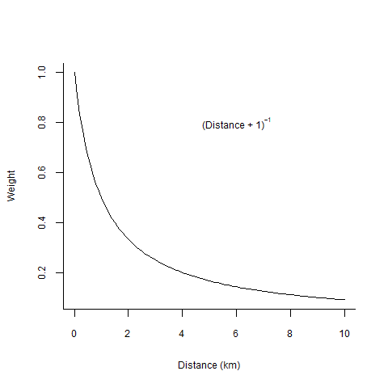
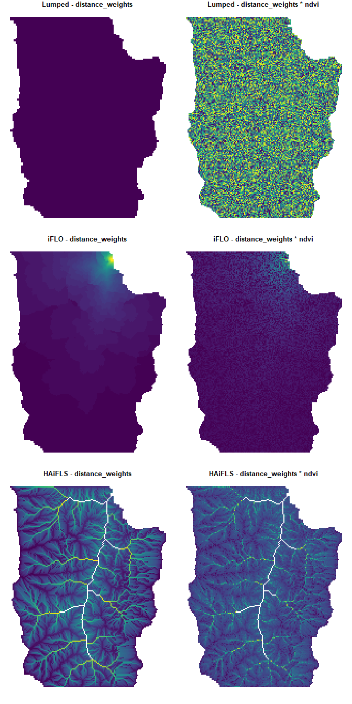

<!-- README.md is generated from README.Rmd. Please edit that file -->

# hydroweight: Inverse distance-weighted rasters and attributes



## 1.0 Introduction

Environmental scientists often want to calculate landscape statistics
within upstream contributing areas (i.e., catchments) to examine their
potential effects on a target (e.g., stream network point or waterbody).
When calculating landscape statistics like the proportion of upstream
urban cover, practitioners typically use a “lumped” approach - this
gives equal weighting to areas nearby and far from the target (Peterson
et al. 2011).

A more spatially explicit approach might be to generate buffers of
successive distances away from the target and calculate the lumped
statistics. For example, one could calculate the proportion of urban
cover in a 250 m buffer and a 1000 m buffer from the target (Kielstra et
al. 2019).

Another approach is to calculate landscape statistics based on distances
to the target where areas nearby have more weight than those farther
away (i.e., inverse distance-weighting). A set of inverse distance
weighting scenarios for stream survey sites was described in Peterson
*et al.* (2011) that included various types of Euclidean and flow-path
distances to targets. Tools are implemented as *IDW-Plus* in *ArcGIS*
(Peterson et al. 2017) as well as in *rdwplus* in R through GRASS GIS
(Pearse et al. 2019).

***hydroweight*** replicates the above approaches but also provides a
set of simple and flexible functions to accommodate a wider set of
scenarios and statistics (e.g., numerical and categorical rasters and
polygons). It also uses the speedy WhiteboxTools (Lindsay 2016, Wu
2020).

There are two functions:

  - `hydroweight()` generates distance-weighted rasters for targets on a
    digital elevation model raster. Examples of targets include single
    points, areas such as lakes, or linear features such as streams. The
    function outputs a list of `length(weighting_scheme)` and an
    accompanying `*.rds` file of distance-weighted rasters for targets
    (`target_O` is a point/area target as in iFLO and `target_S` is a
    stream/waterbody target as in iFLS in Peterson *et al.* 2011).
    IMPORTANTLY, this function acts on a single set of targets but can
    produce multiple weights. The distance-weighted rasters can be used
    for generating distance-weighted attributes with
    `hydroweight_attributes()` (e.g., % urban cover weighted by flow
    distance to a point).

  - `hydroweight_attributes()` calculates distance-weighted attributes
    using distance-weighted rasters generated in `hydroweight()`, an
    attribute layer (`loi`, e.g., land use raster/polygon), and a region
    of interest (`roi`, e.g., a catchment polygon). The function outputs
    an attribute summary table or a list that includes the summary table
    and layers used for calculation. Summary statistics are calculated
    as in Peterson *et al.* (2011). IMPORTANTLY, this function only
    produces one instance of the `loi` x `distance_weight` summary
    statistics (i.e., one `loi`, one `roi`, and one `distance_weight`).

Workflows are provided below to run these functions across multiple
sites and layers.

## 2.0 Installation and system setup

WhiteboxTools must be installed for ***hydroweight*** to run. See
[whiteboxR](https://github.com/giswqs/whiteboxR) or below for
installation.

``` r
# install.packages("devtools")
devtools::install_github("bkielstr/hydroweight")

## Follow instructions for whitebox installation accordingly
install.packages("whitebox", repos="http://R-Forge.R-project.org")
whitebox::wbt_init()
```

## 3.0 Generate inverse distance-weighted rasters using `hydroweight()`

### 3.1 Generate toy terrain dataset

We begin by bringing in our toy digital elevation model and use it to
generate terrain products.

``` r
library(dplyr)
library(foreach)
library(hydroweight)
library(raster)
library(sf)
library(viridis)
library(whitebox)

## Import toy_dem from whitebox package
toy_file <- system.file("extdata", "DEM.tif", package = "whitebox")
toy_dem <- raster(x = toy_file, values = TRUE)
crs(toy_dem) <- "+init=epsg:3161"

## Generate hydroweight_dir as a temporary directory
hydroweight_dir <- tempdir()

## Write toy_dem to hydroweight_dir
writeRaster(
  x = toy_dem, filename = file.path(hydroweight_dir, "toy_dem.tif"),
  overwrite = TRUE
)

## Breach depressions to ensure continuous flow
wbt_breach_depressions(
  dem = file.path(hydroweight_dir, "toy_dem.tif"),
  output = file.path(hydroweight_dir, "toy_dem_breached.tif")
)
#> [1] "breach_depressions - Elapsed Time (excluding I/O): 0.12s"

## Generate d8 flow pointer (note: other flow directions are available)
wbt_d8_pointer(
  dem = file.path(hydroweight_dir, "toy_dem_breached.tif"),
  output = file.path(hydroweight_dir, "toy_dem_breached_d8.tif")
)
#> [1] "d8_pointer - Elapsed Time (excluding I/O): 0.3s"

## Generate d8 flow accumulation in units of cells (note: other flow directions are available)
wbt_d8_flow_accumulation(
  input = file.path(hydroweight_dir, "toy_dem_breached.tif"),
  output = file.path(hydroweight_dir, "toy_dem_breached_accum.tif"),
  out_type = "cells"
)
#> [1] "d8_flow_accumulation - Elapsed Time (excluding I/O): 0.100s"

## Generate streams with a stream initiation threshold of 2000 cells
wbt_extract_streams(
  flow_accum = file.path(hydroweight_dir, "toy_dem_breached_accum.tif"),
  output = file.path(hydroweight_dir, "toy_dem_streams.tif"),
  threshold = 2000
)
#> [1] "extract_streams - Elapsed Time (excluding I/O): 0.1s"
```

### 3.2 Generate targets

The first target is a low lying area we will call a lake (`tg_O`). All
cells \<220 m elevation are `TRUE` or `1` and those \>220 m are assigned
`NA`. We also generate its catchment (`tg_O_catchment`) using
`whitebox::wbt_watershed()`. Target streams (`tg_S`) are loaded from the
`whitebox::wbt_extract_streams()` output. Finally, we do some
manipulation to the stream network raster to generate three points along
the stream network (`tg_O_multi`) and their catchments
(`tg_O_multi_catchment`).

``` r
## For hydroweight, there are target_O and target_S
## target_O is a target point/area for calculating distances
## target_S is a stream/waterbody target for calculating distances

## Generate target_O, tg_O, representing a lake, and its catchment
tg_O <- toy_dem < 220
tg_O[tg_O@data@values != 1] <- NA
writeRaster(tg_O, file.path(hydroweight_dir, "tg_O.tif"), overwrite = TRUE)
tg_O <- rasterToPolygons(tg_O, dissolve = TRUE)
tg_O <- st_as_sf(tg_O)

wbt_watershed(
  d8_pntr = file.path(hydroweight_dir, "toy_dem_breached_d8.tif"),
  pour_pts = file.path(hydroweight_dir, "tg_O.tif"),
  output = file.path(hydroweight_dir, "tg_O_catchment.tif")
)
#> [1] "watershed - Elapsed Time (excluding I/O): 0.7s"

tg_O_catchment <- raster(file.path(hydroweight_dir, "tg_O_catchment.tif"))
tg_O_catchment <- rasterToPolygons(tg_O_catchment, dissolve = TRUE)
tg_O_catchment <- st_as_sf(tg_O_catchment)

## Generate target_S, tg_S, representing the stream network
tg_S <- raster(file.path(hydroweight_dir, "toy_dem_streams.tif"))

## Generate target_O, tg_O, representing several points along stream network, and their catchments
tg_O_multi <- raster(file.path(hydroweight_dir, "toy_dem_streams.tif"))
tg_O_multi <- rasterToPoints(tg_O_multi, spatial = TRUE)
tg_O_multi <- st_as_sf(tg_O_multi)
tg_O_multi <- tg_O_multi[st_coordinates(tg_O_multi)[, 1] < 675000, ] # selects single network
tg_O_multi <- tg_O_multi[c(10, 50, 100), ]
tg_O_multi$Site <- c(1, 2, 3)

tg_O_multi_catchment <- foreach(xx = 1:nrow(tg_O_multi), .errorhandling = "pass") %do% {

  ## Take individual stream point and write to file
  sel <- tg_O_multi[xx, ]
  st_write(sel, file.path(hydroweight_dir, "tg_O_multi_single.shp"),
    delete_layer = TRUE, quiet = TRUE
  )

  ## Run watershed operation on stream point
  wbt_watershed(
    d8_pntr = file.path(hydroweight_dir, "toy_dem_breached_d8.tif"),
    pour_pts = file.path(hydroweight_dir, "tg_O_multi_single.shp"),
    output = file.path(hydroweight_dir, "tg_O_multi_single_catchment.tif")
  )

  ## Load catchment and convert to polygon with Site code.
  sel_catchment_r <- raster(file.path(hydroweight_dir, "tg_O_multi_single_catchment.tif"))
  sel_catchment_r <- rasterToPolygons(sel_catchment_r, dissolve = TRUE)
  sel_catchment_r$Site <- sel$Site
  sel_catchment_r <- st_as_sf(sel_catchment_r)

  return(sel_catchment_r)
}
tg_O_multi_catchment <- do.call(bind_rows, tg_O_multi_catchment)

## Plot locations
plot(toy_dem, legend = TRUE, col = viridis(101), main = "Toy DEM")
plot(tg_S, col = "grey", add = TRUE, legend = FALSE)
plot(st_geometry(tg_O), col = "red", add = TRUE)
plot(st_geometry(tg_O_multi), col = "red", pch = 25, add = TRUE)
plot(st_geometry(tg_O_multi_catchment), col = NA, border = "red", add = TRUE)
legend("bottom", legend = c("target_O sites", "target_S"), fill = c("red", "grey"), horiz = TRUE, bty = "n")
```


### 3.3 Run `hydroweight()`

Below, `hydroweight()` is run using our lake as `target_O` for iEucO,
iFLO, and HAiFLO, and using our streams as `target_S` for iEucS, iFLS,
and HAiFLS. For export of the distance-weighted rasters, we use “Lake”;
the .rds exported from `hydroweight()` to `hydroweight_dir` will now be
called “Lake\_inv\_distances.rds”. Since our DEM is small, we decide to
not clip our region (i.e., `clip_region = NULL`). Using `OS_combine =
TRUE`, we indicate that distances to the nearest waterbody will be
either the lake or stream. Furthermore, for HAiFLO or HAiFLS, both the
lake and streams will be set to NoData for their calculation. Our `dem`
and `flow_accum` are assigned using character strings with the `.tif`
files located in `hydroweight_dir`. Weighting schemes and the inverse
function are indicated.

Note that these distance-weighted rasters will eventually be clipped to
an `roi` - a region of interest like a site’s catchment - in
`hydroweight_attributes()`. The value for `clipped_region` is really
meant to decrease processing time of large rasters.

See `?hydroweight` for more details.

``` r
## Generate inverse distance-weighting function
myinv <- function(x) {
  (x * 0.001 + 1)^-1
} ## 0.001 multiplier turns m to km

## Run hydroweight::hydroweight()
hw_test_1 <- hydroweight::hydroweight(
  hydroweight_dir = hydroweight_dir,
  target_O = tg_O,
  target_S = tg_S,
  target_uid = "Lake",
  clip_region = NULL,
  OS_combine = TRUE,
  dem = "toy_dem_breached.tif",
  dem_crs = crs(toy_dem),
  flow_accum = "toy_dem_breached_accum.tif",
  weighting_scheme = c(
    "lumped", "iEucO", "iFLO", "HAiFLO",
    "iEucS", "iFLS", "HAiFLS"
  ),
  inv_function = myinv
)
#> Preparing hydroweight layers @ 2021-02-11 16:01:57
#> Running distance-weighting @ 2021-02-11 16:02:22

## Resultant structure:
# length(hw_test_1) ## 1 set of targets and 7 distance-weighted rasters
# hw_test_1[[1]] ## lumped
# hw_test_1[[2]] ## iEucO
# hw_test_1[[3]] ## iFLO
# hw_test_1[[4]] ## HAiFLO
# hw_test_1[[5]] ## iEucS
# hw_test_1[[6]] ## iFLS
# hw_test_1[[7]] ## HAiFLS

## Plot different weighting schemes; where purple --> yellow == low --> high weight
par(mfrow = c(2, 4), mar = c(1, 1, 1, 1), oma = c(0, 0, 0, 0))
layout(matrix(c(
  1, 2, 3, 4,
  1, 5, 6, 7
), nrow = 2, byrow = TRUE))
plot(hw_test_1[[1]], main = "Lumped", axes = F, legend = F, box = FALSE, col = viridis(101))
plot(hw_test_1[[2]], main = "iEucO", axes = F, legend = F, box = FALSE, col = viridis(101))
plot(hw_test_1[[3]], main = "iFLO", axes = F, legend = F, box = FALSE, col = viridis(101))
plot(log(hw_test_1[[4]]), main = "HAiFLO", axes = F, legend = F, box = FALSE, col = viridis(101))
plot.new()
plot(hw_test_1[[5]], main = "iEucS", axes = F, legend = F, box = FALSE, col = viridis(101))
plot(hw_test_1[[6]], main = "iFLS", axes = F, legend = F, box = FALSE, col = viridis(101))
plot(log(hw_test_1[[7]]), main = "HAiFLS", axes = F, legend = F, box = FALSE, col = viridis(101))
```


Important things to note from this plot:

  - Lumped is equal weighting where all values = 1.
  - iEucO and iEucS distances extend outward to the extent of the DEM.
  - For iFLO/HAiFLO/iFLS/HAiFLS, only distances in cells contributing to
    the areas of interest are included.  
  - As in Peterson *et al.* (2011), for HAiFLO and HAiFLS, the targets
    are set to NoData (i.e., NA) since they likely represent
    concentrated flow areas.

These temporary files are made per instance of
`hydroweight::hydroweight()`:

``` r
list.files(hydroweight_dir)[grep("TEMP-", list.files(hydroweight_dir))]
#>  [1] "TEMP-clip_region.dbf"     "TEMP-clip_region.prj"    
#>  [3] "TEMP-clip_region.shp"     "TEMP-clip_region.shx"    
#>  [5] "TEMP-cost_backlink.tif"   "TEMP-cost_distance.tif"  
#>  [7] "TEMP-dem_clip.tif"        "TEMP-flow_accum_clip.tif"
#>  [9] "TEMP-flowdist.tif"        "TEMP-HAiFLO.tif"         
#> [11] "TEMP-HAiFLS.tif"          "TEMP-iEucO.tif"          
#> [13] "TEMP-iEucS.tif"           "TEMP-iFLO.tif"           
#> [15] "TEMP-iFLS.tif"            "TEMP-OS_combine.tif"     
#> [17] "TEMP-target_O.dbf"        "TEMP-target_O.prj"       
#> [19] "TEMP-target_O.shp"        "TEMP-target_O.shx"       
#> [21] "TEMP-target_O_clip.tif"   "TEMP-target_S.tif"       
#> [23] "TEMP-target_S_clip.tif"
```

A few options to consider:

``` r
## Ignoring target_O
hw_test_2 <- hydroweight::hydroweight(
  hydroweight_dir = hydroweight_dir,
  target_S = tg_S,
  target_uid = "Lake",
  dem = "toy_dem_breached.tif",
  dem_crs = crs(toy_dem),
  flow_accum = "toy_dem_breached_accum.tif",
  weighting_scheme = c("lumped", "iEucS", "iFLS", "HAiFLS"),
  inv_function = myinv
)
## Resultant structure:
# length(hw_test_3) ## 1 set of targets and 4 distance-weighted rasters
# hw_test_2[[1]] ## lumped
# hw_test_2[[2]] ## iEucS
# hw_test_2[[3]] ## iFLS
# hw_test_2[[4]] ## HAiFLS

## Ignoring target_S
hw_test_3 <- hydroweight::hydroweight(
  hydroweight_dir = hydroweight_dir,
  target_O = tg_O,
  target_uid = "Lake",
  dem = "toy_dem_breached.tif",
  dem_crs = crs(toy_dem),
  flow_accum = "toy_dem_breached_accum.tif",
  weighting_scheme = c("lumped", "iEucO", "iFLO", "HAiFLO"),
  inv_function = myinv
)
# length(hw_test_3) ## 1 set of targets and 4 distance-weighted rasters
# hw_test_3[[1]] ## lumped
# hw_test_3[[2]] ## iEucO
# hw_test_3[[3]] ## iFLO
# hw_test_3[[4]] ## HAiFLO

## Setting a clip region
hw_test_4 <- hydroweight::hydroweight(
  hydroweight_dir = hydroweight_dir,
  target_O = tg_O,
  target_S = tg_S,
  target_uid = "Lake",
  clip_region = 8000,
  OS_combine = TRUE,
  dem = "toy_dem_breached.tif",
  dem_crs = crs(toy_dem),
  flow_accum = "toy_dem_breached_accum.tif",
  weighting_scheme = c(
    "lumped", "iEucO", "iFLO", "HAiFLO",
    "iEucS", "iFLS", "HAiFLS"
  ),
  inv_function = myinv
)

## Plot
plot(hw_test_1[[1]], main = "iEucO - 8000 m clip", axes = FALSE, legend = FALSE, box = FALSE, col = viridis(101))
plot(hw_test_4[[2]], add = TRUE, axes = FALSE, legend = FALSE, box = FALSE, col = viridis(101))
```


### 3.4 Running `hydroweight()` across a set of sites

We wanted users to access intermediate products and also anticipated
that layers and/or errors may be very case-specific. For these reasons,
we don’t *yet* provide an all-in-one solution for multiple sites and/or
layers of interest but provide workflows.

We advocate using `foreach` since it is `lapply`-like but passes along
errors to allow for later fixing. Linking `foreach` with `doParallel`
allows for parallel processing. (e.g., `foreach(...) %dopar%`). We have
not tested `whitebox` using parallel processing. However
`hydroweight_attributes()` can be run in parallel.

Since `hydroweight()` exports an `.rds` of its result to
`hydroweight_dir`, it allows users to assign the results of
`hydroweight()` to an object in the current environment or to run
`hydroweight()` alone and upload the `.rds` afterwards.

``` r
## Run hydroweight across sites found in stream points tg_O_multi/tg_O_multi_catchment
hw_test_5 <- foreach(xx = 1:nrow(tg_O_multi), .errorhandling = "pass") %do% {
  message("Running hydroweight for site ", xx, " at ", Sys.time())

  hw_test_xx <- hydroweight::hydroweight(
    hydroweight_dir = hydroweight_dir,
    target_O = tg_O_multi[xx, ], ## Important to change
    target_S = tg_S,
    target_uid = tg_O_multi$Site[xx], ## Important to change
    clip_region = NULL,
    OS_combine = TRUE,
    dem = "toy_dem_breached.tif",
    dem_crs = crs(toy_dem),
    flow_accum = "toy_dem_breached_accum.tif",
    weighting_scheme = c(
      "lumped", "iEucO", "iFLO", "HAiFLO",
      "iEucS", "iFLS", "HAiFLS"
    ),
    inv_function = myinv
  )

  return(hw_test_xx)
}
#> Running hydroweight for site 1 at 2021-02-11 16:03:30
#> Preparing hydroweight layers @ 2021-02-11 16:03:30
#> Running distance-weighting @ 2021-02-11 16:03:54
#> Running hydroweight for site 2 at 2021-02-11 16:03:58
#> Preparing hydroweight layers @ 2021-02-11 16:03:58
#> Running distance-weighting @ 2021-02-11 16:04:23
#> Running hydroweight for site 3 at 2021-02-11 16:04:27
#> Preparing hydroweight layers @ 2021-02-11 16:04:27
#> Running distance-weighting @ 2021-02-11 16:04:53

## Resultant structure:
## length(hw_test_5) # 3 sites
## length(hw_test_5[[1]]) # 7 distance-weighted rasters for each site
## hw_test_5[[1]][[1]] # site 1, lumped
## hw_test_5[[1]][[2]] # site 1, iEucO
## hw_test_5[[1]][[3]] # site 1, iFLO
## hw_test_5[[1]][[4]] # site 1, HAiFLO
## hw_test_5[[1]][[5]] # site 1, iEucS
## hw_test_5[[1]][[6]] # site 1, iFLS
## hw_test_5[[1]][[7]] # site 1, HAiFLS
## ...
## ...
## ...
## hw_test_5[[3]][[7]] # site 3, HAiFLS

## Loading up data as if it were not assigned to object
inv_distance_collect <- file.path(hydroweight_dir, paste0(tg_O_multi$Site, "_inv_distances.rds"))
hw_test_5 <- lapply(inv_distance_collect, function(x) {
  readRDS(x)
})

## Resultant structure:
## length(hw_test_5) # 3 sites
## length(hw_test_5[[1]]) # 7 distance-weighted rasters for each site
## hw_test_5[[1]][[1]] # site 1, lumped
## hw_test_5[[1]][[2]] # site 1, iEucO
## hw_test_5[[1]][[3]] # site 1, iFLO
## hw_test_5[[1]][[4]] # site 1, HAiFLO
## hw_test_5[[1]][[5]] # site 1, iEucS
## hw_test_5[[1]][[6]] # site 1, iFLS
## hw_test_5[[1]][[7]] # site 1, HAiFLS
## ...
## ...
## ...
## hw_test_5[[3]][[7]] # site 3, HAiFLS

## Plot sites, their catchments, and their respective distance-weighted iFLO rasters
par(mfrow = c(1, 3), mar = c(1, 1, 1, 1), oma = c(0, 0, 0, 0))
plot(st_geometry(tg_O_multi_catchment), col = NA, border = "red", main = "Site 1 - iFLO")
plot(hw_test_5[[1]][[3]], axes = F, legend = F, box = FALSE, col = viridis(101), add = T)
plot(st_geometry(tg_O_multi_catchment), col = NA, border = "red", main = "Site 2 - iFLO")
plot(hw_test_5[[2]][[3]], axes = F, legend = F, box = FALSE, col = viridis(101), add = T)
plot(st_geometry(tg_O_multi_catchment), col = NA, border = "red", main = "Site 3 - iFLO")
plot(hw_test_5[[3]][[3]], axes = F, legend = F, box = FALSE, col = viridis(101), add = T)
```


## 4.0 Generate inverse distance-weighted attributes using `hydroweight_attributes()`

### 4.1 Using a numeric raster layer of interest

Applying the same approach as above (i.e., using `foreach()`), we
generate distance-weighted attributes for a single site across all of
our distance-weighted rasters.

First, we generate a numeric raster layer of interest `loi = ndvi` and
then summarize those pixels falling within the region of interest, `roi
= tg_O_catchment`, for each distance-weighted raster in `tw_test_1` (all
types of distances, see above). See `?hydroweight_attributes` for
`loi_`- and `roi_`-specific information indicating type of data and how
results are returned.

``` r
## Construct continuous dataset
ndvi <- toy_dem
values(ndvi) <- runif(n = (ndvi@ncols * ndvi@nrows), min = 0, max = 1)
names(ndvi) <- "ndvi"

## For each distance weight from hydroweight_test above, calculate the landscape statistics for ndvi
hwa_test_numeric <- foreach(xx = 1:length(hw_test_1), .errorhandling = "pass") %do% {
  hwa <- hydroweight_attributes(
    loi = ndvi,
    loi_attr_col = "ndvi",
    loi_numeric = TRUE,
    loi_resample = "bilinear",
    roi = tg_O_catchment,
    roi_uid = "1",
    roi_uid_col = "Lake",
    distance_weight = hw_test_1[[xx]],
    remove_region = tg_O,
    return_products = TRUE
  )

  return(hwa)
}

## Resultant structure:
# length(hwa_test_numeric) # Attributes and processing components for 7 inputted distance-weighted rasters
# hwa_test_numeric[[1]][[1]] # Attributes calculated for lumped attribute statistics
# hwa_test_numeric[[1]][[2]] # processed loi used in calculating lumped attribute statistics
# hwa_test_numeric[[1]][[3]] # processed distance-weighted raster used in calculating lumped attribute statistics
## ...
## ...
## ...
## hwa_test_numeric[[7]][[3]] # processed distance-weighted raster used in calculating HAiFLS attribute statistics

## For each distance-weighted raster input, extract results and apply name changes to specify distance-weighting name used
results <- foreach(xx = 1:length(hwa_test_numeric), .errorhandling = "pass") %do% {

  ## Get names of distance-weighted rasters
  (names_hwtn <- names(hw_test_1)[xx])

  ## Paste distance-weighted raster name together with attribute column names except "site" from above
  (names_hwtn <- paste0(names_hwtn, "_", colnames(hwa_test_numeric[[xx]][[1]])[-1]))

  ## Assign column names
  colnames(hwa_test_numeric[[xx]][[1]])[-1] <- names_hwtn

  return(hwa_test_numeric[[xx]])
}

## Extract only the summary table and bind results, see names of dataframe
results_agg <- lapply(results, function(x) {
  x[[1]]
})
results_agg <- Reduce(merge, results_agg)
names(results_agg)
#>  [1] "Lake"                     "lumped_ndvi_distwtd_mean"
#>  [3] "lumped_ndvi_distwtd_sd"   "lumped_ndvi_median"      
#>  [5] "lumped_ndvi_min"          "lumped_ndvi_max"         
#>  [7] "lumped_ndvi_sum"          "lumped_ndvi_pixel_count" 
#>  [9] "iEucO_ndvi_distwtd_mean"  "iEucO_ndvi_distwtd_sd"   
#> [11] "iEucO_ndvi_median"        "iEucO_ndvi_min"          
#> [13] "iEucO_ndvi_max"           "iEucO_ndvi_sum"          
#> [15] "iEucO_ndvi_pixel_count"   "iFLO_ndvi_distwtd_mean"  
#> [17] "iFLO_ndvi_distwtd_sd"     "iFLO_ndvi_median"        
#> [19] "iFLO_ndvi_min"            "iFLO_ndvi_max"           
#> [21] "iFLO_ndvi_sum"            "iFLO_ndvi_pixel_count"   
#> [23] "HAiFLO_ndvi_distwtd_mean" "HAiFLO_ndvi_distwtd_sd"  
#> [25] "HAiFLO_ndvi_median"       "HAiFLO_ndvi_min"         
#> [27] "HAiFLO_ndvi_max"          "HAiFLO_ndvi_sum"         
#> [29] "HAiFLO_ndvi_pixel_count"  "iEucS_ndvi_distwtd_mean" 
#> [31] "iEucS_ndvi_distwtd_sd"    "iEucS_ndvi_median"       
#> [33] "iEucS_ndvi_min"           "iEucS_ndvi_max"          
#> [35] "iEucS_ndvi_sum"           "iEucS_ndvi_pixel_count"  
#> [37] "iFLS_ndvi_distwtd_mean"   "iFLS_ndvi_distwtd_sd"    
#> [39] "iFLS_ndvi_median"         "iFLS_ndvi_min"           
#> [41] "iFLS_ndvi_max"            "iFLS_ndvi_sum"           
#> [43] "iFLS_ndvi_pixel_count"    "HAiFLS_ndvi_distwtd_mean"
#> [45] "HAiFLS_ndvi_distwtd_sd"   "HAiFLS_ndvi_median"      
#> [47] "HAiFLS_ndvi_min"          "HAiFLS_ndvi_max"         
#> [49] "HAiFLS_ndvi_sum"          "HAiFLS_ndvi_pixel_count"

## Plot
plot(ndvi, axes = F, legend = F, box = FALSE, col = viridis(101))
plot(st_geometry(tg_O_catchment), col = adjustcolor("grey", alpha.f = 0.5), add = T)
plot(st_geometry(tg_O), col = "red", add = T)
plot(tg_S, col = "blue", add = T, legend = FALSE)
legend("bottom", legend = c("target_O = tg_O", "target_S = tg_S", "catchment"), 
       fill = c("red", "blue", adjustcolor("grey", alpha.f = 0.5)), horiz = TRUE, bty = "n")
```


``` r
## Plot results
par(mfrow = c(3, 2), mar = c(1, 1, 1, 1), oma = c(0, 0, 0, 0))

## Lumped
plot(st_as_sfc(st_bbox(tg_O_catchment)), border = "white", main = "Lumped - distance_weight")
plot(results[[1]]$distance_weight_bounded, axes = F, legend = F, box = FALSE, col = "yellow", add = TRUE)
plot(st_as_sfc(st_bbox(tg_O_catchment)), border = "white", main = "Lumped - distance_weight * ndvi")
plot(results[[1]]$`loi_Raster*_bounded` * results[[1]]$distance_weight_bounded, axes = F, legend = F, box = FALSE, col = viridis(101), add = TRUE)

## iEucO
plot(st_as_sfc(st_bbox(tg_O_catchment)), border = "white", main = "iEucO - distance_weight")
plot(results[[2]]$distance_weight_bounded, axes = F, legend = F, box = FALSE, col = viridis(101), add = TRUE)
plot(st_as_sfc(st_bbox(tg_O_catchment)), border = "white", main = "iEucO - distance_weight * ndvi")
plot(results[[2]]$`loi_Raster*_bounded` * results[[2]]$distance_weight_bounded, main = "Lumped \n- loi * distance_weight", axes = F, legend = F, box = FALSE, col = viridis(101), add = TRUE)

## iFLS
plot(st_as_sfc(st_bbox(tg_O_catchment)), border = "white", main = "iFLS - distance_weight")
plot(results[[6]]$distance_weight_bounded, axes = F, legend = F, box = FALSE, col = viridis(101), add = TRUE)
plot(st_as_sfc(st_bbox(tg_O_catchment)), border = "white", main = "iFLS - distance_weight * ndvi")
plot(results[[6]]$`loi_Raster*_bounded` * results[[6]]$distance_weight_bounded, main = "Lumped \n- loi * distance_weight", axes = F, legend = F, box = FALSE, col = viridis(101), add = TRUE)
```


### 4.2 Using a categorical raster layer of interest

We generate a categorical raster layer of interest `loi = lulc` and then
summarize those pixels falling within the region of interest, `roi =
tg_O_catchment`, for each distance-weighted raster in `tw_test_1` (all
types of distances, see above). See `?hydroweight_attributes` for
`loi_`- and `roi_`-specific information indicating type of data and how
results are returned.

``` r
## Construct categorical dataset by reclassify elevation values into categories
lulc <- toy_dem
m <- c(0, 220, 1, 220, 300, 2, 300, 400, 3, 400, Inf, 4)
rclmat <- matrix(m, ncol = 3, byrow = TRUE)
lulc <- reclassify(lulc, rclmat)

## For each distance weight from hydroweight_test above, calculate the landscape statistics for ndvi
hwa_test_categorical <- foreach(xx = 1:length(hw_test_1), .errorhandling = "pass") %do% {
  hwa <- hydroweight_attributes(
    loi = lulc,
    loi_attr_col = "lulc",
    loi_numeric = FALSE,
    loi_resample = "ngb",
    roi = tg_O_catchment,
    roi_uid = "1",
    roi_uid_col = "Lake",
    distance_weight = hw_test_1[[xx]],
    remove_region = tg_O,
    return_products = TRUE
  )

  return(hwa)
}

## Resultant structure:
# length(hwa_test_categorical) # Attributes and processing components for 7 inputted distance-weighted rasters
# hwa_test_categorical[[1]][[1]] # Attributes calculated for lumped attribute statistics
# hwa_test_categorical[[1]][[2]] # processed loi used in calculating lumped attribute statistics
# hwa_test_categorical[[1]][[3]] # processed distance-weighted raster used in calculating lumped attribute statistics
## ...
## ...
## ...
## hwa_test_categorical[[7]][[3]] # processed distance-weighted raster used in calculating HAiFLS attribute statistics

## For each distance-weighted raster input, extract results and apply name changes to specify distance-weighting name used

results <- foreach(xx = 1:length(hwa_test_categorical), .errorhandling = "pass") %do% {

  ## Get names of distance-weighted rasters
  (names_hwtn <- names(hw_test_1)[xx])

  ## Paste distance-weighted raster name together with attribute column names except "site" from above
  (names_hwtn <- paste0(names_hwtn, "_", colnames(hwa_test_categorical[[xx]][[1]])[-1]))

  ## Assign column names
  colnames(hwa_test_categorical[[xx]][[1]])[-1] <- names_hwtn

  return(hwa_test_categorical[[xx]])
}

## Extract only the summary table and bind results, see names of dataframe
results_agg <- lapply(results, function(x) {
  x[[1]]
})
results_agg <- Reduce(merge, results_agg)
names(results_agg)
#>  [1] "Lake"               "lumped_lulc_prop_4" "lumped_lulc_prop_3"
#>  [4] "lumped_lulc_prop_2" "iEucO_lulc_prop_4"  "iEucO_lulc_prop_3" 
#>  [7] "iEucO_lulc_prop_2"  "iFLO_lulc_prop_4"   "iFLO_lulc_prop_3"  
#> [10] "iFLO_lulc_prop_2"   "HAiFLO_lulc_prop_4" "HAiFLO_lulc_prop_3"
#> [13] "HAiFLO_lulc_prop_2" "iEucS_lulc_prop_4"  "iEucS_lulc_prop_3" 
#> [16] "iEucS_lulc_prop_2"  "iFLS_lulc_prop_4"   "iFLS_lulc_prop_3"  
#> [19] "iFLS_lulc_prop_2"   "HAiFLS_lulc_prop_4" "HAiFLS_lulc_prop_3"
#> [22] "HAiFLS_lulc_prop_2"

## Plot
plot(lulc, axes = F, legend = F, box = FALSE, col = viridis(4))
plot(st_geometry(tg_O_catchment), col = adjustcolor("grey", alpha.f = 0.5), add = T)
plot(tg_O, col = "red", add = T, legend = FALSE)
plot(tg_S, col = "blue", add = T, legend = FALSE)
legend("bottom", legend = c("target_O = tg_O", "target_S = tg_S", "catchment"), 
       fill = c("red", "blue", adjustcolor("grey", alpha.f = 0.5)), horiz = TRUE, bty = "n")
```



``` r
## Plot results
par(mfrow = c(3, 4), mar = c(1, 1, 1, 1), oma = c(0, 0, 0, 0), cex = 0.75)

## Lumped
plot(st_as_sfc(st_bbox(tg_O_catchment)), border = "white", main = "Lumped")
plot(results[[1]]$distance_weight_bounded, axes = F, legend = F, box = FALSE, col = "yellow", add = TRUE)
plot(st_as_sfc(st_bbox(tg_O_catchment)), border = "white", main = "Lumped - loi * lulc (cat: 4)")
plot(results[[1]][[2]][[1]] * results[[1]]$distance_weight_bounded, axes = F, legend = F, box = FALSE, col = viridis(101), add = TRUE)
plot(st_as_sfc(st_bbox(tg_O_catchment)), border = "white", main = "Lumped - loi * lulc (cat: 3)")
plot(results[[1]][[2]][[2]] * results[[1]]$distance_weight_bounded, axes = F, legend = F, box = FALSE, col = viridis(101), add = TRUE)
plot(st_as_sfc(st_bbox(tg_O_catchment)), border = "white", main = "Lumped - loi * lulc (cat: 2)")
plot(results[[1]][[2]][[3]] * results[[1]]$distance_weight_bounded, axes = F, legend = F, box = FALSE, col = viridis(101), add = TRUE)

## iEucO
plot(st_as_sfc(st_bbox(tg_O_catchment)), border = "white", main = "iEucO")
plot(results[[2]]$distance_weight_bounded, axes = F, legend = F, box = FALSE, col = viridis(101), add = TRUE)
plot(st_as_sfc(st_bbox(tg_O_catchment)), border = "white", main = "iEucO - loi * lulc (cat: 4)")
plot(results[[2]][[2]][[1]] * results[[2]]$distance_weight_bounded, axes = F, legend = F, box = FALSE, col = viridis(101), add = TRUE)
plot(st_as_sfc(st_bbox(tg_O_catchment)), border = "white", main = "iEucO - loi * lulc (cat: 3)")
plot(results[[2]][[2]][[2]] * results[[2]]$distance_weight_bounded, axes = F, legend = F, box = FALSE, col = viridis(101), add = TRUE)
plot(st_as_sfc(st_bbox(tg_O_catchment)), border = "white", main = "iEucO - loi * lulc (cat: 2)")
plot(results[[2]][[2]][[3]] * results[[2]]$distance_weight_bounded, axes = F, legend = F, box = FALSE, col = viridis(101), add = TRUE)

## iFLO
plot(st_as_sfc(st_bbox(tg_O_catchment)), border = "white", main = "iFLO")
plot(results[[3]]$distance_weight_bounded, axes = F, legend = F, box = FALSE, col = viridis(101), add = TRUE)
plot(st_as_sfc(st_bbox(tg_O_catchment)), border = "white", main = "iFLO - loi * lulc (cat: 4)")
plot(results[[3]][[2]][[1]] * results[[3]]$distance_weight_bounded, axes = F, legend = F, box = FALSE, col = viridis(101), add = TRUE)
plot(st_as_sfc(st_bbox(tg_O_catchment)), border = "white", main = "iFLO - loi * lulc (cat: 3)")
plot(results[[3]][[2]][[2]] * results[[3]]$distance_weight_bounded, axes = F, legend = F, box = FALSE, col = viridis(101), add = TRUE)
plot(st_as_sfc(st_bbox(tg_O_catchment)), border = "white", main = "iFLO - loi * lulc (cat: 2)")
plot(results[[3]][[2]][[3]] * results[[3]]$distance_weight_bounded, axes = F, legend = F, box = FALSE, col = viridis(101), add = TRUE)
```


### 4.3 Using a polygon layer of interest with numeric data in the column

Here, we `lulc` and polygonize the raster to `lulc_p`. We then generate
some numeric data in the polygon layer called `var_1` and `var_2`. We
then spatially summarize the numeric data in those two columns using
`hydroweight_attributes()`.

Internally, the `lulc` polygons are rasterized using `distance_weight`
as the template. This basically treats the columns as if they were
individual numeric raster layers. Landscape statistics are calculated
accordingly (e.g., distance-weighted mean). Those pixels falling within
the region of interest, `roi = tg_O_catchment`, for each
distance-weighted raster in `tw_test_1` (all types of distances, see
above). See `?hydroweight_attributes` for `loi_`- and `roi_`-specific
information indicating type of data and how results are returned.

``` r
## Construct polygons with numeric data by converting lulc to polygons and assigning values to columns
lulc_p <- rasterToPolygons(lulc, dissolve = T, na.rm = T)
lulc_p <- st_as_sf(lulc_p)

lulc_p$var_1 <- sample(c(1:10), size = 4, replace = TRUE)
lulc_p$var_2 <- sample(c(20:30), size = 4, replace = TRUE)

## For each distance weight from hydroweight_test above, calculate the landscape statistics for ndvi
hwa_test_numeric_polygon <- foreach(xx = 1:length(hw_test_1), .errorhandling = "pass") %do% {
  hwa <- hydroweight_attributes(
    loi = lulc_p,
    loi_attr_col = "lulc",
    loi_categories = c("var_1", "var_2"),
    loi_numeric = TRUE,
    loi_resample = "ngb",
    roi = tg_O_catchment,
    roi_uid = "1",
    roi_uid_col = "Lake",
    distance_weight = hw_test_1[[xx]],
    remove_region = tg_O,
    return_products = TRUE
  )

  return(hwa)
}

## Resultant structure:
# length(hwa_test_numeric_polygon) # Attributes and processing components for 7 inputted distance-weighted rasters
# hwa_test_numeric_polygon[[1]][[1]] # Attributes calculated for lumped attribute statistics
# hwa_test_numeric_polygon[[1]][[2]][[1]] # processed loi used in calculating lumped attribute statistics, RasterLayer representing var_1
# hwa_test_numeric_polygon[[1]][[2]][[2]] # processed loi used in calculating lumped attribute statistics, RasterLayer representing var_2
# hwa_test_numeric_polygon[[1]][[3]] # processed distance-weighted raster used in calculating lumped attribute statistics
# ...
# ...
# ...
# hwa_test_numeric_polygon[[7]][[3]] # processed distance-weighted raster used in calculating HAiFLS attribute statistics

## For each distance-weighted raster input, extract results and apply name changes to specify distance-weighting name used
results <- foreach(x = 1:length(hwa_test_numeric_polygon), .errorhandling = "pass") %do% {

  ## Get names of distance-weighted rasters from hw_test_1
  (names_hwtn <- names(hw_test_1)[x])

  ## Paste distance-weighted raster name together with attribute column names except "site" from above
  (names_hwtn <- paste0(names_hwtn, "_", colnames(hwa_test_numeric_polygon[[x]][[1]])[-1]))

  ## Assign column names
  colnames(hwa_test_numeric_polygon[[x]][[1]])[-1] <- names_hwtn

  return(hwa_test_numeric_polygon[[x]])
}

## Extract only the summary table and bind results, see names of dataframe
results_agg <- lapply(results, function(x) {
  x[[1]]
})
results_agg <- Reduce(merge, results_agg)
names(results_agg)
#>  [1] "Lake"                           "lumped_lulc_var_1_distwtd_mean"
#>  [3] "lumped_lulc_var_2_distwtd_mean" "lumped_lulc_var_1_distwtd_sd"  
#>  [5] "lumped_lulc_var_2_distwtd_sd"   "lumped_lulc_var_1_median"      
#>  [7] "lumped_lulc_var_2_median"       "lumped_lulc_var_1_min"         
#>  [9] "lumped_lulc_var_2_min"          "lumped_lulc_var_1_max"         
#> [11] "lumped_lulc_var_2_max"          "lumped_lulc_var_1_sum"         
#> [13] "lumped_lulc_var_2_sum"          "lumped_lulc_var_1_pixel_count" 
#> [15] "lumped_lulc_var_2_pixel_count"  "iEucO_lulc_var_1_distwtd_mean" 
#> [17] "iEucO_lulc_var_2_distwtd_mean"  "iEucO_lulc_var_1_distwtd_sd"   
#> [19] "iEucO_lulc_var_2_distwtd_sd"    "iEucO_lulc_var_1_median"       
#> [21] "iEucO_lulc_var_2_median"        "iEucO_lulc_var_1_min"          
#> [23] "iEucO_lulc_var_2_min"           "iEucO_lulc_var_1_max"          
#> [25] "iEucO_lulc_var_2_max"           "iEucO_lulc_var_1_sum"          
#> [27] "iEucO_lulc_var_2_sum"           "iEucO_lulc_var_1_pixel_count"  
#> [29] "iEucO_lulc_var_2_pixel_count"   "iFLO_lulc_var_1_distwtd_mean"  
#> [31] "iFLO_lulc_var_2_distwtd_mean"   "iFLO_lulc_var_1_distwtd_sd"    
#> [33] "iFLO_lulc_var_2_distwtd_sd"     "iFLO_lulc_var_1_median"        
#> [35] "iFLO_lulc_var_2_median"         "iFLO_lulc_var_1_min"           
#> [37] "iFLO_lulc_var_2_min"            "iFLO_lulc_var_1_max"           
#> [39] "iFLO_lulc_var_2_max"            "iFLO_lulc_var_1_sum"           
#> [41] "iFLO_lulc_var_2_sum"            "iFLO_lulc_var_1_pixel_count"   
#> [43] "iFLO_lulc_var_2_pixel_count"    "HAiFLO_lulc_var_1_distwtd_mean"
#> [45] "HAiFLO_lulc_var_2_distwtd_mean" "HAiFLO_lulc_var_1_distwtd_sd"  
#> [47] "HAiFLO_lulc_var_2_distwtd_sd"   "HAiFLO_lulc_var_1_median"      
#> [49] "HAiFLO_lulc_var_2_median"       "HAiFLO_lulc_var_1_min"         
#> [51] "HAiFLO_lulc_var_2_min"          "HAiFLO_lulc_var_1_max"         
#> [53] "HAiFLO_lulc_var_2_max"          "HAiFLO_lulc_var_1_sum"         
#> [55] "HAiFLO_lulc_var_2_sum"          "HAiFLO_lulc_var_1_pixel_count" 
#> [57] "HAiFLO_lulc_var_2_pixel_count"  "iEucS_lulc_var_1_distwtd_mean" 
#> [59] "iEucS_lulc_var_2_distwtd_mean"  "iEucS_lulc_var_1_distwtd_sd"   
#> [61] "iEucS_lulc_var_2_distwtd_sd"    "iEucS_lulc_var_1_median"       
#> [63] "iEucS_lulc_var_2_median"        "iEucS_lulc_var_1_min"          
#> [65] "iEucS_lulc_var_2_min"           "iEucS_lulc_var_1_max"          
#> [67] "iEucS_lulc_var_2_max"           "iEucS_lulc_var_1_sum"          
#> [69] "iEucS_lulc_var_2_sum"           "iEucS_lulc_var_1_pixel_count"  
#> [71] "iEucS_lulc_var_2_pixel_count"   "iFLS_lulc_var_1_distwtd_mean"  
#> [73] "iFLS_lulc_var_2_distwtd_mean"   "iFLS_lulc_var_1_distwtd_sd"    
#> [75] "iFLS_lulc_var_2_distwtd_sd"     "iFLS_lulc_var_1_median"        
#> [77] "iFLS_lulc_var_2_median"         "iFLS_lulc_var_1_min"           
#> [79] "iFLS_lulc_var_2_min"            "iFLS_lulc_var_1_max"           
#> [81] "iFLS_lulc_var_2_max"            "iFLS_lulc_var_1_sum"           
#> [83] "iFLS_lulc_var_2_sum"            "iFLS_lulc_var_1_pixel_count"   
#> [85] "iFLS_lulc_var_2_pixel_count"    "HAiFLS_lulc_var_1_distwtd_mean"
#> [87] "HAiFLS_lulc_var_2_distwtd_mean" "HAiFLS_lulc_var_1_distwtd_sd"  
#> [89] "HAiFLS_lulc_var_2_distwtd_sd"   "HAiFLS_lulc_var_1_median"      
#> [91] "HAiFLS_lulc_var_2_median"       "HAiFLS_lulc_var_1_min"         
#> [93] "HAiFLS_lulc_var_2_min"          "HAiFLS_lulc_var_1_max"         
#> [95] "HAiFLS_lulc_var_2_max"          "HAiFLS_lulc_var_1_sum"         
#> [97] "HAiFLS_lulc_var_2_sum"          "HAiFLS_lulc_var_1_pixel_count" 
#> [99] "HAiFLS_lulc_var_2_pixel_count"
```

### 4.4 Using a polygon layer of interest with categorical data in the column

Here, we continue to use `lulc_p` but specify `loi_numeric = FALSE`
indicating the data are categorical rather than numeric. Note the final
number in the column name strings is hte “category” that was summarized.

``` r
## Construct polygons with categorical data by converting lulc to polygons and assigning values to columns
lulc_p <- rasterToPolygons(lulc, dissolve = T, na.rm = T)
lulc_p <- st_as_sf(lulc_p)

lulc_p$var_1 <- sample(c(1:10), size = 4, replace = TRUE)
lulc_p$var_2 <- sample(c(20:30), size = 4, replace = TRUE)

## For each distance weight from hydroweight_test above, calculate the landscape statistics for ndvi
hwa_test_categorical_polygon <- foreach(xx = 1:length(hw_test_1), .errorhandling = "pass") %do% {
  hwa <- hydroweight_attributes(
    loi = lulc_p,
    loi_attr_col = "lulc",
    loi_categories = c("var_1", "var_2"),
    loi_numeric = FALSE,
    loi_resample = "ngb",
    roi = tg_O_catchment,
    roi_uid = "1",
    roi_uid_col = "Lake",
    distance_weight = hw_test_1[[xx]],
    remove_region = tg_O,
    return_products = TRUE
  )

  return(hwa)
}

## Resultant structure:
# length(hwa_test_categorical_polygon) # Attributes and processing components for 7 inputted distance-weighted rasters
# hwa_test_categorical_polygon[[1]][[1]] # Attributes calculated for lumped attribute statistics
# hwa_test_categorical_polygon[[1]][[2]][[1]] # processed loi used in calculating lumped attribute statistics, RasterLayer representing var_1
# hwa_test_categorical_polygon[[1]][[2]][[2]] # processed loi used in calculating lumped attribute statistics, RasterLayer representing var_2
# hwa_test_categorical_polygon[[1]][[3]] # processed distance-weighted raster used in calculating lumped attribute statistics
# ...
# ...
# ...
# hwa_test_categorical_polygon[[7]][[3]] # processed distance-weighted raster used in calculating HAiFLS attribute statistics

## For each distance-weighted raster input, extract results and apply name changes to specify distance-weighting name used
results <- foreach(x = 1:length(hwa_test_categorical_polygon), .errorhandling = "pass") %do% {

  ## Get names of distance-weighted rasters from hw_test_1
  (names_hwtn <- names(hw_test_1)[x])

  ## Paste distance-weighted raster name together with attribute column names except "site" from above
  (names_hwtn <- paste0(names_hwtn, "_", colnames(hwa_test_categorical_polygon[[x]][[1]])[-1]))

  ## Assign column names
  colnames(hwa_test_categorical_polygon[[x]][[1]])[-1] <- names_hwtn

  return(hwa_test_categorical_polygon[[x]])
}

## Extract only the summary table and bind results, see names of dataframe
results_agg <- lapply(results, function(x) {
  x[[1]]
})
results_agg <- Reduce(merge, results_agg)
names(results_agg)
#>  [1] "Lake"                      "lumped_lulc_prop_var_1_6" 
#>  [3] "lumped_lulc_prop_var_1_8"  "lumped_lulc_prop_var_1_2" 
#>  [5] "lumped_lulc_prop_var_1_3"  "lumped_lulc_prop_var_2_25"
#>  [7] "lumped_lulc_prop_var_2_24" "lumped_lulc_prop_var_2_27"
#>  [9] "iEucO_lulc_prop_var_1_6"   "iEucO_lulc_prop_var_1_8"  
#> [11] "iEucO_lulc_prop_var_1_2"   "iEucO_lulc_prop_var_1_3"  
#> [13] "iEucO_lulc_prop_var_2_25"  "iEucO_lulc_prop_var_2_24" 
#> [15] "iEucO_lulc_prop_var_2_27"  "iFLO_lulc_prop_var_1_6"   
#> [17] "iFLO_lulc_prop_var_1_8"    "iFLO_lulc_prop_var_1_2"   
#> [19] "iFLO_lulc_prop_var_1_3"    "iFLO_lulc_prop_var_2_25"  
#> [21] "iFLO_lulc_prop_var_2_24"   "iFLO_lulc_prop_var_2_27"  
#> [23] "HAiFLO_lulc_prop_var_1_6"  "HAiFLO_lulc_prop_var_1_8" 
#> [25] "HAiFLO_lulc_prop_var_1_2"  "HAiFLO_lulc_prop_var_1_3" 
#> [27] "HAiFLO_lulc_prop_var_2_25" "HAiFLO_lulc_prop_var_2_24"
#> [29] "HAiFLO_lulc_prop_var_2_27" "iEucS_lulc_prop_var_1_6"  
#> [31] "iEucS_lulc_prop_var_1_8"   "iEucS_lulc_prop_var_1_2"  
#> [33] "iEucS_lulc_prop_var_1_3"   "iEucS_lulc_prop_var_2_25" 
#> [35] "iEucS_lulc_prop_var_2_24"  "iEucS_lulc_prop_var_2_27" 
#> [37] "iFLS_lulc_prop_var_1_6"    "iFLS_lulc_prop_var_1_8"   
#> [39] "iFLS_lulc_prop_var_1_2"    "iFLS_lulc_prop_var_1_3"   
#> [41] "iFLS_lulc_prop_var_2_25"   "iFLS_lulc_prop_var_2_24"  
#> [43] "iFLS_lulc_prop_var_2_27"   "HAiFLS_lulc_prop_var_1_6" 
#> [45] "HAiFLS_lulc_prop_var_1_8"  "HAiFLS_lulc_prop_var_1_2" 
#> [47] "HAiFLS_lulc_prop_var_1_3"  "HAiFLS_lulc_prop_var_2_25"
#> [49] "HAiFLS_lulc_prop_var_2_24" "HAiFLS_lulc_prop_var_2_27"
```

### 4.5 Bringing it all together: Running `hydroweight()` and `hydroweight_attributes()` across sites and layers

Now that we are familiar with the results structure of `hydroweight()`
and `hydroweight_attributes()`, we use our stream points to demonstrate
how to chain an analysis together across sites, distances weights, and
layers of interest.

The basic chain looks like this this:

  - For each site: Run `hydroweight()`
      - For each distance-weighted raster,
          - For each layer of interest: Run `hydroweight_attributes()`

<!-- end list -->

``` r
## Sites and catchments
# tg_O_multi
# tg_O_multi_catchment

## Set up a series of the layers to iterate over sites (indexed `xx` below) and layers (indexed 'yy' below)

# ndvi # numeric raster
# lulc # categorical raster
# lulc_p # polygon with variables var_1 and var_2

loi_ndvi <- list(loi = ndvi, loi_attr_col = "ndvi", loi_numeric = TRUE, loi_resample = "bilinear")
loi_lulc <- list(loi = lulc, loi_attr_col = "lulc", loi_numeric = FALSE, loi_resample = "ngb")
loi_lulc_p_n <- list(
  loi = lulc_p, loi_attr_col = "lulc", loi_numeric = TRUE,
  loi_categories = c("var_1", "var_2"), loi_resample = "ngb"
)
loi_lulc_p_c <- list(
  loi = lulc_p, loi_attr_col = "lulc", loi_numeric = FALSE,
  loi_categories = c("var_1", "var_2"), loi_resample = "ngb"
)

## These are combined into a list of lists
loi_variable <- list(loi_ndvi, loi_lulc, loi_lulc_p_n, loi_lulc_p_c)

site_statistics <- foreach(xx = 1:nrow(tg_O_multi), .errorhandling = "pass") %do% {

  ## Distance-weighted raster component
  message("\n******Running hydroweight() on Site ", xx, " of ", nrow(tg_O_multi), " ", Sys.time(), "******")

  ## Select individual sites and catchments
  sel <- tg_O_multi[xx, ]
  sel_roi <- subset(tg_O_multi_catchment, Site == sel$Site)

  ## Run hydroweight
  site_weights <- hydroweight::hydroweight(
    hydroweight_dir = hydroweight_dir,
    target_O = sel,
    target_S = tg_S,
    target_uid = sel$Site,
    OS_combine = TRUE,
    dem = "toy_dem_breached.tif",
    dem_crs = crs(toy_dem),
    flow_accum = "toy_dem_breached_accum.tif",
    weighting_scheme = c("lumped", "iEucO", "iFLO", "HAiFLO", "iEucS", "iFLS", "HAiFLS"),
    inv_function = myinv
  )

  ## Layer component
  message("\n******Running hydroweight_attributes() on Site ", xx, " of ", nrow(tg_O_multi), " ", Sys.time(), "******")

  ## For each distance-weighted raster,
  site_layers_statistics <- foreach(yy = 1:length(site_weights), .errorhandling = "pass") %do% {

    ## Consistent arguments to hydroweight_attributes, not loi-specific
    loi_consist <- list(
      roi = sel_roi,
      distance_weight = site_weights[[yy]],
      remove_region = NULL,
      return_products = TRUE,
      roi_uid = sel$Site,
      roi_uid_col = "Site"
    )

    ## For each loi,
    layers_statistics <- foreach(zz = 1:length(loi_variable), .errorhandling = "pass") %do% {

      ## Combine loi_variable[[y]] with loi_consist
      loi_combined <- c(loi_variable[[zz]], loi_consist)

      ## Run hydroweight_attributes using arguments in loi_combined
      loi_output <- do.call(hydroweight::hydroweight_attributes, loi_combined)

      ## Append the weighting scheme to output, output structure depends on whether return_products = TRUE
      if (is.list(loi_output)) {
        l_o <- paste(names(site_weights)[yy], colnames(loi_output$loi_statistics), sep = "_")
        l_o[grep(loi_consist$roi_uid_col, l_o)] <- loi_consist$roi_uid_col

        colnames(loi_output$loi_statistics) <- l_o
      } else {
        l_o <- paste(names(site_weights)[xx], colnames(loi_output), sep = "_")
        l_o[grep(loi_consist$roi_uid_col, l_o)] <- loi_consist$roi_uid_col

        colnames(loi_output) <- l_o
      }

      return(loi_output)
    }

    layers_statistics_frames <- lapply(layers_statistics, function(x) {
      x[[1]]
    })
    layers_statistics_frames <- Reduce(merge, layers_statistics_frames)

    return(layers_statistics_frames)
  }

  site_layers_statistics <- Reduce(merge, site_layers_statistics)

  return(site_layers_statistics)
}

site_statistics <- do.call(bind_rows, site_statistics)
names(site_statistics)
#>   [1] "Site"                           "lumped_ndvi_distwtd_mean"      
#>   [3] "lumped_ndvi_distwtd_sd"         "lumped_ndvi_median"            
#>   [5] "lumped_ndvi_min"                "lumped_ndvi_max"               
#>   [7] "lumped_ndvi_sum"                "lumped_ndvi_pixel_count"       
#>   [9] "lumped_lulc_prop_4"             "lumped_lulc_prop_3"            
#>  [11] "lumped_lulc_prop_2"             "lumped_lulc_prop_1"            
#>  [13] "lumped_lulc_var_1_distwtd_mean" "lumped_lulc_var_2_distwtd_mean"
#>  [15] "lumped_lulc_var_1_distwtd_sd"   "lumped_lulc_var_2_distwtd_sd"  
#>  [17] "lumped_lulc_var_1_median"       "lumped_lulc_var_2_median"      
#>  [19] "lumped_lulc_var_1_min"          "lumped_lulc_var_2_min"         
#>  [21] "lumped_lulc_var_1_max"          "lumped_lulc_var_2_max"         
#>  [23] "lumped_lulc_var_1_sum"          "lumped_lulc_var_2_sum"         
#>  [25] "lumped_lulc_var_1_pixel_count"  "lumped_lulc_var_2_pixel_count" 
#>  [27] "lumped_lulc_prop_var_1_6"       "lumped_lulc_prop_var_1_8"      
#>  [29] "lumped_lulc_prop_var_1_2"       "lumped_lulc_prop_var_1_3"      
#>  [31] "lumped_lulc_prop_var_2_25"      "lumped_lulc_prop_var_2_24"     
#>  [33] "lumped_lulc_prop_var_2_27"      "iEucO_ndvi_distwtd_mean"       
#>  [35] "iEucO_ndvi_distwtd_sd"          "iEucO_ndvi_median"             
#>  [37] "iEucO_ndvi_min"                 "iEucO_ndvi_max"                
#>  [39] "iEucO_ndvi_sum"                 "iEucO_ndvi_pixel_count"        
#>  [41] "iEucO_lulc_prop_4"              "iEucO_lulc_prop_3"             
#>  [43] "iEucO_lulc_prop_2"              "iEucO_lulc_prop_1"             
#>  [45] "iEucO_lulc_var_1_distwtd_mean"  "iEucO_lulc_var_2_distwtd_mean" 
#>  [47] "iEucO_lulc_var_1_distwtd_sd"    "iEucO_lulc_var_2_distwtd_sd"   
#>  [49] "iEucO_lulc_var_1_median"        "iEucO_lulc_var_2_median"       
#>  [51] "iEucO_lulc_var_1_min"           "iEucO_lulc_var_2_min"          
#>  [53] "iEucO_lulc_var_1_max"           "iEucO_lulc_var_2_max"          
#>  [55] "iEucO_lulc_var_1_sum"           "iEucO_lulc_var_2_sum"          
#>  [57] "iEucO_lulc_var_1_pixel_count"   "iEucO_lulc_var_2_pixel_count"  
#>  [59] "iEucO_lulc_prop_var_1_6"        "iEucO_lulc_prop_var_1_8"       
#>  [61] "iEucO_lulc_prop_var_1_2"        "iEucO_lulc_prop_var_1_3"       
#>  [63] "iEucO_lulc_prop_var_2_25"       "iEucO_lulc_prop_var_2_24"      
#>  [65] "iEucO_lulc_prop_var_2_27"       "iFLO_ndvi_distwtd_mean"        
#>  [67] "iFLO_ndvi_distwtd_sd"           "iFLO_ndvi_median"              
#>  [69] "iFLO_ndvi_min"                  "iFLO_ndvi_max"                 
#>  [71] "iFLO_ndvi_sum"                  "iFLO_ndvi_pixel_count"         
#>  [73] "iFLO_lulc_prop_4"               "iFLO_lulc_prop_3"              
#>  [75] "iFLO_lulc_prop_2"               "iFLO_lulc_prop_1"              
#>  [77] "iFLO_lulc_var_1_distwtd_mean"   "iFLO_lulc_var_2_distwtd_mean"  
#>  [79] "iFLO_lulc_var_1_distwtd_sd"     "iFLO_lulc_var_2_distwtd_sd"    
#>  [81] "iFLO_lulc_var_1_median"         "iFLO_lulc_var_2_median"        
#>  [83] "iFLO_lulc_var_1_min"            "iFLO_lulc_var_2_min"           
#>  [85] "iFLO_lulc_var_1_max"            "iFLO_lulc_var_2_max"           
#>  [87] "iFLO_lulc_var_1_sum"            "iFLO_lulc_var_2_sum"           
#>  [89] "iFLO_lulc_var_1_pixel_count"    "iFLO_lulc_var_2_pixel_count"   
#>  [91] "iFLO_lulc_prop_var_1_6"         "iFLO_lulc_prop_var_1_8"        
#>  [93] "iFLO_lulc_prop_var_1_2"         "iFLO_lulc_prop_var_1_3"        
#>  [95] "iFLO_lulc_prop_var_2_25"        "iFLO_lulc_prop_var_2_24"       
#>  [97] "iFLO_lulc_prop_var_2_27"        "HAiFLO_ndvi_distwtd_mean"      
#>  [99] "HAiFLO_ndvi_distwtd_sd"         "HAiFLO_ndvi_median"            
#> [101] "HAiFLO_ndvi_min"                "HAiFLO_ndvi_max"               
#> [103] "HAiFLO_ndvi_sum"                "HAiFLO_ndvi_pixel_count"       
#> [105] "HAiFLO_lulc_prop_4"             "HAiFLO_lulc_prop_3"            
#> [107] "HAiFLO_lulc_prop_2"             "HAiFLO_lulc_prop_1"            
#> [109] "HAiFLO_lulc_var_1_distwtd_mean" "HAiFLO_lulc_var_2_distwtd_mean"
#> [111] "HAiFLO_lulc_var_1_distwtd_sd"   "HAiFLO_lulc_var_2_distwtd_sd"  
#> [113] "HAiFLO_lulc_var_1_median"       "HAiFLO_lulc_var_2_median"      
#> [115] "HAiFLO_lulc_var_1_min"          "HAiFLO_lulc_var_2_min"         
#> [117] "HAiFLO_lulc_var_1_max"          "HAiFLO_lulc_var_2_max"         
#> [119] "HAiFLO_lulc_var_1_sum"          "HAiFLO_lulc_var_2_sum"         
#> [121] "HAiFLO_lulc_var_1_pixel_count"  "HAiFLO_lulc_var_2_pixel_count" 
#> [123] "HAiFLO_lulc_prop_var_1_6"       "HAiFLO_lulc_prop_var_1_8"      
#> [125] "HAiFLO_lulc_prop_var_1_2"       "HAiFLO_lulc_prop_var_1_3"      
#> [127] "HAiFLO_lulc_prop_var_2_25"      "HAiFLO_lulc_prop_var_2_24"     
#> [129] "HAiFLO_lulc_prop_var_2_27"      "iEucS_ndvi_distwtd_mean"       
#> [131] "iEucS_ndvi_distwtd_sd"          "iEucS_ndvi_median"             
#> [133] "iEucS_ndvi_min"                 "iEucS_ndvi_max"                
#> [135] "iEucS_ndvi_sum"                 "iEucS_ndvi_pixel_count"        
#> [137] "iEucS_lulc_prop_4"              "iEucS_lulc_prop_3"             
#> [139] "iEucS_lulc_prop_2"              "iEucS_lulc_prop_1"             
#> [141] "iEucS_lulc_var_1_distwtd_mean"  "iEucS_lulc_var_2_distwtd_mean" 
#> [143] "iEucS_lulc_var_1_distwtd_sd"    "iEucS_lulc_var_2_distwtd_sd"   
#> [145] "iEucS_lulc_var_1_median"        "iEucS_lulc_var_2_median"       
#> [147] "iEucS_lulc_var_1_min"           "iEucS_lulc_var_2_min"          
#> [149] "iEucS_lulc_var_1_max"           "iEucS_lulc_var_2_max"          
#> [151] "iEucS_lulc_var_1_sum"           "iEucS_lulc_var_2_sum"          
#> [153] "iEucS_lulc_var_1_pixel_count"   "iEucS_lulc_var_2_pixel_count"  
#> [155] "iEucS_lulc_prop_var_1_6"        "iEucS_lulc_prop_var_1_8"       
#> [157] "iEucS_lulc_prop_var_1_2"        "iEucS_lulc_prop_var_1_3"       
#> [159] "iEucS_lulc_prop_var_2_25"       "iEucS_lulc_prop_var_2_24"      
#> [161] "iEucS_lulc_prop_var_2_27"       "iFLS_ndvi_distwtd_mean"        
#> [163] "iFLS_ndvi_distwtd_sd"           "iFLS_ndvi_median"              
#> [165] "iFLS_ndvi_min"                  "iFLS_ndvi_max"                 
#> [167] "iFLS_ndvi_sum"                  "iFLS_ndvi_pixel_count"         
#> [169] "iFLS_lulc_prop_4"               "iFLS_lulc_prop_3"              
#> [171] "iFLS_lulc_prop_2"               "iFLS_lulc_prop_1"              
#> [173] "iFLS_lulc_var_1_distwtd_mean"   "iFLS_lulc_var_2_distwtd_mean"  
#> [175] "iFLS_lulc_var_1_distwtd_sd"     "iFLS_lulc_var_2_distwtd_sd"    
#> [177] "iFLS_lulc_var_1_median"         "iFLS_lulc_var_2_median"        
#> [179] "iFLS_lulc_var_1_min"            "iFLS_lulc_var_2_min"           
#> [181] "iFLS_lulc_var_1_max"            "iFLS_lulc_var_2_max"           
#> [183] "iFLS_lulc_var_1_sum"            "iFLS_lulc_var_2_sum"           
#> [185] "iFLS_lulc_var_1_pixel_count"    "iFLS_lulc_var_2_pixel_count"   
#> [187] "iFLS_lulc_prop_var_1_6"         "iFLS_lulc_prop_var_1_8"        
#> [189] "iFLS_lulc_prop_var_1_2"         "iFLS_lulc_prop_var_1_3"        
#> [191] "iFLS_lulc_prop_var_2_25"        "iFLS_lulc_prop_var_2_24"       
#> [193] "iFLS_lulc_prop_var_2_27"        "HAiFLS_ndvi_distwtd_mean"      
#> [195] "HAiFLS_ndvi_distwtd_sd"         "HAiFLS_ndvi_median"            
#> [197] "HAiFLS_ndvi_min"                "HAiFLS_ndvi_max"               
#> [199] "HAiFLS_ndvi_sum"                "HAiFLS_ndvi_pixel_count"       
#> [201] "HAiFLS_lulc_prop_4"             "HAiFLS_lulc_prop_3"            
#> [203] "HAiFLS_lulc_prop_2"             "HAiFLS_lulc_prop_1"            
#> [205] "HAiFLS_lulc_var_1_distwtd_mean" "HAiFLS_lulc_var_2_distwtd_mean"
#> [207] "HAiFLS_lulc_var_1_distwtd_sd"   "HAiFLS_lulc_var_2_distwtd_sd"  
#> [209] "HAiFLS_lulc_var_1_median"       "HAiFLS_lulc_var_2_median"      
#> [211] "HAiFLS_lulc_var_1_min"          "HAiFLS_lulc_var_2_min"         
#> [213] "HAiFLS_lulc_var_1_max"          "HAiFLS_lulc_var_2_max"         
#> [215] "HAiFLS_lulc_var_1_sum"          "HAiFLS_lulc_var_2_sum"         
#> [217] "HAiFLS_lulc_var_1_pixel_count"  "HAiFLS_lulc_var_2_pixel_count" 
#> [219] "HAiFLS_lulc_prop_var_1_6"       "HAiFLS_lulc_prop_var_1_8"      
#> [221] "HAiFLS_lulc_prop_var_1_2"       "HAiFLS_lulc_prop_var_1_3"      
#> [223] "HAiFLS_lulc_prop_var_2_25"      "HAiFLS_lulc_prop_var_2_24"     
#> [225] "HAiFLS_lulc_prop_var_2_27"
```

Now - like any good environmental scientist - you have more variables
and/or metrics than sites.

## 5.0 References

Kielstra, B. W., Chau, J., & Richardson, J. S. (2019). Measuring
function and structure of urban headwater streams with citizen
scientists. Ecosphere, 10(4):e02720. <https://doi.org/10.1002/ecs2.2720>

Lindsay J.B. (2016). Whitebox GAT: A case study in geomorphometric
analysis. Computers & Geosciences, 95: 75-84.
<https://doi.org/10.1016/j.cageo.2016.07.003>

Peterson, E. E., Sheldon, F., Darnell, R., Bunn, S. E., & Harch, B. D.
(2011). A comparison of spatially explicit landscape representation
methods and their relationship to stream condition. Freshwater Biology,
56(3), 590–610. <https://doi.org/10.1111/j.1365-2427.2010.02507.x>

Peterson, E. E. & Pearse, A. R. (2017). IDW‐Plus: An ArcGIS Toolset for
calculating spatially explicit watershed attributes for survey sites.
Journal of the American Water Resources Association, 53(5): 1241–1249.
<https://doi.org/10.1111/1752-1688.12558>

Pearse A., Heron G., & Peterson E. (2019). rdwplus: An Implementation of
IDW-PLUS. R package version 0.1.0.
<https://CRAN.R-project.org/package=rdwplus>

Wu Q. (2020). whitebox: ‘WhiteboxTools’ R Frontend. R package version
1.4.0. <https://github.com/giswqs/whiteboxR>

## 6.0 Future Plans

This package was implemented to mostly serve our purposes. There is
probably lots of room for improvement that we don’t see yet.

The core functions should stay the same but we would like to:

1.  Optimize for speed based on user/my own feedback.
2.  Potentially use less in-memory `raster` functions in favour of
    `WhiteboxTools` functions.
3.  Work on moving multi-site/multi-layer capability into their own
    functions based on feedback.
4.  Implement tidier data handling and results structures.
5.  … as things come up.
